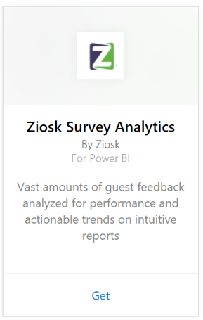
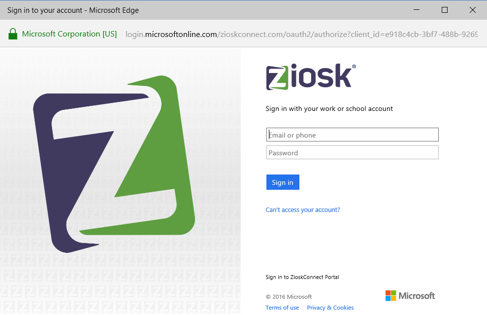
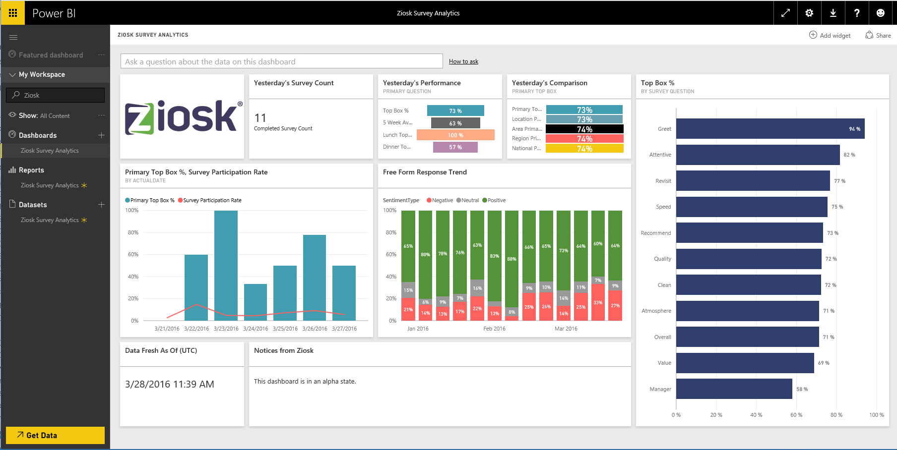

# Connect to Ziosk Survey Analytics with Power BI
Ziosk Survey Analytics content pack for Power BI offers restaurants with Ziosk tablets unparalleled access to insights provided by Ziosk survey data, including segmentation by day, location, employee, and more.

Connect to the [Ziosk Survey Analytics content pack](https://app.powerbi.com/getdata/services/ziosk-survey-analytics) for Power BI.

## How to connect
1. Select **Get Data** at the bottom of the left navigation pane.  
   
    
2. In the **Services** box, select **Get**.  
   
    
3. Select **Ziosk Survey Analytics**, then select **Get**.  
   
    
4. Select **OAuth 2** and then **Sign In**. When prompted, provide your Ziosk credentials.
   
    
   
    
5. Once connected, a dashboard, report and dataset will automatically be loaded. When completed, the tiles will update with data from your Ziosk account.
   
    

**What Now?**

* Try [asking a question in the Q&A box](powerbi-service-q-and-a.md) at the top of the dashboard
* [Change the tiles](service-dashboard-edit-tile.md) in the dashboard.
* [Select a tile](service-dashboard-tiles.md) to open the underlying report.
* While your dataset will be schedule to refreshed daily, you can change the refresh schedule or try refreshing it on demand using **Refresh Now**

## What's included
The content pack includes data from the following tables:  

    - Alcohol Category  
    - Appetizer Category  
    - CommentKeywords  
    - Date  
    - Daypart  
    - Dessert Category  
    - FreeForm  
    - Kids Category  
    - Messages  
    - Premium Content Category  
    - Question  
    - Store  
    - Surveys  
    - Weekday  

## System requirements
A Ziosk account with permissions to the above tables is required in order to instantiate this content pack.

### See also
[Get started with Power BI](service-get-started.md)

[Power BI - Basic Concepts](service-basic-concepts.md)

