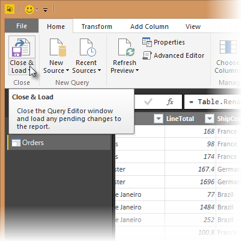
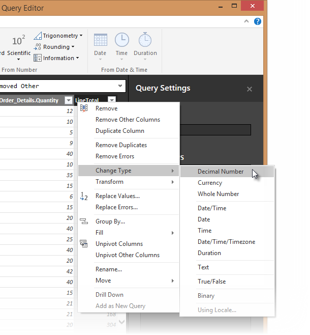
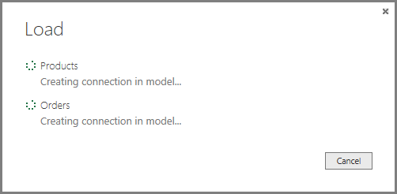

# Tutorial: Analyzing sales data from Excel and an OData feed
With **Power BI Desktop**, you can connect to all sorts of different data sources, then combine and shape them in ways that facilitate making interesting, compelling data analysis and visualizations. In this tutorial, you'll learn how to combine data from two data sources. 

It's common to have data spread across multiple data sources, such as product information in one database, and sales information in another. The techniques you'll learn in this document include an Excel workbook and an OData feed, but these techniques can be applied to other data sources too, like SQL Server queries, CSV files, or any data source in Power BI Desktop.

In this tutorial, you import data from Excel (it includes product information) and from an OData feed (which contains orders data). You'll perform transformation and aggregation steps, and combine data from both sources to produce a **Total Sales per Product and Year** report that includes interactive visualizations. 

Here's what the final report will look like:

To follow the steps in this tutorial you need the Products workbook, which you can download**:**[ click](http://download.microsoft.com/download/1/4/E/14EDED28-6C58-4055-A65C-23B4DA81C4DE/Products.xlsx)[here](http://download.microsoft.com/download/1/4/E/14EDED28-6C58-4055-A65C-23B4DA81C4DE/Products.xlsx)[ to download](http://download.microsoft.com/download/1/4/E/14EDED28-6C58-4055-A65C-23B4DA81C4DE/Products.xlsx)**[Products.xlsx](http://download.microsoft.com/download/1/4/E/14EDED28-6C58-4055-A65C-23B4DA81C4DE/Products.xlsx)**[. ](http://download.microsoft.com/download/1/4/E/14EDED28-6C58-4055-A65C-23B4DA81C4DE/Products.xlsx)

In the **Save As** dialog box, name the file **Products.xlsx**.

## Task 1: Get product data from an Excel workbook
In this task, you import products from the Products.xlsx file into Power BI Desktop.

### Step 1: Connect to an Excel workbook
1. Launch Power BI Desktop.
2. From the Home ribbon, select **Get Data**. Excel is one of the **Most Common** data connections, so you can select it directly from the **Get Data** menu.
   
   
3. If you select the Get Data button directly, you can also select **FIle \> Excel** and select **Connect.**
4. In the **Open File** dialog box, select the **Products.xlsx** file.
5. In the **Navigator** pane, select the **Products** table and then select **Edit**.
   
   

### Step 2: Remove other columns to only display columns of interest
In this step you remove all columns except **ProductID**, **ProductName**, **UnitsInStock**, and **QuantityPerUnit**. In Power BI Desktop, there are often a few ways to accomplish the same task. For example, many buttons in the ribbon can also be achieved by using the right-click menu on a column or a cell.

Power BI Desktop includes Query Editor, which is where you shape and transform your data connections. Query Editor opens automatically when you select **Edit** from **Navigator**. You can also open the Query Editor by selecting **Edit Queries** from the **Home** ribbon in Power BI Desktop. The following steps are performed in Query Editor.

1. In Query Editor, select the **ProductID**, **ProductName**, **QuantityPerUnit**, and **UnitsInStock** columns (use **Ctrl+Click** to select more than one column, or **Shift+Click** to select columns that are beside each other).
2. Select **Remove Columns** \> **Remove Other Columns** from the ribbon, or right-click on a column header and click **Remove Other Columns**.

### Step 3: Change the data type of the UnitsInStock column
When Query Editor connects to data, it reviews each field and to determine the best data type. For the Excel workbook, products in stock will always be a whole number, so in this step you confirm the **UnitsInStock** column’s datatype is Whole Number.

1. Select the **UnitsInStock** column.
2. Select the **Data Type** drop-down button in the **Home** ribbon.
3. If not already a Whole Number, select **Whole Number** for data type from the drop down (the **Data Type:** button also displays the data type for the current selection).
   
         

### Power BI Desktop steps created
As you perform query activities in Query Editor, query steps are created and listed in the **Query Settings** pane, in the **Applied Steps** list. Each query step has a corresponding formula, also known as the "M" language. For more information about the “M” formula language, see [Learn about Power BI formulas](https://support.office.com/Article/Learn-about-Power-Query-formulas-6bc50988-022b-4799-a709-f8aafdee2b2f).

| Task | Query step | Formula |
| --- | --- | --- |
| Connect to an Excel workbook |Source |Source{[Name="Products"]}[Data] |
| Promote the first row to table column headers |FirstRowAsHeader |[Table.PromoteHeaders](https://support.office.com/Article/TablePromoteHeaders-b8eaeb95-042a-42e1-9164-6d3c646acadc "Table.PromoteHeaders")   (Products) |
| Remove other columns to only display columns of interest |RemovedOtherColumns |[Table.SelectColumns](https://support.office.com/Article/TableSelectColumns-20bb9e28-9fd3-4cd2-a21b-97972c82ec22 "Table.SelectColumns")   (FirstRowAsHeader,{"ProductID", "ProductName", "QuantityPerUnit", "UnitsInStock"}) |
| Change datatype |Changed Type |Table.TransformColumnTypes(\#"Removed Other Columns",{{"UnitsInStock", Int64.Type}}) |

## Task 2: Import order data from an OData feed
In this task, you'll bring in order data. This step represents connecting to a sales system. You import data into Power BI Desktop from the sample Northwind OData feed at the following URL, which you can copy (and then paste) in the steps below: <http://services.odata.org/V3/Northwind/Northwind.svc/> 

### Step 1: Connect to an OData feed
1. From the **Home** ribbon tab in Query Editor, select **Get Data.**
2. Browse to the **OData Feed** data source.
3. In the **OData Feed** dialog box, paste the **URL** for the Northwind OData feed.
4. Select **OK**.
5. In the **Navigator** pane, select the **Orders** table, and then select **Edit**.
   
   

**Note**   You can click a table name, without selecting the checkbox, to see a preview.

### Step 2: Expand the Order\_Details table
The **Orders** table contains a reference to a **Details** table, which contains the individual products that were included in each Order. When you connect to data sources with multiples tables (such as a relational database) you can use these references to build up your query. 

In this step, you expand the **Order\_Details** table that is related to the **Orders** table, to combine the **ProductID**, **UnitPrice**, and **Quantity** columns from **Order\_Details** into the **Orders** table. This is a representation of the data in these tables:

The **Expand** operation combines columns from a related table into a subject table. When the query runs, rows from the related table (**Order\_Details**) are combined into rows from the subject table (**Orders**).

After you expand the **Order\_Details** table, three new columns and additional rows are added to the **Orders** table, one for each row in the nested or related table.

1. In the **Query View**, scroll to the **Order\_Details** column.
2. In the **Order\_Details** column, select the expand icon ().
3. In the **Expand** drop-down:
   1. Select **(Select All Columns)** to clear all columns.
   2. Select **ProductID**, **UnitPrice**, and **Quantity**.
   3. Click **OK**.
      

### Step 3: Remove other columns to only display columns of interest
In this step you remove all columns except **OrderDate, ShipCity**, **ShipCountry**, **Order\_Details.ProductID**, **Order\_Details.UnitPrice**, and **Order\_Details.Quantity** columns. In the previous task, you used **Remove Other Columns**. For this task, you remove selected columns.

1. In the **Query View**, select all columns by completing a. and b.:
   1. Click the first column (**OrderID**).
   2. Shift+Click the last column (**Shipper**).
   3. Now that all columns are selected, use Ctrl+Click to unselect the following columns: **OrderDate**, **ShipCity**, **ShipCountry**, **Order\_Details.ProductID**, **Order\_Details.UnitPrice**, and **Order\_Details.Quantity**.
2. Now that only the columns we want to remove are selected, right-click on any selected column header and click **Remove Columns**.

### Step 4: Calculate the line total for each Order\_Details row
Power BI Desktop lets you to create calculations based on the columns you are importing, so you can enrich the data that you connect to. In this step, you create a **Custom Column** to calculate the line total for each **Order\_Details** row.

Calculate the line total for each **Order\_Details** row:

1. In the **Add Column** ribbon tab, click **Add** **Custom Column**.
   
   
2. In the **Add Custom Column** dialog box, in the **Custom Column Formula** textbox, enter **[Order\_Details.UnitPrice] \* [Order\_Details.Quantity]**.
3. In the **New column name** textbox, enter **LineTotal**.
   
   
4. Click **OK**.

### Step 5: Set the datatype of the LineTotal field
1. Right click the **LineTotal** column.
2. Select **Change Type** and choose **Decimal Number.
   
   

### Step 6: Rename and reorder columns in the query
In this step you finish making the model easy to work with when creating reports, by renaming the final columns and changing their order.

1. In **Query Editor**, drag the **LineTotal** column to the left, after **ShipCountry**.
   
   
2. Remove the *Order\_Details.* prefix from the **Order\_Details.ProductID**, **Order\_Details.UnitPrice** and **Order\_Details.Quantity** columns, by double-clicking on each column header, and then deleting that text from the column name.

### Power BI Desktop steps created
As you perform query activities in Query Editor, query steps are created and listed in the **Query Settings** pane, in the **Applied Steps** list. Each query step has a corresponding Power Query formula, also known as the "M" language. For more information about this formula language, see [Learn about Power BI formulas](https://support.office.com/Article/Learn-about-Power-Query-formulas-6bc50988-022b-4799-a709-f8aafdee2b2f "Learn about Power Query formulas").

| Task | Query step | Formula |
| --- | --- | --- |
| Connect to an OData feed |Source |Source{[Name="Orders"]}[Data] |
| Expand the Order\_Details table |Expand Order\_Details |[Table.ExpandTableColumn](https://support.office.com/Article/TableExpandTableColumn-54903f25-75a2-4a44-a9a3-52a9d895ee98 "Table.ExpandTableColumn")   (Orders, "Order\_Details", {"ProductID", "UnitPrice", "Quantity"}, {"Order\_Details.ProductID", "Order\_Details.UnitPrice", "Order\_Details.Quantity"}) |
| Remove other columns to only display columns of interest |RemovedColumns |[Table.RemoveColumns](https://support.office.com/Article/TableRemoveColumns-6265190e-2f58-4300-85b8-df88fc1a67d3 "Table.RemoveColumns")  (\#"Expand Order\_Details",{"OrderID", "CustomerID", "EmployeeID", "RequiredDate", "ShippedDate", "ShipVia", "Freight", "ShipName", "ShipAddress", "ShipCity", "ShipRegion", "ShipPostalCode", "ShipCountry", "Customer", "Employee", "Shipper"}) |
| Calculate the line total for each Order\_Details row |InsertedColumn |[Table.AddColumn](https://support.office.com/Article/TableAddColumn-6c64d0a5-9654-4d15-bfb6-9cc380aaf3c0 "Table.AddColumn")   (RemovedColumns, "Custom", each [Order\_Details.UnitPrice] \* [Order\_Details.Quantity]) |

## Task 3: Combine the Products and Total Sales queries
Power BI Desktop does not require you to combine queries to report on them. Instead, you can create **Relationships** between datasets. These relationships can be created on any column that is common to your datasets. For more information see [Create and manage relationships](powerbi-desktop-create-and-manage-relationships.md).

In this tutorial, we have Orders and Products data that share a common 'ProductID' field, so we need to ensure there's a relationship between them in the model we're using with Power BI Desktop. Simply specify in Power BI Desktop that the columns from each table are related (i.e. columns that have the same values). Power BI Desktop works out the direction and cardinality of the relationship for you. In some cases, it will even detect the relationships automatically.

In this task, you confirm that a relationship is established in Power BI Desktop between the **Products** and **Total Sales** queries.

### Step 1: Confirm the relationship between Products and Total Sales
1. First, we need to load the model that we created in Query Editor into Power BI Desktop. From the **Home** ribbon of Query Editor, select **Close & Load**.
   
   
2. Power BI Desktop loads the data from the two queries.
   
         
3. Once the data is loaded, select the **Manage Relationships** button **Home** ribbon.
   
   
4. Select the **New…** button
   
   
5. When we attempt to create the relationship, we see that one already exists! As shown in the **Create Relationship** dialog (by the shaded columns), the **ProductsID** fields in each query already have an established relationship.
   
    
6. Select **Cancel**, and then select **Relationship** view in Power BI Desktop.
   
   
7. We see the following, which visualizes the relationship between the queries.
   
   
8. When you double-click the arrow on the line that connects the to queries, an **Edit Relationship** dialog appears.
   
   
9. No need to make any changes, so we'll just select **Cancel** to close the **Edit Relationship** dialog.

## Task 4: Build visuals using your data
Power BI Desktop lets you create a variety of visualizations to gain insights from your data. You can build reports with multiple pages and each page can have multiple visuals. You can interact with your visualizations to help analyze and understand your data. For more information about editing reports, see [Edit a Report](service-interact-with-a-report-in-editing-view.md).

In this task, you create a report based on the data previously loaded. You use the Fields pane to select the columns from which you create the visualizations.

### Step 1: Create charts showing Units in Stock by Product and Total Sales by Year
Drag **UnitsInStock** from the Field pane (the Fields pane is along the right of the screen) onto a blank space on the canvas. A Table visualization is created. Next, drag ProductName to the Axis box, found in the bottom half of the Visualizations pane. Then we then select **Sort By \> UnitsInStock** using the skittles in the top right corer of the visualization.

Drag **OrderDate** to the canvas beneath the first chart, then drag LineTotal (again, from the Fields pane) onto the visual, then select Line Chart. The following visualization is created.

 Next, drag **ShipCountry** to a space on the canvas in the top right. Because you selected a geographic field, a map was created automatically. Now drag **LineTotal** to the **Values** field; the circles on the map for each country are now relative in size to the **LineTotal** for orders shipped to that country.

### Step 2: Interact with your report visuals to analyze further
Power BI Desktop lets you interact with visuals that cross-highlight and filter each other to uncover further trends. For more detail see [Filtering and Highlighting in Reports](power-bi-reports-filters-and-highlighting.md)

1. Click on the light blue circle centered in **Canad****a.** Note how the other visuals are filtered to show Stock (**ShipCountry**) and Total Orders (**LineTotal**) just for Canada.
   
   

## Complete Sales Analysis Report
After you perform all these steps, you will have a Sales Report that combines data from Products.xlsx file and Northwind OData feed. The report shows visuals that help analyze sales information from different countries. You can download a completed Power BI Desktop file for this tutorial [here](http://download.microsoft.com/download/1/4/E/14EDED28-6C58-4055-A65C-23B4DA81C4DE/Analyzing_Sales_Data.pbix).

### Where else can I get more information?
* [Read other Power BI Desktop tutorials](http://go.microsoft.com/fwlink/?LinkID=521937)
* [Watch Power BI Desktop videos](http://go.microsoft.com/fwlink/?LinkID=519322)
* [Visit the Power BI Forum](http://go.microsoft.com/fwlink/?LinkID=519326)
* [Read the Power BI Blog](http://go.microsoft.com/fwlink/?LinkID=519327)



