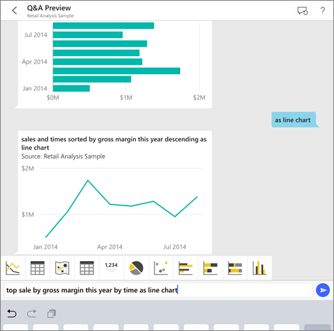
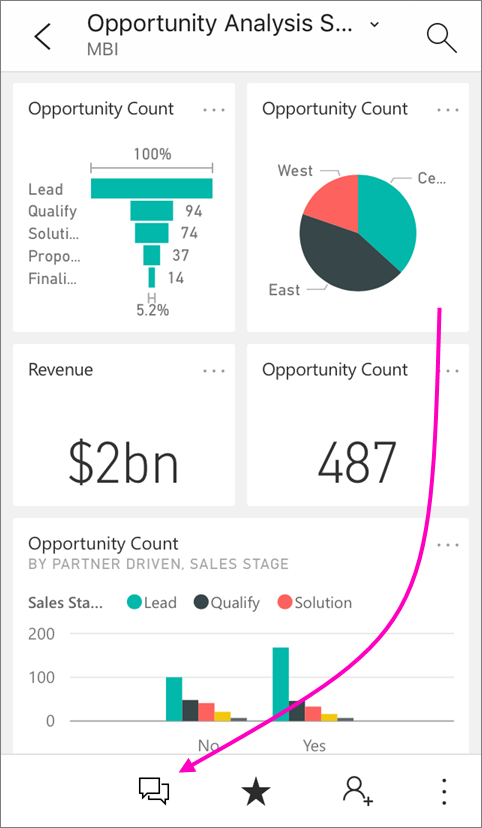

# Ask questions about your data with the Q&A virtual analyst in iOS apps - Power BI
Applies to:

|  |  |
|:--- |:--- |
| iPhones |iPads |

The easiest way to learn about your data is to ask questions about it in your own words. In this tutorial, try asking questions and viewing featured insights about sample data with the Q&A virtual analyst. 

In the Microsoft Power BI mobile app on your iPad, iPhone, and iPod Touch, the Q&A virtual analyst is a conversational BI experience that enhances the previous version of Q&A in iOS. The Q&A virtual analyst still accesses underlying Q&A data in the Power BI service [(https://powerbi.com)](https://powerbi.com). You can still type or say a question, and it also delivers data insights in context. 

## Download the samples
The first step in the tutorial is to download the Retail Analysis and Opportunity Analysis samples in the Power BI service.

* In your workspace on the Power BI service ([https://powerbi.com](https://powerbi.com)):
  
  * Select **Get Data** > **Samples** > **Opportunity Analysis Sample** > **Connect**.
  * After the Opportunity Analysis Sample finishes downloading, select **Get Data** > **Samples** > **Retail Analysis Sample** > **Connect**.

## Try featured insights
1. On your iPhone or iPad, open the Power BI app and navigate to the Opportunity Analysis Sample dashboard.
2. Tap the Q&A virtual analyst icon  from the action menu at the bottom of the page (at the top of the page on an iPad).
   
     
   
     The Power BI Q&A virtual analyst offers some suggestions to get started.
   
     
3. Tap **featured insights**.
   
     The Q&A virtual analyst suggests some insights.
4. Scroll to the right and tap **Insight 2**.
   
    
   
     The Q&A virtual analyst displays Insight 2.
   
    
5. Tap the chart to open it in focus mode.
   
    
6. Tap the arrow in the upper-left corner to go back to the Q&A virtual analyst experience.

## Try asking questions on your iPhone or iPad
1. On your iPhone or iPad, open the Power BI app and navigate to the Retail Analysis Sample dashboard.
2. Tap the Q&A virtual analyst icon  from the action menu at the bottom of the page (at the top of the page on an iPad).
     The Q&A virtual analyst offers some suggestions to get started.
3. Type **show**, tap **sales** from the suggestion list > **Send** .
   
    
4. Tap **by** from the keywords, then tap **item** from the suggestion list > **Send** .
   
    
5. Tap **as** from the keywords, tap the column chart icon , then tap **Send** .
6. Long-tap the resulting chart, then tap **Expand**.
   
    
   
    The chart opens in focus mode in the app.
   
    
7. Tap the arrow in the upper-left corner to go back to the Q&A virtual analyst chat window.
8. Tap the X at the right of the text box to delete the text and start over.
9. Try a new question: Tap **top** from the keywords, tap **sale by avg $/unit ly** > **Send** .
   
    
10. Choose **by** from the keywords, tap **time** from the suggestion list at the top > **Send** .
    
     
11. Type **as**, pick the line chart icon  from the suggestion list > **Send** .
    
    

## Try saying your questions
You can now ask questions about your data in the Power BI mobile app by speaking instead of typing.

1. Tap the Q&A virtual analyst icon  from the action menu at the bottom of the page (at the top of the page on an iPad).
2. Tap the microphone icon .

    

1. When the microphone icon is active, start speaking. For example, say "average unit price by time", then tap **Send** .
   
    

### Questions about privacy when using speech-to-text?
See the Speech Recognition section of [What's New in iOS](https://go.microsoft.com/fwlink/?linkid=845624) in the Apple iOS Developer Guides.

## Help and feedback
* Need help? Just say "Hi" or "Help", and you'll get assistance with starting a new question.
* Care to provide feedback on the results? Long-tap a chart or other result, then tap the smiley or frowny face.
  
    
  
    Your feedback is anonymous, and helps us improve our answers to questions.

## Enhance your Q&A virtual analyst results
You can improve the results you and your customers get when they use the Q&A virtual analyst on a dataset, either by asking more targeted questions or by enhancing the dataset.

### How to ask questions
* Follow these [tips for asking questions in Q&A](service-q-and-a-tips.md) in the Power BI service or the Q&A virtual analyst in your iOS mobile app.

### How to enhance the dataset
* Enhance the dataset in Power BI Desktop or in the Power BI service to [make your data work well with Q&A and the Q&A virtual analyst](service-prepare-data-for-q-and-a.md).

## See also
* [Q&A in the Power BI service](powerbi-service-q-and-a.md)
* Questions? Check the [Mobile apps section of the Power BI Community](https://go.microsoft.com/fwlink/?linkid=839277)

