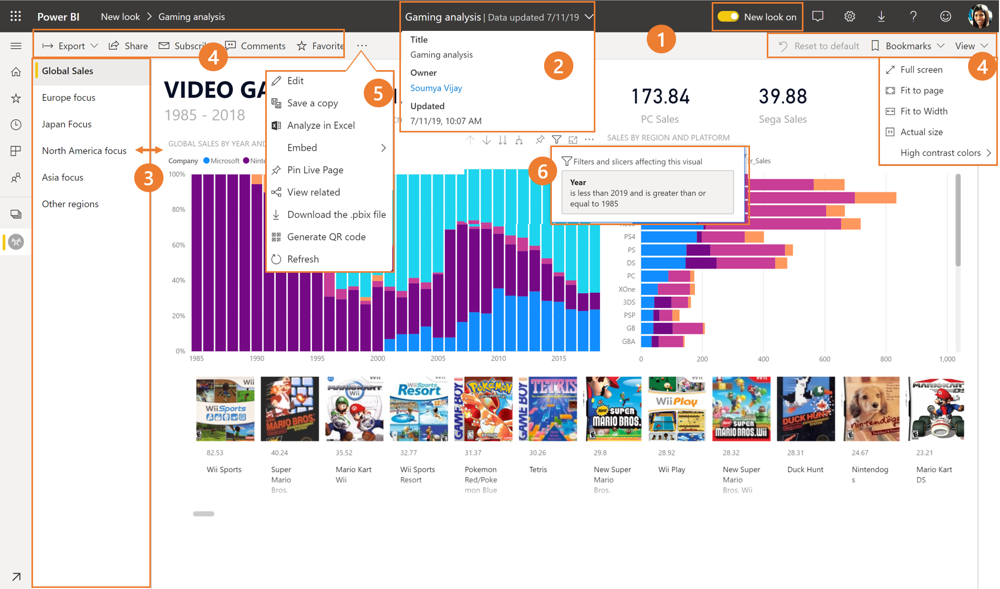
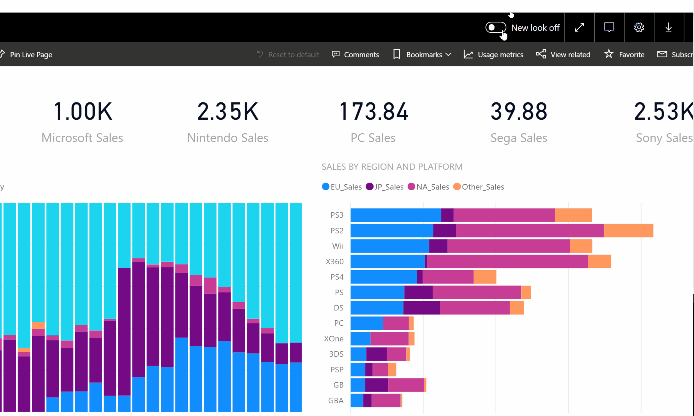
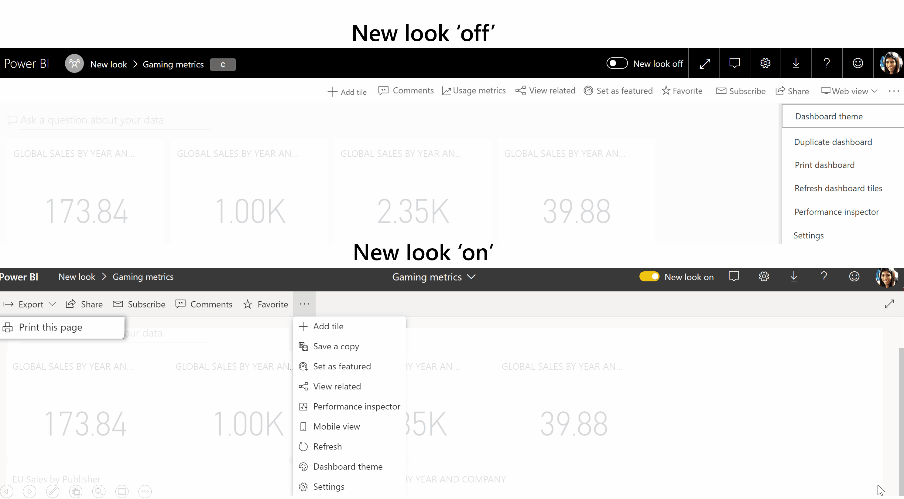
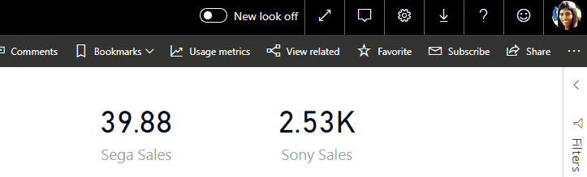

# Navigating a report in the new look

**Summary:** This article outlines how to navigate a report in the new look UI and a summary of what's changing.

**Writer:** Soumya Vijay

**Technical Reviewers:** Adam Wilson, Tony Cao, Sanyam Chaudhary

## Introducing the new look
Power BI service has a new look. We’ve refreshed the user interface for viewing reports, to provide a modern experience that’s simpler and builds on customers’ familiarity with Microsoft products.  Here's an overview of what’s changed in the new look - 

### 1. New colors and icons
Across the user interface, we’ve switched to a lighter color theme and updated icons – so that they complement the canvas, making report content the main point of focus. 

### 2. View metadata 
We’ve surfaced details such as last refresh date and contact information to help customers find additional context on the report.You can view additional details by opening the menu.

### 3. Vertical navigation 
We've switched the horizontal page tabs to a vertical list of pages. Report pages are now prominent, hard to miss and similar to navigation in Word and PowerPoint. You can increase or decrease the screen area by resizing the pane.

### 4. Simplified action bar 
A new, updated action bar designed to surface the most relevant commands front and center for end users, making it easier to export, subscribe, collaborate with others, and delve deeper through filters and bookmarks.

### 5. 100% feature parity
No functionality has been removed. Additional commands such as edit, save a copy, etc., can be found by expanding the ‘…’ menu in the action bar. Usage metrics can be accessed from the content list.

If you're looking for File menu actions, here's where they've moved

### 6. New filters
Recent updates such as viewing applied filters and the new filters pane, will be available by default with the new look. This comes in handy for reports where the designers haven't had a chance to upgrade to the new filters experience.   

### 7. Consistent experience 
The action bar is simplified across dashboards, reports and apps, to provide a consistent experience, while retaining the functional differences. Here's a walkthrough of actions in a dashboard. 

### 8. No changes to edit mode 
We’ve kept the authoring experience similar to that in Desktop. The new look changes only apply to the reading view.

## How to opt in to the new look?
All Power BI Service users will be able to opt-in to the new look using the new toggle.

