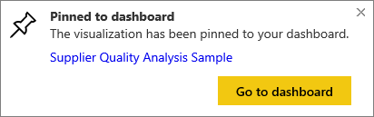

# Pin a tile from one dashboard to another dashboard
One way to add a new [dashboard tile](powerbi-service-dashboard-tiles.md) is by copying it from another dashboard. Each of these tiles, when clicked, is a link back to where it was created -- either in Q&A or a report. 

> [!NOTE]
> You cannot pin tiles from shared dashboards.
> 
> 

## Pin a tile to another dashboard
1. [Get data](powerbi-service-get-data.md). This example uses the [IT Spend Analysis sample](powerbi-sample-it-spend-analysis-take-a-tour.md).
2. Open a [dashboard](powerbi-service-dashboards.md).
3. Hover over the tile you want to pin, select the ellipses (...) and choose the pin  icon.  
   
   
4. Pin the tile to an existing dashboard or to a new dashboard. 
   
   * **Existing dashboard**: select the name of the dashboard from the dropdown.
   * **New dashboard**: type the name of the new dashboard.
   
   
5. Select Pin.
   A Success message (near the top right corner) lets you know the visualization was added, as a tile, to the selected dashboard.
   
   
6. Select **Go to dashboard** to see the pinned tile. There, you can [rename, resize, link, and move](powerbi-service-edit-a-tile-in-a-dashboard.md) the pinned visualization.

## Next steps
[Tiles in Power BI](powerbi-service-dashboard-tiles.md)  
[Dashboards in Power BI](powerbi-service-dashboards.md)  
More questions? [Try the Power BI Community](http://community.powerbi.com/)

