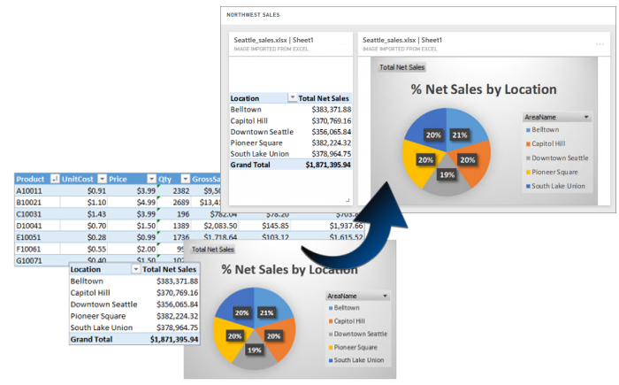
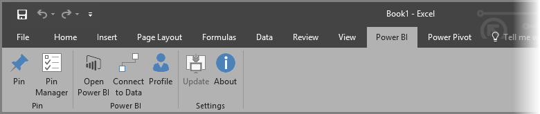
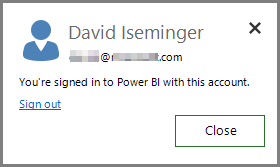
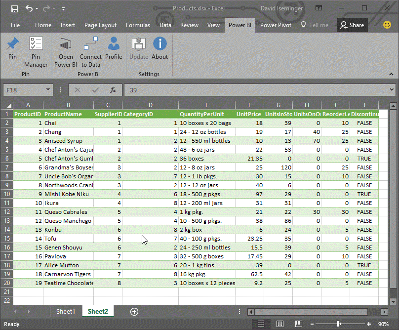
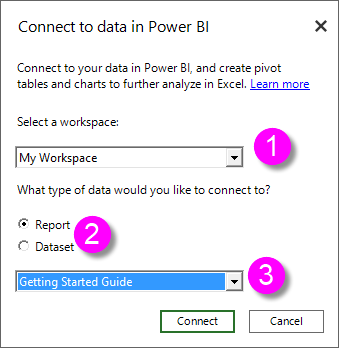
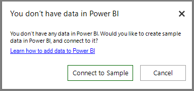

# Power BI publisher for Excel
With Microsoft **Power BI publisher for Excel**, you can take snapshots of your most important insights in Excel, like PivotTables, charts, and ranges and pin them to dashboards in Power BI.

What can you pin? Just about anything in an Excel worksheet. You can select a range of cells from a simple sheet or table, a PivotTable or PivotChart, illustrations and images, text.

What you can't pin: you cannot pin 3D Maps or visualizations in Power View sheets. There are also some elements you can pin, but it wouldn't make much sense to, like a Slicer or Timeline filter.

When you pin an element from Excel, a new tile is added to a new or existing dashboard in Power BI. The new tile is a snapshot, so it's not dynamic but you can still update it. For example, if you make a change to a PivotTable or chart you've already pinned, the dashboard tile in Power BI isn't updated automatically, but you can still update your pinned elements by using **Pin Manager**. You'll learn more about **Pin Manager** in the following sections.

## Download and install
Power BI publisher for Excel is an add-in you can download and install on desktop versions of Microsoft Excel 2007 and later.

[Download Power BI publisher for Excel](http://go.microsoft.com/fwlink/?LinkId=715729)

Once you have the publisher installed, you'll see a new **Power BI** ribbon in Excel, where you can sign in (or sign out) of Power BI, pin elements to dashboards, and manage elements you've already pinned.

The **Power BI publisher for Excel** add-in is enabled by default, but if for some reason you don't see the Power BI ribbon tab in Excel, you'll need to enable it. Click **File** > **Options** > **Add-ins** > **COM Add-ins**. Select **Microsoft Power BI Publisher for Excel**.

## Pin a range to a dashboard
You can select any range of cells from your worksheet, and pin a snapshot of that range to an existing or a new dashboard in Power BI. You can pin the same snapshot to multiple dashboards, too.

To begin, you need to make sure you're signed in to Power BI.

1. Select **Profile** from the **Power BI** ribbon tab in Excel. If you're already signed in to Power BI, you'll see a dialog that shows which account you're currently signed in with. If that's the account you want to use, great - go to the next set of steps to pin your range. Select *Sign out* if you want to use a different Power BI account. If you're not signed in, go to the next step (Step 2).
   
   
2. If you're not signed in, select the **Sign In** link that appears when you select **Profile** from the **Power BI** ribbon tab in Excel, in the **Connect to Power BI** dialog type in the email address of the Power BI account you want to use, then select **Sign In**.
   
   

Once you're signed in, follow these steps to pin a range to a dashboard:

1. In Excel, select the **Power BI** ribbon tab to see the **Pin** ribbon button.
2. Select a range from your Excel workbook.
3. Click the **Pin** button from the **Power BI** ribbon to show the **Pin to dashboard dialog**. If you're not already signed into Power BI, you'll be prompted to do so. Select a workspace from the **Workspace** dropdown list. If you want to pin to your own dashboard, verify **My Workspace** is selected. If you want to pin to a dashboard in a group workspace, select the group from the drop-down list.
4. Choose whether you want to pin to an *existing dashboard* or create a *new dashboard*.
5. Click **Okay** to pin your selection to the dashboard.
6. In **Pin to dashboard**, select an existing dashboard in the workspace or create a new one, and then click the **Ok** button.
   
   

## Pin a Chart to a dashboard
Just click on the chart, and then click Pin .

## Manage pinned elements
With **Pin Manager**, you can update (refresh) a pinned element's associated tile in Power BI. You can also remove the pin between an element you've already pinned to dashboards in Power BI.

To update tiles in your dashboard, in **Pin Manager** select one or more elements and then select **Update**.

To remove the mapping between a pinned element in Excel and the associated tile in a dashboard, remove **Remove**. When you select **Remove**, you're *not* removing the element from your worksheet in Excel or deleting the associated tile in the dashboard. You are removing the pin, or *mapping*, between them. The removed element will no longer appear in **Pin Manager**. If you pin the element again, it will appear as a new tile.

To remove a pinned element (a tile) from a dashboard, you'll need to do that in Power BI. In the tile you want to delete, select the **Open menu** icon 
and then select **Delete tile**   .

## Connect to data in Power BI
Beginning with the July 2016 release of **Power BI publisher for Excel** (including the current release, linked to above), you can connect directly to data in the Power BI service and analyze that data in Excel using PivotTables and PivotCharts. This features makes it easy to use Power BI data and Excel together to analyze data that's most important to you.

Improvements include the following:

* Any drivers required to connect to data in Power BI are automatically updated with each release - no need to install or manage those drivers yourself.
* You no longer need to download .odc files to create the connections - **Power BI publisher for Excel** creates the connections automatically when you select which report or dataset you want to use.
* Now you can create multiple connections and PivotTables in the same workbook
* Errors are improved and specific to **Power BI publisher for Excel**, rather than using default Excel messages

### How to connect to Power BI data in Excel
To connect to Power BI data using **Power BI publisher for Excel**, follow these easy steps:

1. Make sure you're signed in to Power BI. The steps describing how to sign in (or to sign in with a different account) are provided earlier in this article.
2. Once you're signed in to Power BI with the account you want to use, select **Connect to Data** from the **Power BI** ribbon tab in Excel.
   
   
3. Excel connects to Power BI using an HTTPS connection and presents the **Connect to data in Power BI** dialog, where you can select the *workspace* from which you want to select your data (1, in the image below), which *type of data* you want to connect to, either a **report** or a **dataset** (2), and a drop down (3) that allows you to select which *available report or dataset* to which to connect.
   
   
4. When you make your choices and select **Connect** from the **Connect to data in Power BI** dialog, Excel prepares a PivotTable and displays the **PivotTable Fields** pane, where you can select fields from your connected Power BI data, and create tables or charts that help you analyze the data.
   
   

If you don't have any data in Power BI, Excel detects that and offers to create sample data for you to connect to and try.

There are a few things to consider in this release of **Power BI publisher for Excel**:

* **Shared data** - Data that has been shared with you, but isn't directly visible to you in Power BI, is not available in **Connect to Data**.
* **SSAS on-premises** - If the dataset you select originates from an on-premises SQL Server Analysis Services (SSAS) and the dataset in Power BI uses DirectQuery to access the data, **Power BI publisher for Excel** connects to that data through the on-premises network connection, and does *not* go through Power BI to connect to that data. As such, any user trying to connect to such datasets must be connected to the on-premises network, and is authenticated for access to that data using the authentication method employed by the Analysis Services instance where the data is stored.
* **Required drivers** - **Power BI publisher for Excel** installs all the necessary drivers for this feature to work, and does so automatically. Among those automatically installed drivers is the Excel OLE DB driver for Analysis Services; if that driver is removed by the user (or for any other reason), the connection to Power BI data will not work.
* **Dataset must have measures** - The dataset must have model measures defined in order for Excel to treat the measures as values in PivotTables, and to correctly analyze the data. Learn more about [measures](desktop-measures.md).
* **Support for Groups** - Datasets shared with people outside the specified group are not supported, and cannot be connected to.
* **Free versus Pro subscriptions** - Activities associated with groups are not supported for free users of Power BI, and thus won't see any datasets or reports shared with a group in their own workspace.
* **Shared reports or datasets** - Reports or datasets that were shared with you cannot be connected to.
* **Using Tables instead of Data models** - Datasets and reports that are created by importing only tables from Excel (without a data model) are not supported at this time, and cannot be connected to.

Once you've created compelling charts or other visuals such as a range of data, you can easily pin those to a dashboard in Power BI, as described earlier in this article.

## Related Articles
There are many ways to use Excel and Power BI together, and get the best out of both. Take a look at the following articles for more information.

* [Analyze in Excel](service-analyze-in-excel.md)
* [Analyze in Excel troubleshooting](desktop-troubleshooting-analyze-in-excel.md)

