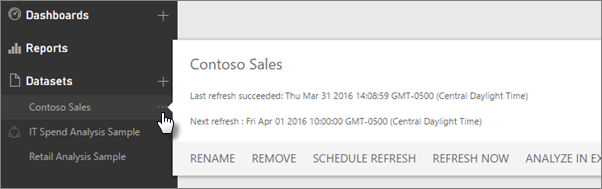
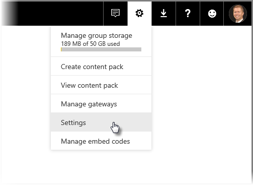

# Data refresh in Power BI
Making sure you’re always getting the latest data is often critical in making the right decisions. You’ve probably already used Get Data in Power BI to connect to and upload some data, created some reports and a dashboard. Now, you want to make sure your data really is the latest and greatest.

In many cases, you don’t need to do anything at all. Some data, like from a Salesforce or Marketo content pack is automatically refreshed for you. If your connection makes use of a live connection or DirectQuery, the data will be update to date. But, in other cases, like with an Excel workbook or Power BI Desktop file that connects to an external online or on-premises data source, you’ll need to refresh manually or setup a refresh schedule so Power BI can refresh the data in your reports and dashboards for you.

This article, along with a few others, are meant to help you understand how data refresh in Power BI really works, whether or not you need to setup a refresh schedule, and what needs to be in-place to refresh your data successfully.

## Understanding data refresh
Before setting up refresh, it’s important to understand what it is you’re refreshing and where you’re getting your data.

A *data source* is where the data you explore in your reports and dashboards really comes from; for example, an online service like Google Analytics or QuickBooks, a database in the cloud like Azure SQL Database, or a database or file on a local computer or server in your own organization. These are all data sources. The type of data source determines how data from it is refreshed. We’ll go into refresh for each type of data source a little later in the [What can be refreshed?](#what-can-be-refreshed) section.

A *dataset* is automatically created in Power BI when you use Get Data to connect to and upload data from a content pack, file, or you connect to a live data source. In Power BI Desktop and Excel 2016, you can also publish your file right to the Power BI service, which is just like using Get Data.

In each case, a dataset is created and appears in the My Workspace, or Group, containers in the Power BI service. When you select the **ellipse (...)** for a dataset, you can explore the data in a report, edit settings, and setup refresh.

A dataset can get data from one or more data sources. For example, you can use Power BI Desktop to get data from a SQL Database in your organization, and get other data from an OData feed online. Then, when you publish the file to Power BI, a single dataset is created, but it will have data sources for both the SQL Database and the OData feed.

A dataset contains information about the data sources, data source credentials, and in most cases, a sub-set of data copied from the data source. When you create visualizations in reports and dashboards, you’re looking at data in the dataset, or in the case of a live connection like Azure SQL Database, the dataset defines the data you see right from the data source. For a live connection to Analysis Services, the dataset definition comes from Analysis Services directly.

> *When you refresh data, you are updating the data in the dataset that is stored in Power BI from your data source. This refresh is a full refresh and not incremental.*
> 
> 

Whenever you refresh data in a dataset, whether by using Refresh Now or by setting up a refresh schedule, Power BI uses information in the dataset to connect to the data sources defined for it, query for updated data, and then loads the updated data into the dataset. Any visualizations in your reports or dashboards based on the data are updated automatically.

Before we go any further, there’s something else that's very important to understand:

> *Regardless of how often you refresh the dataset, or how often you look at live data, it is the data at the data source that must be up-to-date first.*
> 
> 

Most organizations process their data once a day, usually in the evening. If you schedule refresh for a dataset created from a Power BI Desktop file that connects to an on-premises database, and your IT department runs processing on that SQL database once in the evening, then you only need to setup scheduled refresh to run once-a-day. For example, after processing on the database happens, but before you come into work. Of course, this isn’t always the case. Power BI provides many ways to connect to data sources that are updated frequently or even real-time.

## Types of refresh
There are four main types of refresh that happen within Power BI. Package refresh, model/data refresh, tile refresh and visual container refresh.

### Package refresh
This synchronizes your Power BI Desktop, or Excel, file between the Power BI service and OneDrive, or SharePoint Online. This does not pull data from the original data source. The dataset in Power BI will only be updated with what is in the file within OneDrive, or SharePoint Online.

### Model/data refresh
This is referring to refreshing the dataset, within the Power BI service, with data from the original data source. This is done by either using scheduled refresh, or refresh now. This requires a gateway for on-premises data sources.

### Tile refresh
Tile refresh updates the cache for tile visuals, on the dashboard, once data changes. This happens about every fifteen minutes. You can also force a tile refresh by selecting the **ellipsis (...)** in the upper right of a dashboard and selecting **Refresh dashboard tiles**.

For details around common tile refresh errors, see [Troubleshooting tile errors](refresh-troubleshooting-tile-errors.md).

### Visual container refresh
Refreshing the visual container updates the cached report visuals, within a report, once the data changes.

## What can be refreshed?
In Power BI, you’ll typically use Get Data to import data from a file on a local drive, OneDrive or SharePoint Online, publish a report from Power BI Desktop, or connect directly to a database in the cloud in your own organization. Just about any data in Power BI can be refreshed, but whether or not you need to depends on how your dataset was created from and the data sources it connects to. Let’s look at how each of these refresh data.

Before we go further, here are some important definitions to understand:

**Automatic refresh**  - This means no user configuration is necessary in order for the dataset to be refreshed on a regular basis. Data refresh settings are configured for you by Power BI. For online service providers, refresh usually occurs once-a-day. For files loaded from OneDrive, automatic refresh occurs about every hour for data that does not come from an external data source. While you can configure different schedule refresh settings and manually refresh, you probably don’t need to.

**User configured manual or scheduled refresh** – This means you can manually refresh a dataset by using Refresh Now or setup a refresh schedule by using Schedule Refresh in a dataset’s settings. This type of refresh is required for Power BI Desktop files and Excel workbooks that connect to external online and on-premises data sources.

> [!NOTE]
> When you configure a time for scheduled refresh, there can be a delay of up to one hour before it begins.
> 
> 

**Live/DirectQuery** – This means there is a live connection between Power BI and the data source. For on-premises data sources, Admins will need to have a data source configured within an enterprise gateway, but user interaction may not be needed.

> [!NOTE]
> To enhance performance, dashboards with data connected using DirectQuery are automatically updated. You can also manually refresh a tile at any time, by using the **More** menu on the tile.
> 
> 

## Local files and files on OneDrive or SharePoint Online
Data refresh is supported for Power BI Desktop files and Excel workbooks that connect to external online or on-premises data sources. This will only refresh the data for the dataset within the Power BI service. It will not update your local file.

Keeping your files on OneDrive, or SharePoint Online, and connecting to them from Power BI, provides a great amount of flexibility. But with all that flexibility, it also makes it one of the most challenging to understand. Scheduled refresh for files stored in OneDrive, or SharePoint Online, are different from package refresh. You can learn more in the [Types of refresh](#types-of-refresh) section.

### Power BI Desktop file

| **Data source** | **Automatic refresh** | **User configured manual or scheduled refresh** | **Gateway required** |
| --- | --- | --- | --- |
| Get Data (on the ribbon) is used to connect to and query data from any listed online data source. |No |Yes |No (see below) |
| Get Data is used to connect to and explore a live Analysis Services database. |Yes |No |Yes |
| Get Data is used to connect to and explore a supported on-premises DirectQuery data source. |Yes |No |Yes |
| Get Data is used to connect to and query data from an Azure SQL Database, Azure SQL Data Warehouse, Azure HDInsight Spark. |Yes |Yes |No |
| Get Data is used to connect to and query data from any listed  on-premises data source except for Hadoop file (HDFS) and Microsoft Exchange. |No |Yes |Yes |

> [!NOTE]
> If you are using the [**Web.Page**](https://msdn.microsoft.com/library/mt260924.aspx) function, you do need a gateway if you have republished the dataset or your report after  November 18th, 2016.
> 
> 

For details, see [Refresh a dataset created from a Power BI Desktop file on OneDrive](refresh-desktop-file-onedrive.md).

### Excel workbook

| **Data source** | **Automatic refresh** | **User configured manual or scheduled refresh** | **Gateway required** |
| --- | --- | --- | --- |
| Tables of data in a worksheet not loaded into the Excel data model. |Yes, hourly *(OneDrive/SharePoint Online only)* |Manual only *(OneDrive/SharePoint Online only)* |No |
| Tables of data in a worksheet linked to a table in the Excel data model (linked tables). |Yes, hourly *(OneDrive/SharePoint Online only)* |Manual only *(OneDrive/SharePoint Online only)* |No |
| Power Query* is used to connect to and query data from any listed online data source and load data into the Excel data model. |No |Yes |No |
| Power Query* is used to connect to and query data from any listed on-premises data source except for Hadoop file (HDFS) and Microsoft Exchange and load data into the Excel data model. |No |Yes |Yes |
| Power Pivot is used to connect to and query data from any listed online data source and load data into the Excel data model. |No |Yes |No |
| Power Pivot is used to connect to and query data from any listed on-premises data source and load data into the Excel data model. |No |Yes |Yes |

*\* Power Query is known as Get & Transform Data in Excel 2016.*

For more detailed information, see [Refresh a dataset created from an Excel workbook on OneDrive](refresh-excel-file-onedrive.md).

### Comma separated value (.csv) file on OneDrive or SharePoint Online

| **Data source** | **Automatic refresh** | **User configured manual or scheduled refresh** | **Gateway required** |
| --- | --- | --- | --- |
| Simple comma separated value |Yes, hourly |Manual only |No |

For more detailed information, see [Refresh a dataset created from a comma separated value (.csv) file on OneDrive](refresh-csv-file-onedrive.md).

## Content packs
There are two types of content packs in Power BI:

**Content packs from online services**: like Adobe Analytics, SalesForce, and Dynamics CRM Online. Datasets created from online services are refreshed automatically once a day. While it’s probably not necessary, you can manually refresh or setup a refresh schedule. Because online services are in the cloud, a gateway is not required.

**Organizational content packs**: created and shared by users in your own organization. Content pack consumers cannot setup a refresh schedule or manually refresh. Only the content pack creator can setup refresh for the datasets in the content pack. Refresh settings are inherited with the dataset.

### Content packs from online services

| **Data source** | **Automatic refresh** | **User configured manual or scheduled refresh** | **Gateway required** |
| --- | --- | --- | --- |
| Online services in Get Data &gt; Services |Yes |Yes |No |

### Organizational content packs
Refresh capabilities for a dataset included within an organization content pack depends on the dataset. See information above in relation to local files, OneDrive or SharePoint Online.

To learn more, see [Introduction to organizational content packs](service-organizational-content-pack-introduction.md).

## Live connections and DirectQuery to on-premises data sources
With the On-premises data gateway, you can issue queries from Power BI to your on-premises data sources. When you interact with a visualization, queries are sent from Power BI directly to the database. Updated data is then returned and visualizations are updated. Because there is a direct connection between Power BI and the database, there is no need to schedule refresh.

When connecting to a SQL Service Analysis Services (SSAS) data source using a Live connection, unlike DirectQuery, the Live connection to a SSAS source can run against the cache, even upon loading a report. This behavior improves load performance for the report. You can request the latest data from the SSAS data source by using the **refresh** button. Owners of SSAS data sources can configure the scheduled cache refresh frequency for the dataset to ensure reports are as up to date as they require. 

When you configure a data source with the On-premises data gateway, you can use that data source as the scheduled refresh option. This would be instead of using the personal gateway.

> [!NOTE]
> If your dataset is configured for a live or DirectQuery connection, datasets are refreshed approximately each hour or when interaction with the data occurs. You can manually adjust the *refresh frequency* in the *Scheduled cache refresh* option in the Power BI service.
> 
> 

| **Data source** | **Live/DirectQuery** | **User configured manual or scheduled refresh** | **Gateway required** |
| --- | --- | --- | --- |
| Analysis Services Tabular |Yes |Yes |Yes |
| Analysis Services Multidimensional |Yes |Yes |Yes |
| SQL Server |Yes |Yes |Yes |
| SAP HANA |Yes |Yes |Yes |
| Oracle |Yes |Yes |Yes |
| Teradata |Yes |Yes |Yes |

To learn more, see [On-premises data gateway](service-gateway-onprem.md)

## Databases in the cloud
With DirectQuery, there is a direct connection between Power BI and the database in the cloud. When you interact with a visualization, queries are sent from Power BI directly to the database. Updated data is then returned and visualizations are updated. And, because both the Power BI service and the data source are in the cloud, there is no need for a Personal Gateway.

If there is no user interaction in a visualization, data is refreshed automatically approximately every hour. You can change that refresh frequency using the *Scheduled cache refresh* option, and set the refresh frequency.

To set the frequency, select the **gear** icon in the upper right corner of the Power BI service, then select **Settings**.

The **Settings** page appears, where you can select the dataset for which you want to adjust the frequency. On that page, select the **Datasets** tab along the top.

Select the dataset, and in the right pane you'll see a collection of options for that dataset. For the DirectQuery/Live connection, you can set the refresh frequency from 15 minutes to weekly using the associated drop-down menu, as shown in the following image.

| **Data source** | **Live/DirectQuery** | **User configured manual or scheduled refresh** | **Gateway required** |
| --- | --- | --- | --- |
| SQL Azure Data Warehouse |Yes |Yes |No |
| Spark on HDInsight |Yes |Yes |No |

To learn more, see [Azure and Power BI](service-azure-and-power-bi.md).

## Real-time dashboards
Real-time dashboards use the Microsoft Power BI REST API, or Microsoft Stream Analytics, to make sure the data is up-to-date. Since real time dashboards do not require users to configure refresh, they are outside the scope of this article.

| **Data source** | **Automatic** | **User configured manual or scheduled refresh** | **Gateway required** |
| --- | --- | --- | --- |
| Custom apps developed with the Power BI Rest API or Microsoft Stream Analytics |Yes, live streaming |No |No |

## Configure scheduled refresh
To learn how to configure scheduled refresh, see [Configure scheduled refresh](refresh-scheduled-refresh.md)

## Common data refresh scenarios
Sometimes the best way to learn about data refresh in Power BI is to look at examples. Here are some of the more common data refresh scenarios:

### Excel workbook with tables of data
You have an Excel workbook with several tables of data, but none of them are loaded into the Excel data model. You use Get Data to upload the workbook file from your local drive into Power BI, and create a dashboard. But, now you’ve made some changes to a couple of the workbook’s tables on your local drive, and you want to update your dashboard in Power BI with the new data.

Unfortunately, refresh is not supported in this scenario. In order to refresh the dataset for your dashboard, you will have to re-upload the workbook. However, there’s a really great solution: Put your workbook file on OneDrive, or SharePoint Online!

When you connect to a file on OneDrive, or SharePoint Online, your reports and dashboards will show data as it is in the file. In this case, your Excel workbook. Power BI automatically checks the file, about every hour, for updates. If you make changes to the workbook (stored in OneDrive or SharePoint Online), those changes are reflected in your dashboard and reports within an hour. You don’t need to setup refresh at all. However, if you need to see your updates in Power BI immediately, you can manually refresh the dataset by using Refresh Now.

To learn more, see [Excel data in Power BI](service-excel-workbook-files.md), or [Refresh a dataset created from an Excel workbook on OneDrive](refresh-excel-file-onedrive.md).

### Excel workbook connects to a SQL database in your company
Let’s say you have an Excel workbook named SalesReport.xlsx on your local computer. Power Query in Excel was used to connect to a SQL database on a server in your company and query for sales data that is loaded into the data model. Each morning, you open the workbook and hit Refresh to update your PivotTables.

Now you want to explore your sales data in Power BI, so you use Get Data to connect to and upload the SalesReport.xlsx workbook from your local drive.

In this case, you can manually refresh the data in the SalesReport.xlsx dataset or setup a refresh schedule. Because the data really comes from the SQL database in your company, you’ll need to download and install a gateway. Once you’ve installed and configured the gateway, you’ll need to go into the SalesReport dataset’s settings and sign in to the data source; but you’ll only have to do this once. You can then setup a refresh schedule so Power BI automatically connects to the SQL database and gets updated data. Your reports and dashboards will also be updated automatically.

> [!NOTE]
> This will only update the data within the dataset in the Power BI service. Your local file will not be updated as part of the refresh.
> 
> 

To learn more, see  [Excel data in Power BI](service-excel-workbook-files.md), [Power BI Gateway - Personal](service-gateway-personal-mode.md), [On-premises data gateway](service-gateway-onprem.md), [Refresh a dataset created from an Excel workbook on a local drive](refresh-excel-file-local-drive.md).

### Power BI Desktop file with data from an OData feed
In this case, you use Get Data in Power BI Desktop to connect to and import census data from an OData feed.  You create several reports in Power BI Desktop, then name the file WACensus and save it on a share in your company. You then publish the file to the Power BI service.

In this case, you can manually refresh the data in the WACensus dataset or setup a refresh schedule. Because the data in the data source comes from an OData feed online, you do not need to install a gateway, but you will need to go into the WACensus dataset’s settings and sign in to the OData data source. You can then setup a refresh schedule so Power BI automatically connects to the OData feed and gets updated data. Your reports and dashboards will also be updated automatically.

To learn more, see [Publish from Power BI Desktop](desktop-upload-desktop-files.md), [Refresh a dataset created from a Power BI Desktop file on a local drive](refresh-desktop-file-local-drive.md), [Refresh a dataset created from a Power BI Desktop file on OneDrive](refresh-desktop-file-onedrive.md).

### Shared content pack from another user in your organization
You’ve connected to an organizational content pack. It includes a dashboard, several reports, and a dataset.

In this scenario, you cannot setup refresh for the dataset. The data analyst who created the content pack is responsible for making sure the dataset is refreshed, depending on the data sources used.

If your dashboards and reports from the content pack aren’t updating, you’ll want to talk to the data analyst who created the content pack.

To learn more, see [Introduction to organizational content packs](service-organizational-content-pack-introduction.md), [Work with organizational content packs](service-organizational-content-pack-copy-refresh-access.md).

### Content pack from an online service provider like Salesforce
In Power BI you used Get Data to connect to and import your data from an online service provider like Salesforce. Well, not much to do here. Your Salesforce data set is automatically scheduled to refresh once a day. 

Like most online service providers, Salesforce updates data once a day, usually at night. You can manually refresh your Salesforce dataset, or setup a refresh schedule, but it’s not necessary because Power BI will automatically refresh the dataset and your reports and dashboards will be updated too.

To learn more, see [Salesforce content pack for Power BI](service-connect-to-salesforce.md).

## Troubleshooting
When things go wrong, it’s usually because Power BI can’t sign into data sources, or the dataset connects to an on-premises data source and the gateway is offline. Make sure Power BI can sign into data sources. If a password you use to sign into a data source changes, or Power BI gets signed out from a data source, be sure to try signing into your data sources again in Data Source Credentials.

For more information about troubleshooting, see [Tools for troubleshooting refresh issues](service-gateway-onprem-tshoot.md) and [Troubleshooting refresh scenarios](refresh-troubleshooting-refresh-scenarios.md).

## Next steps
[Tools for troubleshooting refresh issues](service-gateway-onprem-tshoot.md)  
[Troubleshooting refresh scenarios](refresh-troubleshooting-refresh-scenarios.md)  
[Power BI Gateway - Personal](service-gateway-personal-mode.md)  
[On-premises data gateway](service-gateway-onprem.md)  

More questions? [Try asking the Power BI Community](http://community.powerbi.com/)

