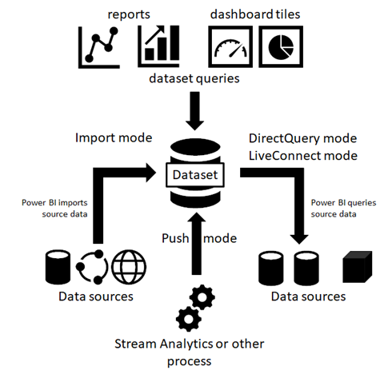
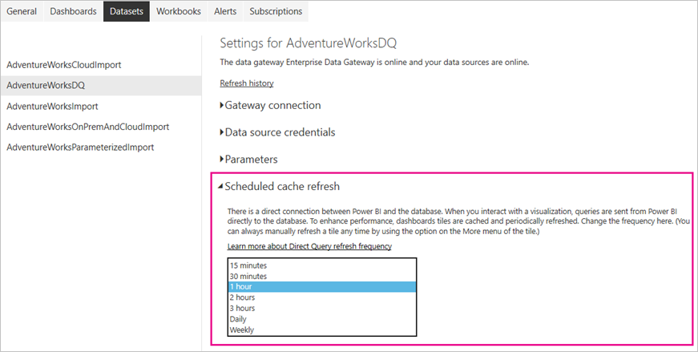
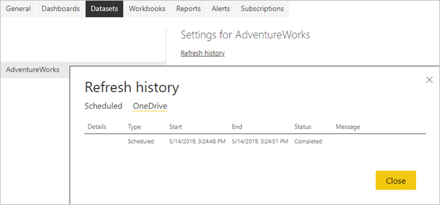
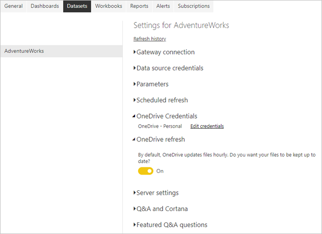
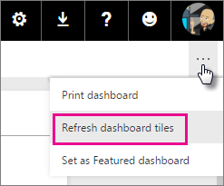
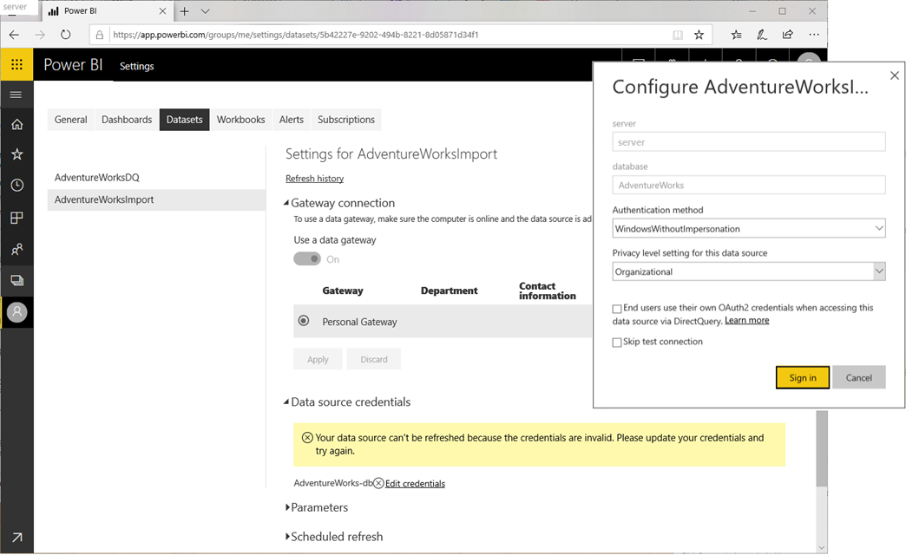
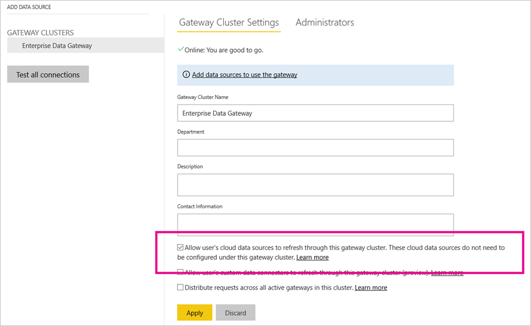

# Data refresh in Power BI

Power BI enables you to go from data to insight to action quickly, yet you must make sure the data in your Power BI reports and dashboards is recent. Knowing how to refresh the data is often critical in delivering accurate results.

This article describes the data refresh features of Power BI and their dependencies at a conceptual level. It also provides best practices and tips to avoid common refresh issues. The content lays a foundation to help you understand how data refresh works. For targeted step-by-step instructions to configure data refresh, refer to the tutorials and how-to guides listed in the Next steps section at the end of this article.

## Understanding data refresh

Whenever you refresh data, Power BI must query the underlying data sources, possibly load the source data into a dataset, and then update any visualizations in your reports or dashboards that rely on the updated dataset. The entire process consists of multiple phases, depending on the storage modes of your datasets, as explained in the following sections.

To understand how Power BI refreshes your datasets, reports, and dashboards, you must be aware of the following concepts:

- **Storage modes and dataset types**: The storage modes and dataset types that Power BI supports have different refresh requirements. You can choose between re-importing data into Power BI to see any changes that occurred or querying the data directly at the source.
- **Power BI refresh types**: Regardless of dataset specifics, knowing the various refresh types can help you understand where Power BI might spend its time during a refresh operation. And combining these details with storage mode specifics helps to understand what exactly Power BI performs when you select **Refresh Now** for a dataset.

### Storage modes and dataset types

A Power BI dataset can operate in one of the following modes to access data from a variety of data sources. For a more information, see [Storage mode in Power BI Desktop](desktop-storage-mode.md).

- Import mode
- DirectQuery mode
- LiveConnect mode
- Push mode

The following diagram illustrates the different data flows, based on storage mode. The most significant point is that only Import mode datasets require a source data refresh. They require refresh because only this type of dataset imports data from its data sources, and the imported data might be updated on a regular or ad-hoc basis. DirectQuery datasets and datasets in LiveConnect mode to Analysis Services don't import data; they query the underlying data source with every user interaction. Datasets in push mode don't access any data sources directly but expect you to push the data into Power BI. Dataset refresh requirements vary depending on the storage mode/dataset type.



#### Datasets in Import mode

Power BI imports the data from the original data sources into the dataset. Power BI report and dashboard queries submitted to the dataset return results from the imported tables and columns. You might consider such a dataset a point-in-time copy. Because Power BI copies the data, you must refresh the dataset to fetch changes from the underlying data sources.

Because Power BI caches the data, Import mode dataset sizes can be substantial. Refer to the following table for maximum dataset sizes per capacity. Stay well below the maximum dataset sizes to avoid refresh issues that might occur if your datasets require more than the maximum available resources during a refresh operation.

| Capacity type | Maximum dataset size |
| --- | --- |
| Shared, A1, A2, or A3 | 1 GB |
| A4 or P1 | 3 GB |
| A4 or P2 | 6 GB |
| A6 or P3 | 10 GB |
| | |

#### Datasets in DirectQuery/LiveConnect mode

Power BI does not import data over connections that operate in DirectQuery/LiveConnect mode. Instead, the dataset returns results from the underlying data source whenever a report or dashboard queries the dataset. Power BI transforms and forwards the queries to the data source.

Although DirectQuery mode and LiveConnect mode are similar in that Power BI forwards the queries to the source, it is important to note that Power BI does not have to transform queries in LiveConnect mode. The queries go directly to the Analysis Services instance hosting the database without consuming resources on shared capacity or a Premium capacity.

Because Power BI does not import the data, you don't need to run a data refresh. However, Power BI still performs tile refreshes and possibly report refreshes, as the next section on refresh types explains. A tile is a report visual pinned to a dashboard, and dashboard tile refreshes happen about every hour so that the tiles show recent results. You can change the schedule in the dataset settings, as in the screenshot below, or force a dashboard update manually by using the **Refresh Now** option.



> [!NOTE]
> The **Scheduled cache refresh** section of the **Datasets** tab is not available for datasets in import mode. These datasets don't require a separate tile refresh because Power BI refreshes the tiles automatically during each scheduled or on-demand data refresh.

#### Push datasets

Push datasets don't contain a formal definition of a data source, so they don't require you to perform a data refresh in Power BI. You refresh them by pushing your data into the dataset through an external service or process, such as Azure Stream Analytics. This is a common approach for real-time analytics with Power BI. Power BI still performs cache refreshes for any tiles used on top of a push dataset. For a detailed walkthrough, see [Tutorial: Stream Analytics and Power BI: A real-time analytics dashboard for streaming data](/azure/stream-analytics/stream-analytics-power-bi-dashboard).

> [!NOTE]
> Push Mode has several limitations as documented in [Power BI REST API limitations](developer/api-rest-api-limitations.md).

### Power BI refresh types

A Power BI refresh operation can consist of multiple refresh types, including data refresh, OneDrive refresh, refresh of query caches, tile refresh, and refresh of report visuals. While Power BI determines the required refresh steps for a given dataset automatically, you should know how they contribute to the complexity and duration of a refresh operation. For a quick reference, refer to the following table.

| Storage mode | Data refresh | OneDrive refresh | Query caches | Tile refresh | Report visuals |
| --- | --- | --- | --- | --- | --- |
| Import | Scheduled and on-demand | Yes, for connected datasets | If enabled on Premium capacity | Automatically and on-demand | No |
| DirectQuery | Not applicable | Yes, for connected datasets | If enabled on Premium capacity | Automatically and on-demand | No |
| LiveConnect | Not applicable | Yes, for connected datasets | If enabled on Premium capacity | Automatically and on-demand | Yes |
| Push | Not applicable | Not applicable | Not practical | Automatically and on-demand | No |
| | | | | | |

#### Data refresh

For Power BI users, refreshing data typically means importing data from the original data sources into a dataset, either based on a refresh schedule or on-demand. You can perform multiple dataset refreshes daily, which might be necessary if the underlying source data changes frequently. Power BI limits datasets on shared capacity to eight daily refreshes. If the dataset resides on a Premium capacity, you can perform up to 48 refreshes per day. For more information, see Configuring scheduled refresh later in this article.

It is also important to call out that the daily refresh limitation applies to both, scheduled and on-demand refreshes combined. You can trigger an on-demand refresh by selecting **Refresh Now** in the dataset menu, as the following screenshot depicts. You can also trigger a data refresh programmatically by using the Power BI REST API. See [Datasets - Refresh Dataset](/rest/api/power-bi/datasets/refreshdataset) if you are interested in building your own refresh solution.


> [!NOTE]
> Data refreshes must complete in less than 2 hours. If your datasets require longer refresh operations, consider moving the dataset onto a Premium capacity. On Premium, the maximum refresh duration is 5 hours.

#### OneDrive refresh

If you created your datasets and reports based on a Power BI Desktop file, Excel workbook, or comma separated value (.csv) file on OneDrive or SharePoint Online, Power BI performs another type of refresh, known as OneDrive refresh. For more information, see [Get data from files for Power BI](service-get-data-from-files.md).

Unlike a dataset refresh during which Power BI imports data from a data source into a dataset, OneDrive refresh synchronizes datasets and reports with their source files. By default, Power BI checks about every hour if a dataset connected to a file on OneDrive or SharePoint Online requires synchronization. To review past synchronization cycles, check the OneDrive tab in the refresh history. The following screenshot shows a completed synchronization cycle for a sample dataset.



As the above screenshot shows, Power BI identified this OneDrive refresh as a **Scheduled** refresh, but it is not possible to configure the refresh interval. You can only deactivate OneDrive refresh in the dataset's settings. Deactivating refresh is useful if you don't want your datasets and reports in Power BI to pick up any changes from the source files automatically.

Note that the dataset settings page only shows the **OneDrive Credentials** and **OneDrive refresh** sections if the dataset is connected to a file in OneDrive or SharePoint Online, as in the following screenshot. Datasets that are not connected to sources file in OneDrive or SharePoint Online don't show these sections.



If you disable OneDrive refresh for a dataset, you can still synchronize your dataset on-demand by selecting **Refresh Now** in the dataset menu. As part of the on-demand refresh, Power BI checks if the source file on OneDrive or SharePoint Online is newer than the dataset in Power BI and synchronizes the dataset if this is the case. The **Refresh history** lists these activities as on-demand refreshes on the **OneDrive** tab.

Keep in mind that OneDrive refresh does not pull data from the original data sources. OneDrive refresh simply updates the resources in Power BI with the metadata and data from the .pbix, .xlsx, or .csv file, as the following diagram illustrates. To ensure that the dataset has the most recent data from the data sources, Power BI also triggers a data refresh as part of an on-demand refresh. You can verify this in the **Refresh history** if you switch to the **Scheduled** tab.


If you keep OneDrive refresh enabled for a OneDrive or SharePoint Online-connected dataset and you want to perform data refresh on a scheduled basis, make sure you configure the schedule so that Power BI performs the data refresh after the OneDrive refresh. For example, if you created your own service or process to update the source file in OneDrive or SharePoint Online every night at 1 am, you could configure scheduled refresh for 2:30 am to give Power BI enough time to complete the OneDrive refresh before starting the data refresh.

#### Refresh of query caches

If your dataset resides on a Premium capacity, you might be able to improve the performance of any associated reports and dashboards by enabling query caching, as in the following screenshot. Query caching instructs the Premium capacity to use its local caching service to maintain query results, avoiding having the underlying data source compute those results. For more information, see [Query caching in Power BI Premium](power-bi-query-caching.md).


Following a data refresh, however, previously cached query results are no longer valid. Power BI discards these cached results and must rebuild them. For this reason, query caching might not be as beneficial for reports and dashboards associated with datasets that you refresh very often, such as 48 times per day.

#### Tile refresh

Power BI maintains a cache for every tile visual on your dashboards and proactively updates the tile caches when data changes. In other words, tile refresh happens automatically following a data refresh. This is true for both, scheduled and on-demand refresh operations. You can also force a tile refresh by selecting the ellipsis (...) in the upper right of a dashboard and selecting **Refresh dashboard tiles**.



Because it happens automatically, you can consider tile refresh an intrinsic part of data refresh. Among other things, you might notice that the refresh duration increases with the number of tiles. The tile refresh overhead can be significant.

By default, Power BI maintains a single cache for every tile, but if you use dynamic security to restrict data access based on user roles, as covered in the article [row-level security (RLS) with Power BI](service-admin-rls.md), then Power BI must maintain a cache for every role and every tile. The number of tile caches multiplies by the number of roles.

The situation can get even more involved if your dataset uses a live connection to an Analysis Services data model with RLS, as highlighted in the tutorial [Dynamic row level security with Analysis services tabular model](desktop-tutorial-row-level-security-onprem-ssas-tabular.md). In this situation, Power BI must maintain and refresh a cache for every tile and every user who ever viewed the dashboard. It is not uncommon that the tile refresh portion of such a data refresh operation far exceeds the time it takes to fetch the data from the source. For more details around tile refresh, see [Troubleshooting tile errors](refresh-troubleshooting-tile-errors.md).

#### Refresh of report visuals

This refresh process is less important because it is only relevant for live connections to Analysis Services. For these connections, Power BI caches the last state of the report visuals so that when you view the report again, Power BI does not have to query the Analysis Services tabular model. When you interact with the report, such as by changing a report filter, Power BI queries the tabular model and updates the report visuals automatically. If you suspect that a report is showing stale data, you can also select the Refresh button of the report to trigger a refresh of all report visuals, as the following screenshot illustrates.


## Review data infrastructure dependencies

Regardless of storage modes, no data refresh can succeed unless the underlying data sources are accessible. Your data sources might reside on-premises or in the cloud, or both.

There are three main data access scenarios:

- A dataset uses data sources that reside on-premises
- A dataset uses data sources in the cloud
- A dataset uses data from both, on-premises and cloud sources

### Connecting to on-premises data sources

If your dataset uses a data source that Power BI can't access over a direct network connection, you must configure a gateway connection for this dataset before you can enable a refresh schedule or perform an on-demand data refresh. For more information about data gateways and how they work, see [What are on-premises data gateways?](service-gateway-getting-started.md)

You have the following options:

- Choose an enterprise data gateway with the required data source definition
- Deploy a personal data gateway

> [!NOTE]
> You can find a list of data source types that require a data gateway in the article [Manage your data source - Import/Scheduled Refresh](service-gateway-enterprise-manage-scheduled-refresh.md).

#### Using an enterprise data gateway

Microsoft recommends using an enterprise data gateway instead of a personal gateway to connect a dataset to an on-premises data source. Make sure the gateway is properly configured, which means the gateway must have the latest updates and all required data source definitions. A data source definition provides Power BI with the connection information for a given source, including connection endpoints, authentication mode, and credentials. For more information about managing data sources on a gateway, see [Manage your data source - import/scheduled refresh](service-gateway-enterprise-manage-scheduled-refresh.md).

Connecting a dataset to an enterprise gateway is relatively straightforward if you are a gateway administrator. With admin permissions, you can promptly update the gateway and add missing data sources, if necessary. In fact, you can add a missing data source to your gateway straight from the dataset settings page. Expand the toggle button to view the data sources and select the **Add to gateway** link, as in the following screenshot. If you are not a gateway administrator, on the other hand, use the displayed contact information to send a request to a gateway admin for adding the required data source definition.


> [!NOTE]
> A dataset can only use a single gateway connection. In other words, it is not possible to access on-premises data sources across multiple gateway connections. Accordingly, you must add all required data source definitions to the same gateway.

#### Deploying a personal data gateway

If you have no access to an enterprise data gateway and you're the only person who manages datasets so you don't need to share data sources with others, you can deploy a data gateway in personal mode. In the **Gateway connection** section, under **You have no personal gateways installed** , select **Install now**. The personal data gateway has several limitations as documented in [On-premises data gateway (personal mode)](service-gateway-personal-mode.md).

Unlike for an enterprise data gateway, you don't need to add data source definitions to a personal gateway. Instead, you manage the data source configuration by using the **Data source credentials** section in the dataset settings, as the following screenshot illustrates.



> [!NOTE]
> The personal data gateway does not support datasets in DirectQuery/LiveConnect mode. The dataset settings page might prompt you to install it, but if you only have a personal gateway, you can't configure a gateway connection. Make sure you have an enterprise data gateway to support these types of datasets.

### Accessing cloud data sources

Datasets that use cloud data sources, such as Azure SQL DB, don't require a data gateway if Power BI can establish a direct network connection to the source. Accordingly, you can manage the configuration of these data sources by using the **Data source credentials** section in the dataset settings. As the following screenshot shows, you don't need to configure a gateway connection.


### Accessing on-premises and cloud sources in the same source query

A dataset can get data from multiple sources, and these sources can reside on-premises or in the cloud. However, a dataset can only use a single gateway connection, as mentioned earlier. While cloud data sources don't necessarily require a gateway, a gateway is required if a dataset connects to both on-premises and cloud sources in a single mashup query. In this scenario, Power BI must use a gateway for the cloud data sources as well. The following diagram illustrates how such a dataset accesses its data sources.


> [!NOTE]
> If a dataset uses separate mashup queries to connect to on-premises and cloud sources, Power BI uses a gateway connection to reach the on-premises sources and a direct network connection to the cloud sources. If a mashup query merges or appends data from on-premises and cloud sources, Power BI switches to the gateway connection even for the cloud sources.

Power BI datasets rely on Power Query to access and retrieve source data. The following mashup listing shows a basic example of a query that merges data from an on-premises source and a cloud source.

```
Let

    OnPremSource = Sql.Database("on-premises-db", "AdventureWorks"),

    CloudSource = Sql.Databases("cloudsql.database.windows.net", "AdventureWorks"),

    TableData1 = OnPremSource{[Schema="Sales",Item="Customer"]}[Data],

    TableData2 = CloudSource {[Schema="Sales",Item="Customer"]}[Data],

    MergedData = Table.NestedJoin(TableData1, {"BusinessEntityID"}, TableData2, {"BusinessEntityID"}, "MergedData", JoinKind.Inner)

in

    MergedData
```

There are two options to configure a data gateway to support merging or appending data from on-premises and cloud sources:

- Add a data source definition for the cloud source to the data gateway in addition to the on-premises data sources.
- Enable the checkbox **Allow user's cloud data sources to refresh through this gateway cluster**.



If you enable the checkbox **Allow user's cloud data sources to refresh through this gateway cluster in the gateway configuration** , as in the screenshot above, Power BI can use the configuration that the user defined for the cloud source under **Data source credentials** in the dataset settings. This can help to lower the gateway configuration overhead. On the other hand, if you want to have greater control over the connections that your gateway establishes, you should not enable this checkbox. In this case, you must add an explicit data source definition for every cloud source that you want to support to your gateway. It is also possible to enable the checkbox and add explicit data source definitions for your cloud sources to a gateway. In this case, the gateway uses the data source definitions for all matching sources.

### Configuring query parameters

The mashup or M queries you create by using Power Query can vary in complexity from trivial steps to parameterized constructs. The following listing shows a small sample mashup query that uses two parameters called _SchemaName_ and _TableName_ to access a given table in an AdventureWorks database.

```
let

    Source = Sql.Database("SqlServer01", "AdventureWorks"),

    TableData = Source{[Schema=SchemaName,Item=TableName]}[Data]

in

    TableData
```

> [!NOTE]
> Query parameters are only supported for Import mode datasets. DirectQuery/LiveConnect mode does not support query parameter definitions.

To ensure that a parameterized dataset accesses the correct data, you must configure the mashup query parameters in the dataset settings. You can also update the parameters programmatically by using the [Power BI REST API](/rest/api/power-bi/datasets/updateparametersingroup). The following screenshot shows the user interface to configure the query parameters for a dataset that uses the above mashup query.


> [!NOTE]
> Power BI currently does not support parameterized data source definitions, also known as dynamic data sources. For example, you can't parameterize the data access function Sql.Database("SqlServer01", "AdventureWorks"). If your dataset relies on dynamic data sources, Power BI informs you that it detected unknown or unsupported data sources. You must replace the parameters in your data access functions with static values if you want Power BI to be able to identify and connect to the data sources. For more information, see [Troubleshooting unsupported data source for refresh](service-admin-troubleshoot-unsupported-data-source-for-refresh.md).

## Configure scheduled refresh

Establishing connectivity between Power BI and your data sources is by far the most challenging task in configuring a data refresh. The remaining steps are relatively straightforward and include setting the refresh schedule and enabling refresh failure notifications. For step-by-step instructions, see the how-to guide [Configuring scheduled refresh](refresh-scheduled-refresh.md).

### Setting a refresh schedule

The **Scheduled refresh** section is where you define the frequency and time slots to refresh a dataset. As mentioned earlier, you can configure up to eight daily time slots if your dataset is on shared capacity, or 48 time slots on Power BI Premium. The following screenshot shows a refresh schedule on a twelve-hour interval.


Having configured a refresh schedule, the dataset settings page informs you about the next refresh time, as in the screenshot above. If you want to refresh the data sooner, such as to test your gateway and data source configuration, perform an on-demand refresh by using the Refresh Now option in the dataset menu in the left navigation pane. On-demand refreshes don't affect the next scheduled refresh time, but they count against the daily refresh limit, as explained earlier in this article.

Note also that the configured refresh time might not be the exact time when Power BI starts the next scheduled process. Power BI starts scheduled refreshes on a best effort basis. The target is to initiate the refresh within 15 minutes of the scheduled time slot, but a delay of up to one hour can occur if the service can't allocate the required resources sooner.

> [!NOTE]
> Power BI deactivates your refresh schedule after four consecutive failures or when the service detects an unrecoverable error that requires a configuration update, such as invalid or expired credentials. It is not possible to change the consecutive failures threshold.

### Getting refresh failure notifications

By default, Power BI sends refresh failure notifications through email to the dataset owner so that the owner can act in a timely manner should refresh issues occur. Power BI also sends you a notification when the service disables your schedule due to consecutive failures. Microsoft recommends that you leave the checkbox **Send refresh failure notification emails to me** enabled.

Note that Power BI not only sends notifications on refresh failures but also when the service pauses a scheduled refresh due to inactivity. After two months, when no user has visited any dashboard or report built on the dataset, Power BI considers the dataset inactive. In this situation, Power BI sends an email message to the dataset owner indicating that the service disabled the refresh schedule for the dataset. See the following screenshot for an example of such a notification.


To resume scheduled refresh, visit a report or dashboard built using this dataset or manually refresh the dataset using the **Refresh Now** option.

### Checking refresh status and history

In addition to failure notifications, it is a good idea to check your datasets periodically for refresh errors. A quick way is to view the list of datasets in a workspace. Datasets with errors show a small warning icon. Select the warning icon to obtain additional information, as in the following screenshot. For more information about troubleshooting specific refresh errors, see [Troubleshooting refresh scenarios](refresh-troubleshooting-refresh-scenarios.md).


The warning icon helps to indicate current dataset issues, but it is also a good idea to check the refresh history occasionally. As the name implies, the refresh history enables you to review the success or failure status of past synchronization cycles. For example, a gateway administrator might have updated an expired set of database credentials. As you can see in the following screenshot, the refresh history shows when an affected refresh started working again.


> [!NOTE]
> You can find a link to display the refresh history in the dataset settings. You can also retrieve the refresh history programmatically by using the [Power BI REST API](/rest/api/power-bi/datasets/getrefreshhistoryingroup). By using a custom solution, you can monitor the refresh history of multiple datasets in a centralized way.

## Best Practices

Checking the refresh history of your datasets regularly is one of the most important best practices you can adopt to ensure that your reports and dashboards use current data. If you discover issues, address them promptly and follow up with data source owners and gateway administrators if necessary.

In addition, consider the following recommendations to establish and maintain reliable data refresh processes for your datasets:

- Schedule your refreshes for less busy times, especially if your datasets are on Power BI Premium. If you distribute the refresh cycles for your datasets across a broader time window, you can help to avoid peaks that might otherwise overtax available resources. Delays starting a refresh cycle are an indicator of resource overload. If a Premium capacity is completely exhausted, Power BI might even skip a refresh cycle.
- Keep refresh limits in mind. If the source data changes frequently or the data volume is substantial, consider using DirectQuery/LiveConnect mode instead of Import mode if the increased load at the source and the impact on query performance are acceptable. Avoid constantly refreshing an Import mode dataset. However, DirectQuery/LiveConnect mode has several limitations, such as a one-million-row limit for returning data and a 225 seconds response time limit for running queries, as documented in [Use DirectQuery in Power BI Desktop](desktop-use-directquery.md). These limitations might require you to use Import mode nonetheless. For very large data volumes, consider the use of [aggregations in Power BI](desktop-aggregations.md).
- Verify that your dataset refresh time does not exceed the maximum refresh duration. Use Power BI Desktop to check the refresh duration. If it takes more than 2 hours, consider moving your dataset to Power BI Premium. Your dataset might not be refreshable on shared capacity. Also consider using [incremental refresh in Power BI Premium](service-premium-incremental-refresh.md) for datasets that are larger than 1GB or take several hours to refresh.
- Optimize your datasets to include only those tables and columns that your reports and dashboards use. Optimize your mashup queries and, if possible, avoid dynamic data source definitions and expensive DAX calculations. Specifically avoid DAX functions that test every row in a table because of the high memory consumption and processing overhead.
- Apply the same privacy settings as in Power BI Desktop to ensure that Power BI can generate efficient source queries. Keep in mind that Power BI Desktop does not publish privacy settings. You must manually reapply the settings in the data source definitions after publishing your dataset.
- Limit the number of visuals on your dashboards, especially if you use [row-level security (RLS)](service-admin-rls.md). As explained earlier in this article, an excessive number of dashboard tiles can significantly increase the refresh duration.
- Use a reliable enterprise data gateway deployment to connect your datasets to on-premises data sources. If you notice gateway-related refresh failures, such as gateway unavailable or overloaded, follow up with gateway administrators to either add additional gateways to an existing cluster or deploy a new cluster (scale up versus scale out).
- Use separate data gateways for Import datasets and DirectQuery/LiveConnect datasets so that the data imports during scheduled refresh don't impact the performance of reports and dashboards on top of DirectQuery/LiveConnect datasets, which query the data sources with each user interaction.
- Ensure that Power BI can send refresh failure notifications to your mailbox. Spam filters might block the email messages or move them into a separate folder where you might not notice them immediately.

## Next steps
[Tools for troubleshooting refresh issues](service-gateway-onprem-tshoot.md)  
[Troubleshooting refresh scenarios](refresh-troubleshooting-refresh-scenarios.md)  
[Power BI Gateway - Personal](service-gateway-personal-mode.md)  
[On-premises data gateway](service-gateway-onprem.md)  

More questions? [Try asking the Power BI Community](http://community.powerbi.com/)

