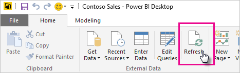

# Refresh a dataset stored on OneDrive or SharePoint Online
Importing files from OneDrive, or SharePoint Online, into the Power BI service is a great way to make sure the work you’re doing in **Power BI Desktop** stays in sync with the Power BI service.

## Advantages of storing a Power BI Desktop file on OneDrive or SharePoint Online
When you store a **Power BI Desktop** file on OneDrive or SharePoint Online, any data you’ve loaded into your file’s model is imported into the dataset, and any reports you’ve created in the file are loaded into **Reports** in the Power BI serviced. When you make changes to your file on OneDrive or SharePoint Online, such as adding new measures, changing column names, or editing visualizations, once you save the file those changes will be updated in the Power BI service too, usually within about an hour.

You can perform a one-time, manual refresh right in Power BI Desktop by selecting Refresh on the Home ribbon. When you select Refresh here, the data in the *file’s* model is refreshed with updated data from the original data source. This kind of refresh, entirely from within the Power BI Desktop application itself, is different from manual or scheduled refresh in Power BI, and it’s important to understand the distinction.

When you import your Power BI Desktop file from OneDrive, or SharePoint Online, data, along with other information about the model is loaded into a dataset in Power BI. In the Power BI service, not Power BI Desktop, you want to refresh data in the dataset because that is what your reports, in the Power BI service, are based on. Because the data sources are external, you can manually refresh the dataset by using **Refresh now** or you can setup a refresh schedule by using **Schedule Refresh**.

When you refresh the dataset, Power BI does not connect to the file on OneDrive, or SharePoint Online, to query for updated data. It uses information in the dataset to connect directly to the data sources to query for updated data it then loads into the dataset. This refreshed data in the dataset is not synchronized back to the file on OneDrive, or SharePoint Online.

## What’s supported?
In Power BI, Refresh Now and Schedule Refresh is supported for datasets created from Power BI Desktop files imported from a local drive where Get Data/Query Editor is used to connect to and load data from any of the following data sources:

### Power BI Gateway - Personal
* All online data sources shown in Power BI Desktop’s Get Data and Query Editor.
* All on-premises data sources shown in Power BI Desktop’s Get Data and Query Editor except for Hadoop file (HDFS) and Microsoft Exchange.

<!-- Refresh Data sources-->
[!INCLUDE [refresh-datasources](./includes/refresh-datasources.md)]

> [!NOTE]
> A gateway must be installed and running in order for Power BI to connect to on-premises data sources and refresh the dataset.
> 
> 

## OneDrive or OneDrive for Business. What’s the difference?
If you have both a personal OneDrive and OneDrive for Business, it’s recommended you keep any files you want to import into Power BI in OneDrive for Business. Here’s why: You likely use two different accounts to sign into them.

Connecting to OneDrive for Business in Power BI is typically seamless because the same account you use to sign into Power BI with is often the same account used to sign into OneDrive for Business. But, with personal OneDrive, you likely sign in with a different [Microsoft account](https://account.microsoft.com).

When you sign in with your Microsoft account, be sure to select Keep me signed in. Power BI can then synchronize any updates you make in the file in Power BI Desktop with datasets in Power BI  
    

If you make changes to your file on OneDrive that cannot be synchronized with the dataset or reports in Power BI, because your Microsoft account credentials might have changed, you’ll need to connect to and import your file again from your personal OneDrive.

## How do I schedule refresh?
When you setup a refresh schedule, Power BI will connect directly to the data sources using connection information and credentials in the dataset to query for updated data, then load the updated data into the dataset. Any visualizations in reports and dashboards based on that dataset in the Power BI service are also updated.

For details on how to setup schedule refresh, see [Configure Schedule Refresh](refresh-scheduled-refresh.md).

## When things go wrong
When things go wrong, it’s usually because Power BI can’t sign into data sources, or if the dataset connects to an on-premises data source, the gateway is offline. Make sure Power BI can sign into data sources. If a password you use to sign into a data source changes, or Power BI gets signed out from a data source, be sure to try signing into your data sources again in Data Source Credentials.

If you’re making changes to the Power BI Desktop file on OneDrive and saving, and those changes aren’t being reflected in Power BI within an hour or so, it could be because Power BI cannot connect to your OneDrive. Try connecting to the file on OneDrive again. If you’re prompted to sign in, make sure you select Keep me signed in. Because Power BI was not able to connect to your OneDrive to synchronize with the file, you’ll need to import your file again.

Be sure to leave the **Send refresh failure notification email to me** checked. You’ll want to know right away if a scheduled refresh fails.

## Troubleshooting
Sometimes refreshing data may not go as expected. Typically this will be an issue connected with a gateway. Take a look at the gateway troubleshooting articles for tools and known issues.

[Troubleshooting the On-premises data gateway](service-gateway-onprem-tshoot.md)

[Troubleshooting the Power BI Gateway - Personal](service-admin-troubleshooting-power-bi-personal-gateway.md)

More questions? [Try asking the Power BI Community](http://community.powerbi.com/)

