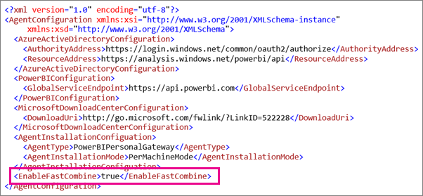
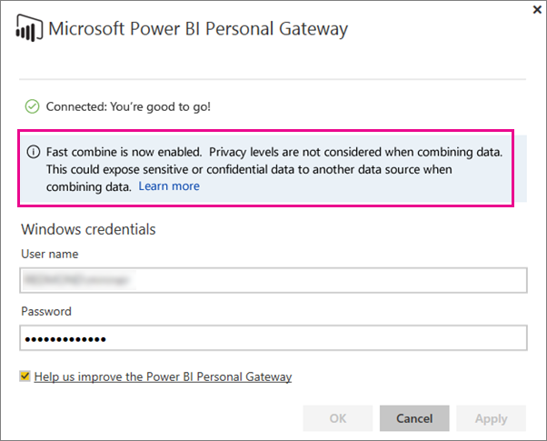

# Disable privacy setting in Power BI Gateway - Personal
> [!NOTE]
> There is a new version of the personal gateway for Power BI, called the **On-premises data gateway (personal mode)**. The following article describes the previous version of the personal gateway, called **Power BI Gateway - Personal**, which will be retired and stop working after July 31, 2017. For information about the new version of the personal gateway, including how to install the new version, see the [**On-premises data gateway (personal mode)** article](service-gateway-personal-mode.md). Fast combine is also available in the new version of the personal gateway, and is described in that article, too.
> 
> 

You may receive the following error based on the privacy settings for your data sources when used with the personal gateway.

> *An error occurred while processing the data in the dataset.*
> 
> *[Unable to combine data] &lt;query part&gt;/&lt;…&gt;/&lt;…&gt; is accessing data sources that have privacy levels which cannot be used together. Please rebuild this data combination.*
> 
> 

To work around this error, you can turn on **Fast Combine**. **Fast Combine** will ignore the privacy settings allowing the different data sources to be combined.

> [!NOTE]
> Privacy levels are not considered when combining data. This could expose sensitive or confidential data to another data source when combining data.
> 
> 

## What is Fast Combine?
To learn more about privacy levels and Fast Combine, you can look at [Privacy Levels](https://support.office.com/en-us/article/Privacy-levels-Power-Query-CC3EDE4D-359E-4B28-BC72-9BEE7900B540). By default, the privacy level will be set to private which could result in the error mentioned above. This is because a setting of private will isolate the data source from other sources. An example of where this would be a problem would be a parameterized query getting inputs from another data source.

Turning Fast Combine on will ignore the private setting and allow the execution to occur.

## Turn on Fast Combine
You can use the following steps to enable Fast Combine for your personal gateway. The on-premises data gateway does not have this setting.

1. Open **ConnectorConfig.xml**.  This may be in one of two locations on your machine.  If you are an administrator on the computer, it will be the following.
   
    <pre><code>C:\Program Files\Power BI Personal Gateway\1.0\Configurator\Connector</code></pre>
   
    If you are not an administrator, the location will be the following.
   
    <pre><code>C:\Users\[username]\AppData\Local\Power BI Personal Gateway\1.0\Configurator\Connector</code></pre>
2. Add the **&lt;EnableFastCombine&gt;** element with a value of true to the config file. Adding this element will turn **Fast Combine** on.
   
   <pre><code>&lt;EnableFastCombine&gt;true&lt;/EnableFastCombine&gt;</code></pre>
   
   
3. Exit and re-launch the gateway configuration screen.
4. You will see a status letting you know that Fast Combine is enabled.
   
   

## Turn off Fast Combine
1. Open **ConnectorConfig.xml**.  This may be in one of two locations on your machine.  If you are an administrator on the computer, it will be the following.
   
    <pre><code>C:\Program Files\Power BI Personal Gateway\1.0\Configurator\Connector</code></pre>
   
    If you are not an administrator, the location will be the following.
   
    <pre><code>C:\Users\[username]\AppData\Local\Power BI Personal Gateway\1.0\Configurator\Connector</code></pre>
2. Remove the **&lt;EnableFastCombine&gt;** element from the config file. Removing this element will turn **Fast Combine** off.
3. Exit and re-launch the gateway configuration screen.
4. You will no longer see a status telling you know that **Fast Combine** is enabled.

## Next steps
[On-premises data gateway (personal mode) - the new version of the personal gateway](service-gateway-personal-mode.md)
[Privacy Levels](https://support.office.com/en-us/article/Privacy-levels-Power-Query-CC3EDE4D-359E-4B28-BC72-9BEE7900B540)  
[Common query tasks in Power BI Desktop](desktop-common-query-tasks.md)  
More questions? [Try the Power BI Community](http://community.powerbi.com/)

