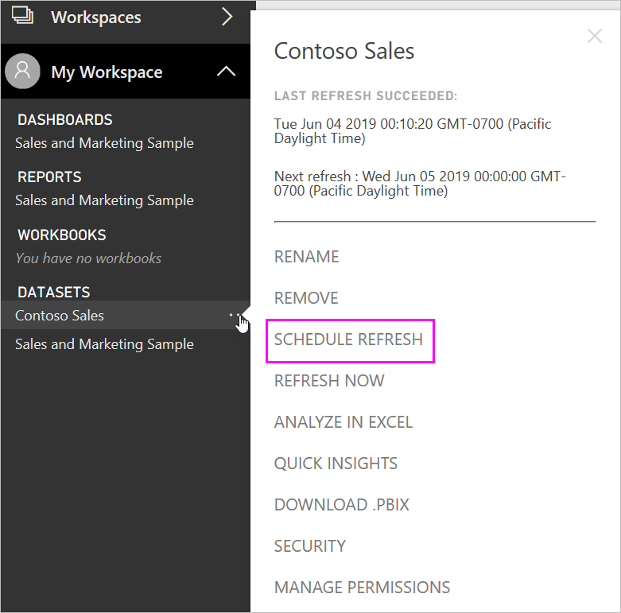

# Configuring scheduled refresh

>[!NOTE]
>After two months of inactivity, scheduled refresh on your dataset is paused. See the [*Schedule refresh*](#schedule-refresh) section later in this article for more information.
> 
> 

If your dataset supports scheduled refresh, by using Refresh Now and Schedule Refresh, there are a few requirements and settings important for refresh to be successful. These are **Gateway connection**, **Data Source Credentials**, and **Schedule Refresh**. Let’s take a closer look at each.

This will describe the options available for both the [Power BI Gateway – Personal](service-gateway-personal-mode.md) and the [On-premises data gateway](service-gateway-onprem.md).

To get to the schedule refresh screen, you can do the following.

1. Select the **ellipsis (...)** next to a dataset listed under **Datasets**.
2. Select **Schedule Refresh**.
   
    

## Gateway connection
You will see different options here depending on whether you have a personal, or enterprise, gateway online and available.

If no gateway is available, you will see **Gateway settings** disabled. You will also see a message indicating how to install the personal gateway.

If you have a personal gateway configured, it will be available to select, if it is online. It will show offline if it is not available.

You can also select the enterprise gateway if one is available for you. You will only see an enterprise gateway available if your account is listed in the Users tab of the data source configured for a given gateway.

## Data source credentials
### Power BI Gateway - Personal
If you are using the personal gateway to refresh data, you will need to supply the credentials used to connect to the back end data source. If you connected to a content pack, from an online service, the credentials you entered to connect will be carried over for scheduled refresh.

You’re only required to sign in to data sources the first time you use refresh on that dataset. Once entered, those credentials are retained with the dataset.

> [!NOTE]
> For some authentication methods, if the password you use to sign into a data source expires or is changed, you'll need to change it for the data source in Data Source Credentials too.
> 
> 

When things go wrong, the problem usually has something to do with either the gateway being offline because it could not sign in to Windows and start the service, or Power BI could not sign in to the data sources in order to query for updated data. If refresh fails, check the dataset’s settings. If the gateway service is offline, Gateway Status is where you’ll see the error. If Power BI cannot sign into the data sources, you’ll see an error in Data Source Credentials.

### On-premises data gateway
If you are using the On-premises data gateway to refresh data, you do not need to supply credentials as they are defined for the data source by the gateway administrator.

> [!NOTE]
> When connecting to on-premises SharePoint for data refresh, Power BI supports only *Anonymous*, *Basic*, and *Windows (NTLM/Kerberos)* authentication mechanisms. Power BI does not support *ADFS* or any *Forms-Based Authentication* mechanisms for data refresh of on-premises SharePoint data sources.
> 
> 

## Schedule refresh
The scheduled refresh section is where you define the frequency and time slots to refresh the dataset. Some data sources do not require a gateway present in order to be available to configure. Others will require a gateway.

You must set the **Keep your data up to date** slider to **Yes** in order to configure the settings.

> [!NOTE]
> The Power BI service targets initiating the refresh of your data within **15 minutes** of your scheduled refresh time.
> 
> 

> [!NOTE]
> After two months of inactivity, scheduled refresh on your dataset is paused. A dataset is considered inactive when no user has visited any dashboard or report built on the dataset. At that time, the dataset owner is sent an email indicating the scheduled refresh is paused, and the refresh schedule for the dataset is displayed as **disabled**. To resume scheduled refresh, simply revisit any dashboard or report built on the dataset.
> 
> 

## What’s supported?
Certain datasets are supported against different gateways for scheduled refresh. Here is a reference to understand what is available.

### Power BI Gateway - Personal
**Power BI Desktop**

* All online data sources shown in Power BI Desktop’s Get Data and Query Editor.
* All on-premises data sources shown in Power BI Desktop’s Get Data and Query Editor except for Hadoop file (HDFS) and Microsoft Exchange.

**Excel**

> [!NOTE]
> In Excel 2016, and later, Power Query is now listed on the Data section of the ribbon, under Get & Transform data.
> 
> 

* All online data sources shown in Power Query.
* All on-premises data sources shown in Power Query except for Hadoop file (HDFS) and Microsoft Exchange.
* All online data sources shown in Power Pivot.\*
* All on-premises data sources shown in Power Pivot except for Hadoop file (HDFS) and Microsoft Exchange.

<!-- Refresh Data sources-->
[!INCLUDE [refresh-datasources](./includes/refresh-datasources.md)]

## Troubleshooting
Sometimes refreshing data may not go as expected. Typically this will be an issue connected with a gateway. Take a look at the gateway troubleshooting articles for tools and known issues.

[Troubleshooting the On-premises data gateway](service-gateway-onprem-tshoot.md)

[Troubleshooting the Power BI Gateway - Personal](service-admin-troubleshooting-power-bi-personal-gateway.md)

## Next steps
[Data refresh in Power BI](refresh-data.md)  
[Power BI Gateway - Personal](service-gateway-personal-mode.md)  
[On-premises data gateway](service-gateway-onprem.md)  
[Troubleshooting the On-premises data gateway](service-gateway-onprem-tshoot.md)  
[Troubleshooting the Power BI Gateway - Personal](service-admin-troubleshooting-power-bi-personal-gateway.md)  

More questions? [Try asking the Power BI Community](http://community.powerbi.com/)

