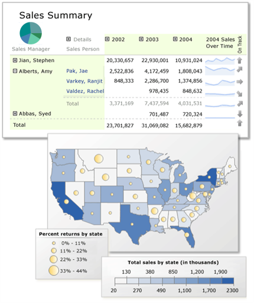

# Shared datasets in Power BI Paginated Report Builder

You can use a dataset that you create in Power BI Desktop as a data source for your Power BI Report Builder paginated reports. The dataset doesn't have to be in a workspace in a Premium capacity, and you don't need to be a member of that workspace. You just need to have Build permission for the dataset. 

Picture a scenario in which you've created a Power BI report in Power BI Desktop. You spent a lot of time designing the data model, then created a beautiful report with all sorts of great visuals. Your report has a matrix with many rows, so you have to scroll to see them all. Your report reader wants a report they can print out, that will show all the rows in that matrix. 

## Prerequisites

- Install Power BI Report Builder.
- Download the Power BI sample.

Power BI Paginated Report Builder is a tool for authoring paginated reports.  When you design a paginated report, you're creating a report definition that specifies what data to retrieve, where to get it, and how to display it. When you run the report, the report processor takes the report definition you have specified, retrieves the data, and combines it with the report layout to generate the report. You can preview your report in Report Builder. Then publish your report to the Power BI service.

## Next steps

- [What are paginated reports in Power BI Premium?](paginated-reports-report-builder-power-bi.md)