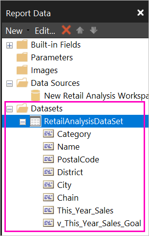
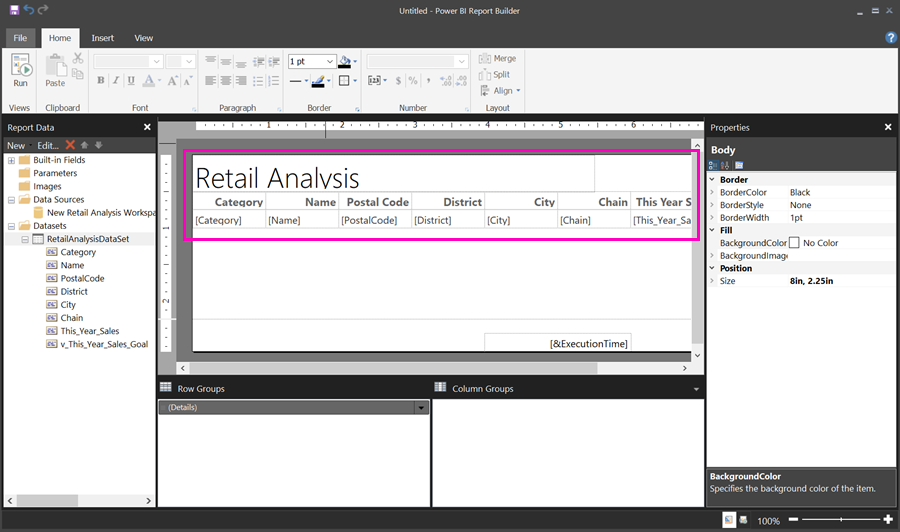

# Use shared datasets in Power BI Report Builder

You can use a dataset that you create in Power BI Desktop as a data source for Power BI Report Builder paginated reports. Picture this scenario: You've created a Power BI report in Power BI Desktop. You spent a lot of time designing the data model, then created a beautiful Power BI report with all sorts of great visuals. Your report has a matrix with many rows, so you have to scroll to see them all. Your report readers want a report they can print out, that will show all the rows in that matrix. A Power BI paginated report can do that: print a table or matrix that runs to multiple pages, with page headers and footers and a perfect page layout that you design. It will complement the Power BI Desktop report. You want them to be based on the exact same data, no discrepancies, so you use the same dataset.

The dataset doesn't have to be in a workspace in a Premium capacity, and you don't need to be a member of that workspace. You just need to have [Build permission](service-datasets-build-permissions.md#build-permissions-for-shared-datasets) for the dataset. To publish your paginated report, you do need a Power BI Pro license. You also need at least a Contributor role for a workspace in a Premium capacity.

## What you need

Here's a list of what you need and don't need to use a shared dataset in Power BI Report Builder.

- Power BI Report Builder. [Download and install Power BI Report Builder](https://go.microsoft.com/fwlink/?linkid=2086513).
- To access a Power BI dataset, you need to have Build permission for the dataset. Read about [Build permission](service-datasets-build-permissions.md#build-permissions-for-shared-datasets).
- You don't need a Power BI Pro license to create a paginated report in Report Builder. 
- You do need a Power BI Pro license to publish your paginated report. You also need at least a Contributor role for a workspace in a Premium capacity. 
- Optional: If you want to follow along with this article, download the Power BI Desktop [Retail Analysis sample .pbix](http://download.microsoft.com/download/9/6/D/96DDC2FF-2568-491D-AAFA-AFDD6F763AE3/Retail%20Analysis%20Sample%20PBIX.pbix) file, open it in Power BI Desktop and add a table with a lot of columns, and then save it to a workspace in the Power BI service. 

## Connect to the Power BI dataset

1. Open Power BI Report Builder.
1. Select **Sign in** in the upper-right corner of Report Builder to sign in to your Power BI account.
1. In the Report Data pane, select **New** > **Power BI Dataset Connection**.

    

    > [!NOTE]
    > You can't create the data source or dataset for a Power BI dataset by using the Report Builder Table, Matrix, or Chart wizards. After you've created them, you can use the wizards to create tables, matrixes, or charts based on them.

1. Search or browse for the dataset or the workspace where it resides > **Select**.
    Report Builder fills in the dataset name.

    
    
1. The dataset is listed under Data Sources in the Report Data pane.

    

    Remember, you can connect to multiple Power BI datasets and other data sources in the same paginated report.

## Get the query for the dataset

When you want the data in your Power BI report and in your Report Builder report to be the same, it's not enough to connect to the dataset. You also need the query that's built on that dataset.

1. Open the Power BI report (.pbix) in Power BI Desktop.
1. Make sure you have a table in your report that contains all the data you want in your paginated report.

1. On the **View** ribbon, select **Performance Analyzer**.

    

1. In the **Performance Analyzer** pane, select **Start recording**, then select **Refresh visuals**.

    

1. Expand the plus sign (**+**) next to the table name, and select **Copy query**. The query is the DAX formula you need for the dataset in Power BI Report Builder.

    

## Create the dataset with the query

1. Go back to Power BI Report Builder.
1. Right-click the dataset under **Data Sources** and select **Add Dataset**.

    

1. In Dataset Properties, give it a name, and select **Query Designer**.

4. Make sure **DAX** is selected, and deselect the **Design Mode** icon.

    

1. In the upper box, paste the query you copied from Power BI Desktop.

1. Select **Execute Query** (the red exclamation mark, !) to be sure your query works. 

    

    You see the results of the query in the lower box.

    

1. Select **OK**. 

    You see your query in the **Query** window of the **Dataset Properties** dialog box.

    

1. Select **OK**.

    Now you see your new dataset with a list of its fields in the Report Data pane.

    

## Create a table in the report

One quick way to create a table is to use the Table Wizard.

1. On the **Insert** ribbon, select **Table** > **Table Wizard**.

    

1. Choose the dataset you created with the DAX query > **Next**.

    

1. To make a flat table, select the fields you want in **Available fields**. You can select multiple fields at a time by selecting the first one you want, holding the Shift key, and selecting the last one.

    

1. Drag the fields to the **Values** box > **Next**.

    

1. Choose the layout options you want > **Next**.

1. Select **Finish**.
    You see your table in Design View.

1. Select **Click to add title** and add a title.

    

1. Select **Run** to preview your report.

    

1. Select **Print Layout** to see how your report will look printed. 

    This report layout needs some work. The columns and margins make the table two pages wide.

    

## Limitations and considerations 

- For datasets that use a Live Connection to Analysis Services, you can connect directly by using the underlying Analysis Services connection instead of a shared dataset.
- Datasets with Promoted or Certified endorsements appear in the list of available datasets, but they aren't marked as such. 

## Next steps

- [What are paginated reports in Power BI Premium?](paginated-reports-report-builder-power-bi.md)