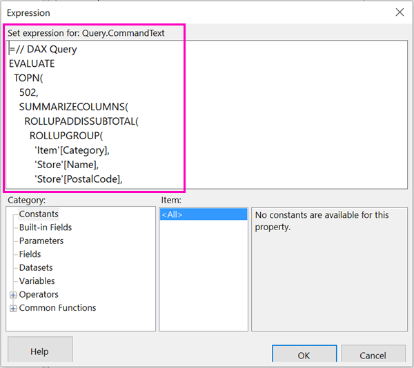

# Use shared datasets in Power BI Paginated Report Builder

You can use a dataset that you create in Power BI Desktop as a data source for Power BI Report Builder paginated reports. The dataset doesn't have to be in a workspace in a Premium capacity, and you don't need to be a member of that workspace. You just need to have Build permission for the dataset. To publish your report, you do need a Power BI Pro license. You also need at least a Contributor role for a workspace in a Premium capacity.

Picture this scenario: You've created a Power BI report in Power BI Desktop. You spent a lot of time designing the data model, then created a beautiful Power BI report with all sorts of great visuals. Your report has a matrix with many rows, so you have to scroll to see them all. Your report readers want a report they can print out, that will show all the rows in that matrix. A Power BI paginated report can do that: print a table or matrix that runs to multiple pages, with page headers and footers and a perfect page layout that you design. It will complement the Power BI Desktop report. You want them to be based on the exact same data, no discrepancies, so you use the same dataset.

## What you need

Here's a list of what you need and don't need to use a shared dataset in Power BI Report Builder.

- Power BI Report Builder. Here's the location to [download and install Power BI Report Builder](https://go.microsoft.com/fwlink/?linkid=2086513).
- To access a Power BI dataset, you need to have Build permission for the dataset. Read about [Build permission](service-datasets-across-workspaces.md#build-permission-for-datasets).
- You don't need a Power BI Pro license to create a paginated report in Report Builder. 
- To publish your paginated report, you do need a Power BI Pro license. You also need at least a Contributor role for a workspace in a Premium capacity. 

## Connect to the Power BI dataset

1. Open Power BI Report Builder.
1. Select **Sign in** in the upper-right corner of Report Builder to sign in to your Power BI account.
1. In the Report Data pane, select **New** > **Power BI Dataset Connection**.

    

    > [!NOTE]
    > You can't create the data source or dataset for a Power BI dataset by using the Report Builder Table, Matrix, or Chart wizards. After you've created them, you can use the wizards to create tables, matrixes, or charts based on them.

1. Search or browse for the dataset or the workspace where it resides > **Select**.
    Report Builder fills in the dataset name.

    
    
1. The dataset is listed under Data Sources in the Report Data pane.

    

    Remember, you can connect to multiple Power BI datasets and other data sources in the same paginated report.

## Get the query for the dataset

In this scenario, where you want the data in the Power BI report and the Report Builder report to be the same, it's not enough to connect to the dataset. You also need the query that's built on that dataset.

1. Open the Power BI report (.pbix) in Power BI Desktop.
1. Make sure you have a table in your report that contains all the data you want in your paginated report. 

1. On the **View** ribbon, select **Performance Analyzer**.

    

1. In the **Performance Analyzer** pane, select **Start recording**, then select **Refresh visuals**.

    

1. Expand the plus sign (**+**) next to the table name, and select **Copy query**. The query is the DAX formula you need for the dataset in Power BI Report Builder.

    

## Create the dataset with the query

1. Go back to Power BI Report Builder.
1. Right-click the dataset under **Data Sources** and select **Add Dataset**.

    

1. In Dataset Properties, give it a name, and select the Expression icon.

    

1. In the Expression dialog box, paste the DAX formula after the equal sign (**+**).

    

1. Select **OK**, and select **OK** again.
    Now you see your dataset in the Report Data pane.

    

## Create the table in the report

One quick way to create a table is to use the Table wizard.

1. On the **Insert** ribbon, select **Table** > **Table wizard**.
1. Choose the dataset you created with the DAX query > **Next**.
1. Select all the fields

Power BI Paginated Report Builder is a tool for authoring paginated reports.  When you design a paginated report, you're creating a report definition that specifies what data to retrieve, where to get it, and how to display it. When you run the report, the report processor takes the report definition you have specified, retrieves the data, and combines it with the report layout to generate the report. You can preview your report in Report Builder. Then publish your report to the Power BI service.

## Limitations and considerations 

- For datasets that use a Live Connection to Analysis Services, you can connect directly by using the underlying Analysis Services connection instead.
- Datasets with endorsements appear in the list of available datasets, but they aren't marked as Promoted and Certified. 

## Next steps

- [What are paginated reports in Power BI Premium?](paginated-reports-report-builder-power-bi.md)