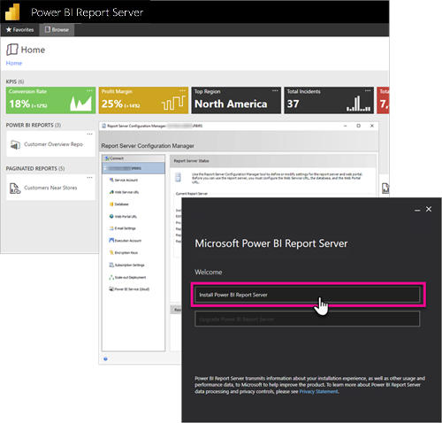

# Admin overview, Power BI Report Server
This article is the administration overview of Power BI Report Server, an on-premises location for storing and managing your Power BI, mobile, and paginated reports. This article introduces concepts of planning, deploying, and managing your Power BI Report Server, with links to more information.

 
## Installing and migration
You need to install Power BI Report Server to start using it. We have articles that explain how to handle this task.

Before you start to install, upgrade, or migrate to Power BI Report Server, take a look at the [system requirements](system-requirements.md) for the report server.

### Installing
If you are deploying a new Power BI Report Server, you use the following document to help you. 

[Install Power BI Report Server](install-report-server.md)

### Migration
There is no in-place upgrade for SQL Server Reporting Services. If you have an existing SQL Server Reporting Services instance that you want to make a Power BI Report Server, you need to migrate it. You may want to perform a migration for other reasons as well. Review the migration document for more details.

[Migrate a report server installation](migrate-report-server.md)

## Configuring your report server
You have many options when configuring your report server. Will you use SSL? Are you configuring an email server? Do you want to integrate with the Power BI service to pin visualizations?

The majority of your configuration will occur within the Report Server Configuration Manager. Check out the [configuration manager](/sql/reporting-services/install-windows/reporting-services-configuration-manager-native-mode) documentation for more details.

## Security
Security and protection are important to every organization. You can learn about authentication, authorization, roles, and permissions over in the [security](/sql/reporting-services/security/reporting-services-security-and-protection) documentation.

## Related content

- [Install Power BI Report Server](install-report-server.md)  
- [Find your report server product key](find-product-key.md)  
- [Install Power BI Desktop for Power BI Report Server](install-powerbi-desktop.md)  
- [Download Report Builder](https://www.microsoft.com/download/details.aspx?id=53613)  
- [Download SQL Server Data Tools (SSDT)](/sql/ssdt/download-sql-server-data-tools-ssdt)

More questions? [Try asking the Power BI Community](https://community.powerbi.com/)