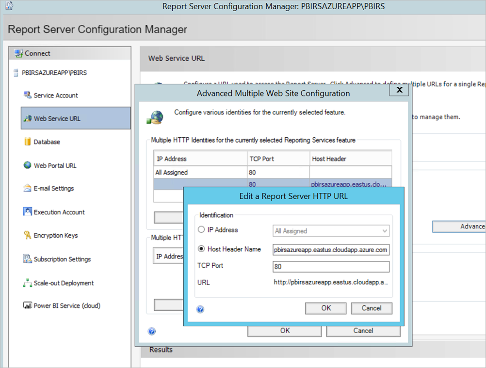
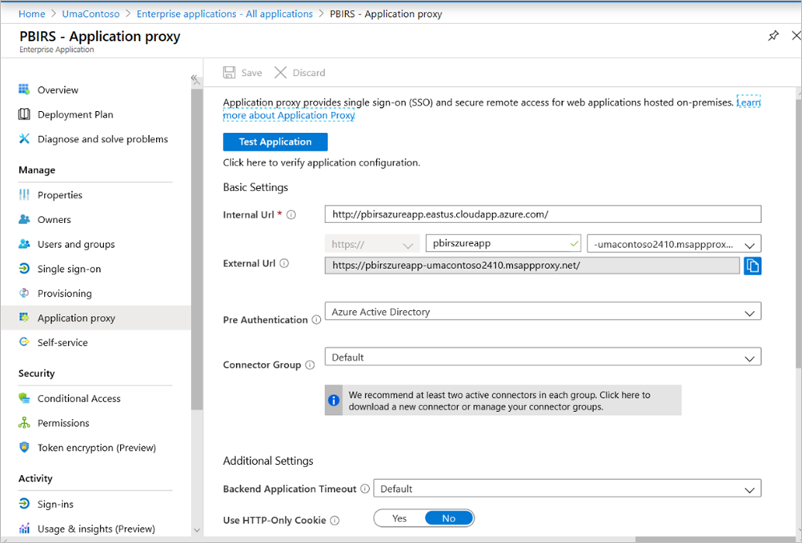
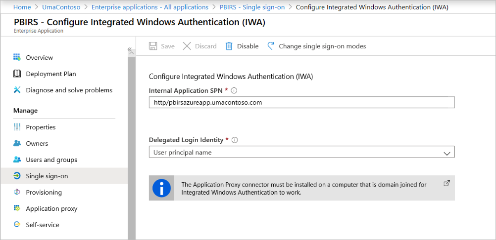
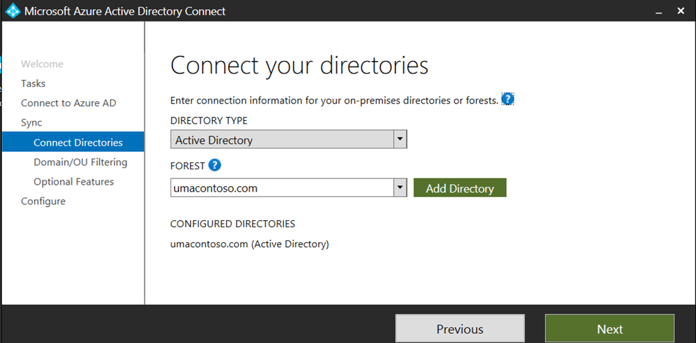
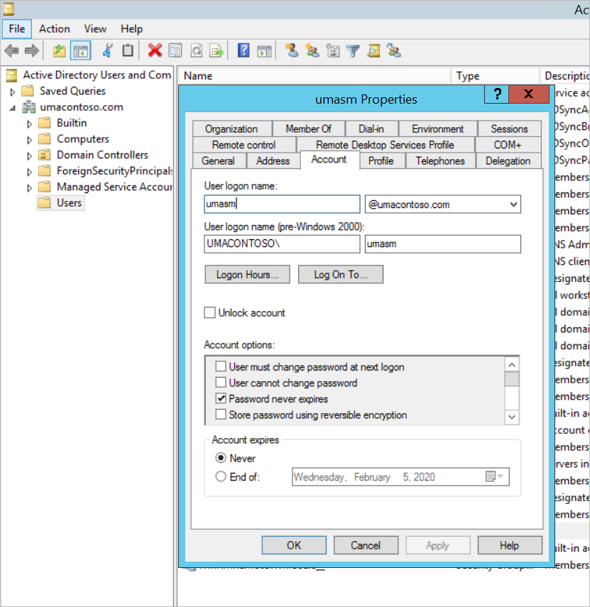
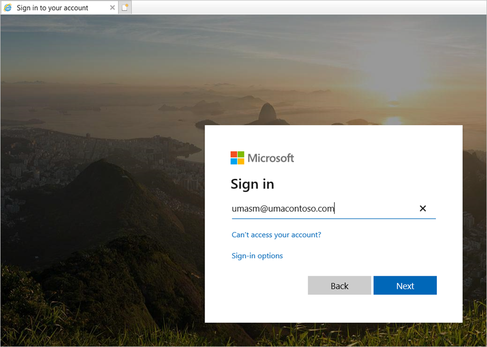
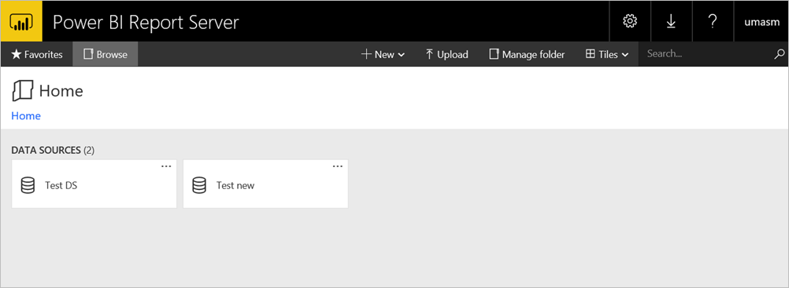
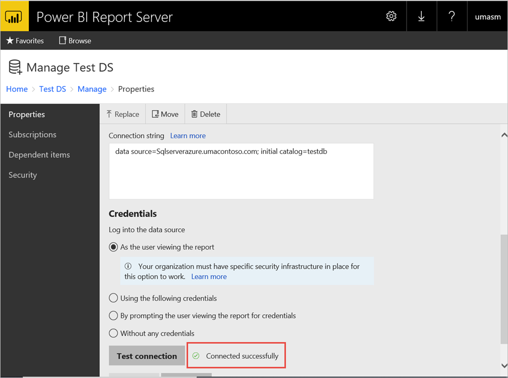

# Configure Power BI Report Server with Microsoft Entra application proxy

This article discusses how to use Microsoft Entra application proxy to connect to Power BI Report Server and SQL Server Reporting Services (SSRS) 2016 and later. Through this integration, users who are away from the corporate network can access their Power BI Report Server and Reporting Services reports from their client browsers and be protected by Microsoft Entra ID. Read more about remote access to on-premises applications through [Microsoft Entra application proxy](/entra/identity/app-proxy/application-proxy).

## Environment details

We used these values in the example we created.

- Domain: umacontoso.com
- Power BI Report Server: PBIRSAZUREAPP.umacontoso.com
- SQL Server Data Source: SQLSERVERAZURE.umacontoso.com

## Configure Power BI Report Server

After installing Power BI Report Server (assuming on an Azure VM), configure the Power BI Report Server web service and web portal URLs using the following steps:

1. Create inbound and outbound rules on the VM firewall for Port 80 (Port 443 if you have https URLs configured). Also, create inbound and outbound rules for Azure VM from the Azure portal for TCP protocol – Port 80.
2. The DNS name configured for the VM in our environment is `pbirsazureapp.eastus.cloudapp.azure.com`.
3. Configure the Power BI Report Server external web service and web portal URL by selecting the **Advanced** tab > **Add** button > **Choose Host Header Name** and adding the host name (DNS name) as shown here.

    

1. We performed the previous step for both Web service and Web portal section and got the URLs registered on the report server Configuration Manager:

    - `https://pbirsazureapp.eastus.cloudapp.azure.com/ReportServer`
    - `https://pbirsazureapp.eastus.cloudapp.azure.com/Reports`

2. In Azure portal we see two IP addresses for the VM in the networking section 

    - **Public IP**. 
    - **Private IP**. 
    
    The Public IP address is used for access from outside the virtual machine.

3. Hence, we added the host file entry on the VM (Power BI Report Server) to include the Public IP address and the host name `pbirsazureapp.eastus.cloudapp.azure.com`.
4. Note that on restarting the VM, the dynamic IP address might change, and you might have to add the right IP address again in the host file. To avoid this, you can set the Public IP address to static in the Azure portal.
5. The Web service and Web portal URLs should be accessible successfully after making the above-mentioned changes.
6. On accessing the URL `https://pbirsazureapp.eastus.cloudapp.azure.com/ReportServer` on the server, we're prompted three times for credentials, and see a blank screen.
7. Add the following registry entry:

    `HKEY\_LOCAL\_MACHINE \SYSTEM\CurrentControlset\Control \Lsa\ MSV1\_0` registry key

1. Add a new value `BackConnectionHostNames`, a multi-string value, and provide the host name `pbirsazureapp.eastus.cloudapp.azure.com`.

After that, we can access the URLs on the server as well.

## Configure Power BI Report Server to work with Kerberos

### 1. Configure the authentication type

We need to configure the authentication type for the report server to allow for Kerberos constrained delegation. This configuring is done within the **rsreportserver.config** file.

Within the rsreportserver.config file, find the **Authentication/AuthenticationTypes** section.

We want to make sure that RSWindowsNegotiate is listed and is first in the list of authentication types. It should look similar to the following.

```
<AuthenticationTypes>

    <RSWindowsNegotiate/>

</AuthenticationTypes>
```

If you have to change the configuration file, **stop and restart the report server** service from Report Server Configuration Manager to make sure the changes take effect.

### 2. Register service principal names (SPNs)

Open the command prompt as an administrator and perform the following steps.

Register the following SPNs under the account **Power BI Report Server service account** using the following commands

```
setspn -s http/ Netbios name\_of\_Power BI Report Server\_server<space> Power BI Report Server\_ServiceAccount

setspn -s http/ FQDN\_of Power BI Report Server\_server<space> Power BI Report Server\_ServiceAccount
```

Register the following SPNs under the SQL Server service account using the following commands (for a default instance of SQL Server):

```
setspn -s MSSQLSVC/FQDN\_of\_SQL\_Server: 1433 (PortNumber) <SQL service service account>

setspn -s MSSQLSVC/FQDN\_of\_SQL\_Server<SQL service service account>
```

### 3. Configure delegation settings

We have to configure the delegation settings on the report server service account.

1. Open Active Directory Users and Computers.
2. Open the Properties of the report server service account within Active Directory Users and Computers.
3. We want to configure constrained delegation with protocol transiting. With constrained delegation, we need to be explicit about which services we want to delegate to.
4. Right click the **report server service account** and select **Properties**.
5. Select the **Delegation** tab.
6. Select **Trust this user for delegation to specified services only**.
7. Select **Use any authentication protocol**.
8. Under the **Services to which this account can present delegated credentials** : select **Add**.
9. In the new dialog, select **Users or Computers**.
10. Enter the **service account for the SQL server service** and select **OK**.

    It begins with MSSQLSVC.

1. Add the SPNs.
2. Select **OK**. You should see the SPN in the list now.

These steps help configure Power BI Report Server to work with Kerberos authentication mechanism and get the test connection to data source working on your local machine.

## Configure Microsoft Entra application proxy connector

Refer to the article for [configuration related to the application proxy connector](/entra/identity/app-proxy/application-proxy-add-on-premises-application#add-an-on-premises-app-to-azure-ad)

We installed the application proxy connector on Power BI Report Server, but you can configure it on a separate server and make sure that delegation is set up properly.

### Ensure the connector is trusted for delegation

Ensure the connector is trusted for delegation to the SPN added to the report server application pool account.

Configure Kerberos Constrained Delegation (KCD) so that the Microsoft Entra application proxy service can delegate user identities to the report server application pool account. Configure KCD by enabling the application proxy connector to retrieve Kerberos tickets for your users who have been authenticated in Microsoft Entra ID. Then that server passes the context to the target application, or Power BI Report Server in this case.

To configure KCD, repeat the following steps for each connector machine.

1. Sign into a domain controller as a domain administrator, and then open **Active Directory Users and Computers**.
2. Find the computer that the connector is running on.
3. Double-click the computer, and then select the **Delegation** tab.
4. Set the delegation settings to **Trust this computer for delegation to the specified services only**. Then select **Use any authentication protocol**.
5. Select **Add**, and then select **Users or Computers**.
6. Enter the service account that you're using for Power BI Report Server. This account is the one you added the SPN to within the report server configuration.
7. Click **OK**. 
8. To save the changes, click **OK** again.

## Publish through Microsoft Entra application proxy

Now you're ready to configure Microsoft Entra application proxy.

Publish Power BI Report Server through application proxy with the following settings. For step-by-step instructions on how to publish an application through application proxy, see [Add an on-premises app to Microsoft Entra ID](/entra/identity/app-proxy/application-proxy-add-on-premises-application#add-an-on-premises-app-to-microsoft-entra-id).

- **Internal URL** : Enter the URL to the report server that the connector can reach in the corporate network. Make sure this URL is reachable from the server the connector is installed on. A best practice is using a top-level domain such as `https://servername/` to avoid issues with subpaths published through application proxy. For example, use `https://servername/` and not `https://servername/reports/` or `https://servername/reportserver/`. We've configured our environment with `https://pbirsazureapp.eastus.cloudapp.azure.com/`.

    > [!NOTE]
    > We recommend using a secure HTTPS connection to the report server. See [Configure SSL connections on a native mode report server](/sql/reporting-services/security/configure-ssl-connections-on-a-native-mode-report-server) for how-to information.

- **External URL** : Enter the public URL the Power BI mobile app will connect to. For example, it may look like `https://reports.contoso.com` if a custom domain is used. To use a custom domain, upload a certificate for the domain, and point a DNS record to the default msappproxy.net domain for your application. For detailed steps, see [Working with custom domains in Microsoft Entra application proxy](/azure/active-directory/manage-apps/application-proxy-configure-custom-domain).

We've configured the external URL to be `https://pbirsazureapp-umacontoso2410.msappproxy.net/` for our environment.

- **Pre-authentication Method**: Microsoft Entra ID.
- **Connector Group:** Default.



We haven't made any changes in the **Additional Settings** section. It's configured to work with the default options.

> [!IMPORTANT]
> When configuring the application proxy, note that the **Backend Application Timeout** property is set to **Default** (85 seconds). If you have reports that take longer than 85 seconds to execute, set this property to **Long** (180 seconds), which is the highest possible timeout value. When configured for **Long**, all reports need to complete within 180 seconds or they time out and result in an error.


### Configure single sign-on

Once your app is published, configure the single sign-on settings with the following steps:

1. On the application page in the portal, select **Single sign-on**.
2. For **Single Sign-on Mode**, select **Integrated Windows Authentication**.
3. Set **Internal Application SPN** to the value that you set earlier. You can identify this value by using the following steps:

    - Try running a report or perform test connection to data source so that a Kerberos ticket gets created.
    - After successful execution of the report/ test connection, open command prompt and run the command: `klist`. In the result section, you should see a ticket with `http/` SPN. If it's same as the SPN you have configured with Power BI Report Server, use that SPN in this section.

1. Choose the **Delegated Login Identity** for the connector to use on behalf of your users. For more information, see [Working with different on-premises and cloud identities](/azure/active-directory/manage-apps/application-proxy-configure-single-sign-on-with-kcd#working-with-different-on-premises-and-cloud-identities).

    We recommend using User Principal name. In our sample, we configured it to work with **User Principal name** option:

    

1. Click **Save** to save your changes.

### Finish setting up your application

To finish setting up your application, go to the **Users and groups** section and assign users to access this application.

1. Configure the **Authentication** section of App registration for the Power BI Report Server application as follows for **Redirect URLs** and **Advanced settings**:

    - Create a new Redirect URL and configure it with **Type** = **Web** and **Redirect URI** = `https://pbirsazureapp-umacontoso2410.msappproxy.net/`
    - In the **Advanced Settings** section, configure the **Logout URL** to `https://pbirsazureapp-umacontoso2410.msappproxy.net/?Appproxy=logout`

    

1. Continue configuring the **Authentication** section of App registration for the Power BI Report Server application as follows for **Implicit grant**, **Default client type**, and **Supported account types**:

    - Set **Implicit grant** to **ID tokens**.
    - Set **Default client type** to **No**.
    - Set **Supported account types** to **Accounts in this organizational directory only (UmaContoso only – Single tenant)**.

    

1. Once the single sign-on is set up and the URL `https://pbirsazureapp-umacontoso2410.msappproxy.net` is working, we have to make sure that the account that we log in with is synced with the account to which the permissions are provided in Power BI Report Server.

1. We first have to configure the custom domain that we are planning to use in the login, then make sure it is verified
2. In this case, we purchased a domain called umacontoso.com and configured the DNS zone with the entries. You can also try using the `onmicrosoft.com` domain and sync it with on-premises AD.

    See the article [Tutorial: Map an existing custom DNS name to Azure App Service](/Azure/app-service/app-service-web-tutorial-custom-domain) for reference.

1. After successfully verifying the DNS entry for the custom domain, you should be able to see the status as **Verified** corresponding to the domain from the portal.

    

1. Install Microsoft Entra Connect on the domain controller server and configure it to sync with Microsoft Entra ID.

    

1. Once the Microsoft Entra ID has synced with on-premises AD, we see the following status from the Azure portal:

    

1. Also, once the sync is successful, open the AD domains and trusts on the Domain controller. Right-click Active Directory Domains and Trusts > Properties and add the UPN. In our environment, `umacontoso.com` is the custom domain we purchased.

1. After adding the UPN, you should be able to configure the user accounts with the UPN so that the Microsoft Entra account and the on-premises AD account are connected and that the token is recognized during authentication.

    The AD domain name gets listed in the drop-down list of the **User logon name** section after you do the previous step. Configure the user name, and select the domain from the drop-down list in the **User logon name** section of the AD user properties.

    

1. Once the AD sync is successful, you see the on-premises AD account coming up in the Azure portal under the **Users and Groups** section of the application. The source for the account is **Windows Server AD.**
2. Logging in with `umasm@umacontoso.com` will be equivalent to using the Windows credentials `Umacontoso\umasm`.

    These previous steps are applicable if you have on-premises AD configured and are planning to sync it with Microsoft Entra ID.

    Successful sign-in after implementing the above steps:

    

    Followed by the display of web portal:

    

    With a successful test connection to data source using Kerberos as the authentication:

    

## Access from Power BI mobile apps

### Configure the application registration

Before the Power BI mobile app can connect and access Power BI Report Server, you must configure the application registration that was automatically created for you in [Publish through Microsoft Entra application proxy](#publish-through-microsoft-entra-application-proxy) earlier in this article.

> [!NOTE]
> If you use conditional access policies that require the Power BI mobile app to be an approved client app, you can’t use Microsoft Entra application proxy to connect the Power BI mobile app to Power BI Report Server.

1. On the Microsoft Entra ID **Overview** page, select **App registrations**.
2. On the **All applications** tab, search for the application you created for Power BI Report Server.
3. Select the application, then select **Authentication**.
4. Add the following Redirect URIs based on which platform you are using.

    When configuring the app for Power BI Mobile **iOS**, add the following Redirect URIs of type Public Client (Mobile and Desktop):

    - `msauth://code/mspbi-adal%3a%2f%2fcom.microsoft.powerbimobile`
    - `msauth://code/mspbi-adalms%3a%2f%2fcom.microsoft.powerbimobilems`
    - `mspbi-adal://com.microsoft.powerbimobile`
    - `mspbi-adalms://com.microsoft.powerbimobilems`

    When configuring the app for Power BI Mobile **Android**, add the following Redirect URIs of type Public Client (Mobile and Desktop):

    - `urn:ietf:wg:oauth:2.0:oob`
    - `mspbi-adal://com.microsoft.powerbimobile`
    - `msauth://com.microsoft.powerbim/g79ekQEgXBL5foHfTlO2TPawrbI%3D`
    - `msauth://com.microsoft.powerbim/izba1HXNWrSmQ7ZvMXgqeZPtNEU%3D`

    When configuring the app for both Power BI Mobile iOS and Android, add the following Redirect URI of type Public Client (Mobile and Desktop) to the list of Redirect URIs configured for iOS:

    - `urn:ietf:wg:oauth:2.0:oob`

    > [!IMPORTANT]
    > The Redirect URIs must be added for the application to work correctly.

### Connect from the Power BI mobile apps

1. In the Power BI mobile app, connect to your report server instance. To connect, enter the **External URL** for the application you published through Application Proxy.
2. Select **Connect**. You'll be directed to the Microsoft Entra sign-in page.
3. Enter valid credentials for your user and select **Sign in**. You'll see the elements from your report server.

## Related content

- [Enable remote access to Power BI Mobile with Microsoft Entra application proxy](/azure/active-directory/manage-apps/application-proxy-integrate-with-power-bi)

More questions? [Try asking the Power BI Community](https://community.powerbi.com/)
