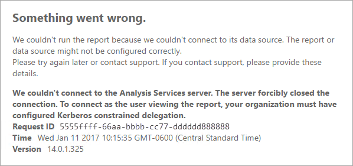
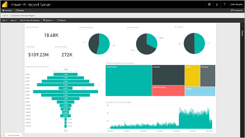

# Configure Kerberos to use Power BI reports

Learn how to configure your report server for Kerberos authentication to data sources used within your Power BI reports for a distributed environment.

Power BI Report Server includes the ability to host Power BI reports. Many data sources are supported by your report server. While this article focuses specifically on SQL Server Analysis Services, you can use the concepts and apply that to other data sources such as SQL Server.

You can install Power BI Report Server, SQL Server and Analysis Services on a single machine and everything should work without additional configuration. This is great for a test environment. You may hit errors if you have these services installed on separate machines which is called a distributed environment. In this environment, you are required to use Kerberos authentication. There is configuration required to implement this. 

Specifically, you will need to configure constrained delegation. You may have Kerberos configured in your environment but it may not be configured for constrained delegation.

## Error running report

If your report server is not configured properly, you may receive the following error.

```output
Something went wrong.

We couldn't run the report because we couldn't connect to its data source. The report or data source might not be configured correctly. 
```

Within Technical details, you will see the following message.

```output
We couldn't connect to the Analysis Services server. The server forcibly closed the connection. To connect as the user viewing the report, your organization must have configured Kerberos constrained delegation.
```



## Configuring Kerberos constrained delegation

There are several items that need to be configured in order for Kerberos constrained delegation to work. This includes Service Principal Names (SPN) and delegation settings on service accounts.

> [!NOTE]
> In order to configure SPNs and delegation settings, you need to be a domain administrator.
>
>

We will need to configure, or validate, the following.

1. Authentication type within Report Server config.
2. SPNs for the report server service account.
3. SPNs for the Analysis Services service.
4. SPNs for the SQL Browser service on the Analysis Services machine. This is for named instances only.
5. Delegation settings on the report server service account.

## Authentication type within Report Server configuration

We need to configure the authentication type for the report server to allow for Kerberos constrained delegation. This is done within the **rsreportserver.config** file. The default location for this file is `C:\Program Files\Microsoft Power BI Report Server\PBIRS\ReportServer`.

Within the rsreportserver.config file, you will want to fine the **Authentication/AuthenticationTypes** section.

We want to make sure that RSWindowsNegotiate is listed and the first in the list of authentication types. It should look similar to the following.

```xml
<AuthenticationTypes>
    <RSWindowsNegotiate/>
    <RSWindowsNTLM/>
</AuthenticationTypes>
```

If you had to change the configuration file, you will want to stop and start the report server to make sure the changes take effect.

For more information, see [Configure Windows Authentication on the Report Server](/sql/reporting-services/security/configure-windows-authentication-on-the-report-server).

## SPNs for the report server service account

Next, we need to make sure that the report server has valid SPNs available. This is based on the service account that is configured for the report server.

### Virtual Service Account or Network Service

If your report server is configured for the Virtual Service Account or Network Service account, you should not have to do anything. These are in the context of the machine account. The machine account will have HOST SPNs by default. These will cover the HTTP service and will be used by the report server.

If you are using a virtual server name, one that is not same as the machine account, the HOST entries will not cover you and you will need to manually add the SPNs for the virtual server host name.

### Domain user account

If your report server is configured to use a domain user account, you will have to manually create HTTP SPNs on that account. This can be done using the setspn tool that comes with Windows.

> [!NOTE]
> You will need domain admin rights in order to create the SPN.
>
>

It is recommended to create two SPNs. One with the NetBIOS name and the other with the fully qualified domain name (FQDN). The SPN will be in the following format.

```console
<Service>/<Host>:<port>
```

Power BI Report Server will use a Service of HTTP. For HTTP SPNs you will not list a port. The service we are interested in here is HTTP. The host of the SPN will be the name you use in a URL. Typically, this is the machine name. If you are behind a load balancer, this may be a virtual name.

> [!NOTE]
> You can verify the URL by either looking at what you enter into the address bar of the browser, or you can look in the Report Server Configuration Manager on the Web Portal URL tab.
>
>

If your machine name is ContosoRS, your SPNs would be the following.

| SPN Type | SPN |
| --- | --- |
| Fully Qualified Domain Name (FQDN) |HTTP/ContosoRS.contoso.com |
| NetBIOS |HTTP/ContosoRS |

### Location of SPN

So, where do you put the SPN? The SPN will be placed on whatever you are using for your service account. If you are using Virtual Service Account or Network Service, this will be the machine account. Although we mentioned before you should only need to do this for a virtual URL. If you are using a domain user for the report server service account, then you will place the SPN on that domain user account.

For example, if we are using the Network Service account and our machine name is ContosoRS, we would place the SPN on ContosoRS.

If we are using a domain user account of RSService, we would place the SPN on RSService.

### Using SetSPN to add the SPN

We can use the SetSPN tool to add the SPN. We will follow the same example as above with the Machine account and the domain user account.

Placing the SPN on a machine account, for both the FQDN and NetBIOS SPN, would look similar to the following if we were using a virtual URL of contosoreports.

```console
Setspn -a HTTP/contosoreports.contoso.com ContosoRS
Setspn -a HTTP/contosoreports ContosoRS
```

Placing the SPN on a domain user account, for both the FQDN and NetBIOS SPN, would look similar to the following if you were using the machine name for the host of the SPN.

```console
Setspn -S HTTP/ContosoRS.contoso.com RSService
Setspn -S HTTP/ContosoRS RSService
```

## SPNs for the Analysis Services service

The SPNs for Analysis Services are similar to what we did with Power BI Report Server. The format of the SPN is a little different if you have a named instance.

For Analysis Services, we use a Service of MSOLAPSvc.3. We will specify the instance name for the port location on the SPN. The host part of the SPN will either be the machine name, or the Cluster virtual name.

An example of an Analysis Services SPN would look like the following.

| Type | Format |
| --- | --- |
| Default instance |MSOLAPSvc.3/ContosoAS.contoso.com<br>MSOLAPSvc.3/ContosoAS |
| Named instance |MSOLAPSvc.3/ContosoAS.contoso.com:INSTANCENAME<br>MSOLAPSvc.3/ContosoAS:INSTANCENAME |

Placement of the SPN is also similar to what was mentioned with Power BI Report Server. It is based on the service account.  If you are using Local System or Network Service, you will be in the context of the machine account. If you are using a domain user account for the Analysis Services instance, you will place the SPN on the domain user account.

### Using SetSPN to add the SPN

We can use the SetSPN tool to add the SPN. For this example, the machine name will be ContosoAS.

Placing the SPN on a machine account, for both the FQDN and NetBIOS SPN, would look similar to the following.

```console
Setspn -S MSOLAPSvc.3/ContosoAS.contoso.com ContosoAS
Setspn -S MSOLAPSvc.3/ContosoAS ContosoAS
```

Placing the SPN on a domain user account, for both the FQDN and NetBIOS SPN, would look similar to the following.

```console
Setspn -S MSOLAPSvc.3/ContosoAS.contoso.com OLAPService
Setspn -S MSOLAPSvc.3/ContosoAS OLAPService
```

## SPNs for the SQL Browser service

If you have an Analysis Services named instance, you also need to make sure you have an SPN for the browser service. This is unique to Analysis Services.

The SPNs for SQL Browser are similar to what we did with Power BI Report Server.

For SQL Browser, we use a Service of MSOLAPDisco.3. We will specify the instance name for the port location on the SPN. The host part of the SPN will either be the machine name, or the Cluster virtual name.
You do not have to specify anything for the instance name or port.

An example of an Analysis Services SPN would look like the following.

```console
MSOLAPDisco.3/ContosoAS.contoso.com
MSOLAPDisco.3/ContosoAS
```

Placement of the SPN is also similar to what was mentioned with Power BI Report Server. The difference here is that SQL Browser always runs under the Local System account. This means that the SPNs will always go on the machine account. 

### Using SetSPN to add the SPN

We can use the SetSPN tool to add the SPN. For this example, the machine name will be ContosoAS.

Placing the SPN on the machine account, for both the FQDN and NetBIOS SPN, would look similar to the following.

```console
Setspn -S MSOLAPDisco.3/ContosoAS.contoso.com ContosoAS
Setspn -S MSOLAPDisco.3/ContosoAS ContosoAS
```

For more information, see [An SPN for the SQL Server Browser service is required](https://support.microsoft.com/kb/950599).

## Delegation settings on the report server service account

The last part that we have to configure are the delegation settings on the report server service account. There are different tools you can use to perform these steps. For the purposes of this document, we will stick with Active Directory Users and Computers.

You will need to start by going to the properties of the report server service account within Active Directory Users and Computers. This will either be the machine account, if you used Virtual Service Account or Network Service, or it will be a domain user account.

We will want to configure constrained delegation with protocol transiting. With constrained delegation, you need to be explicit with which services we want to delegate to. We will go and add both the Analysis Services service SPN and the SQL Browser SPN to the list that Power BI Report Server can delegate to.

1. Right click on the report server service account and select **Properties**.
2. Select the **Delegation** tab.
3. Select **Trust this computer for delegation to specified services only**.
4. Select **Use any authentication protocol**.
5. Under the **Services to which this account can present delegated credentials**: select **Add**.
6. In the new dialog, select **Users or Computers**.
7. Enter the service account for the Analysis Services service and select **Ok**.
8. Select the SPN that you created. It will begin with `MSOLAPSvc.3`. If you added both the FQDN and the NetBIOS SPN, it will select both. You may only see one.
9. Select **OK**.  You should see the SPN in the list now.
10. Optionally, you can select **Expanded** to show both the FQDN and NetBIOS SPN in the list.
11. Select **Add** again. We will add the SQL Browser SPN now.
12. In the new dialog, select **Users or Computers**.
13. Enter the Machine name for the machine the SQL Browser service is on and select **Ok**.
14. Select the SPN that you created. It will begin with `MSOLAPDisco.3`. If you added both the FQDN and the NetBIOS SPN, it will select both. You may only see one.
15. Select **Ok**. The dialog should look similar to the following if you checked **Expanded**.

    
16. Select **Ok**.
17. Reboot the Power BI Report Server.

## Running a Power BI Report

After all of the above configuration is in place, your report should display properly. 



While this configuration should work in most cases, with Kerberos, there can be different configuration depending on your environment. If the report will still not load, you will want to reach out to your domain administrator to investigate further or contact support.

## Related content

- [Administrator overview](admin-handbook-overview.md)  
- [Install Power BI Report Server](install-report-server.md)  

More questions? [Try asking the Power BI Community](https://community.powerbi.com/)
