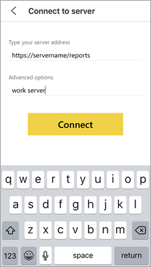

# Configure Power BI iOS mobile app access to a report server remotely

In this article, learn how to use your organization's MDM tool to configure Power BI iOS mobile app access to a report server. To configure it, IT administrators create an app configuration policy with the required information to be pushed to the app. 

 With the report server connection already configured, Power BI iOS mobile app users can connect to their organization's report server more easily. 

## Create the app configuration policy in MDM tool 

As admin, here are the steps you follow in Microsoft Intune to create the app configuration policy. The steps and experience of building the app configuration policy may be different in other MDM tools. 

1. Connect your MDM tool. 
2. Create and name a new app configuration policy. 
3. Choose which users to distribute this app configuration policy to. 
4. Create key-value pairs. 

The following table spells out the pairs.

|Key  |Type  |Description  |
|---------|---------|---------|
| com.microsoft.powerbi.mobile.ServerURL | String | Report Server URL   Should start with http/https |
| com.microsoft.powerbi.mobile.ServerUsername | String | [optional]   The username to use for connecting the server.   If one does not exist, the app prompts the user to type the username for the connection.| 
| com.microsoft.powerbi.mobile.ServerDisplayName | String | [optional]   Default value is “Report server”   A friendly name used in the app to represent the server | 
| com.microsoft.powerbi.mobile.OverrideServerDetails | Boolean | Default value is True  When set to “True”, it overrides any Report Server definition already in the mobile device. Existing servers that are already configured are deleted.   Override set to True also prevents the user from removing that configuration.   Set to “False” adds the pushed values, leaving any existing settings.   If the same server URL is already configured in the mobile app, the app leaves that configuration as is. The app doesn't ask the user to reauthenticate  for the same server. |

Here's an example of setting the configuration policy using Intune.

## End users connecting to a report server

 Say you publish the app configuration policy for a distribution list. When users and devices on that distribution list start the iOS mobile app, they have the following experience. 

1. They see a message that their mobile app is configured with a report server, and tap **Sign in**.

    

2.  On the **Connect to server** page, the report server details already filled in. They tap **Connect**.

    

3. They type a password to authenticate, then tap **Sign in**. 

    

Now they can view and interact with KPIs and Power BI reports stored on the report server.

## Next steps
[Administrator overview](admin-handbook-overview.md)  
[Install Power BI Report Server](install-report-server.md)  

More questions? [Try asking the Power BI Community](https://community.powerbi.com/)

