# Use Web Application Proxy and Active Directory Federated Services - Power BI Report Server

This article discusses how to use Web Application Proxy (WAP) and Active Directory Federated Services (AD FS) to connect to Power BI Report Server, and SQL Server Reporting Services (SSRS) 2016 and later. Through this integration, users who are away from the corporate network can access their Power BI Report Server and Reporting Services reports from their client browsers and be protected by AD FS preauthentication. For the Power BI mobile apps, you also need to [configure OAuth to connect to Power BI Report Server and SSRS](../consumer/mobile/mobile-oauth-ssrs.md).

> [!NOTE]
> The configuration described in this article is no longer the preferred method of connecting to Power BI Report Server and SQL Server Reporting Services (SSRS) 2016 and later. Configure the connection using using Microsoft Entra application proxy instead, as described in [Configure Power BI Report Server with Microsoft Entra application proxy](./azure-application-proxy.md)

## Prerequisites

### Domain Name Services (DNS) configuration

- Determine the public URL that the user will connect to. It may look similar to this example: `https://reports.contosolab.com`.
- Configure your DNS record for the host name, `reports.contosolab.com`, for example, to point to the public IP address of the Web Application Proxy (WAP) server.
- Configure a public DNS record for your AD FS server. For example, you may have configured the AD FS server with the following URL: `https://adfs.contosolab.com`.
- Configure your DNS record to point to the public IP address of the Web Application Proxy (WAP) server, for example `adfs.contosolab.com`. It's published as part of the WAP application.

### Certificates

You need to configure certificates for both the WAP application and the AD FS server. Both of these certificates must be part of a valid certificate authority that your machines recognize.

## 1. Configure the report server

We need to make sure that we have a valid Service Principal Name (SPN). The valid SPN enables the proper Kerberos authentication to occur and enables the report server for negotiate authentication.

### Service Principal Name (SPN)

The SPN is a unique identifier for a service that uses Kerberos authentication. Make sure you have a proper HTTP SPN present for your report server.

For information on how to configure the proper Service Principal Name (SPN) for your report server, see [Register a Service Principal Name (SPN) for a Report Server](/sql/reporting-services/report-server/register-a-service-principal-name-spn-for-a-report-server).

### Enabling negotiate authentication

To enable a report server to use Kerberos authentication, you need to configure the Authentication Type of the report server to be RSWindowsNegotiate. You configure it in the rsreportserver.config file.

```
<AuthenticationTypes>

    <RSWindowsNegotiate />

    <RSWindowsNTLM />

</AuthenticationTypes>
```

For more information, see [Modify a Reporting Services Configuration File](/sql/reporting-services/report-server/modify-a-reporting-services-configuration-file-rsreportserver-config) and [Configure Windows Authentication on a Report Server](/sql/reporting-services/security/configure-windows-authentication-on-the-report-server).

## 2. Configure Active Directory Federation Services (AD FS)

You need to configure AD FS on a Windows 2016 server within your environment. The configuration can be done through the Server Manager and selecting Add Roles and Features under Manage. For more information, see [Active Directory Federation Services](/windows-server/identity/active-directory-federation-services).

On the AD FS server, using AD FS Management App, complete these steps.

1. Right-click **Relying Party Trusts** > **Add Relying Party Trust**.

    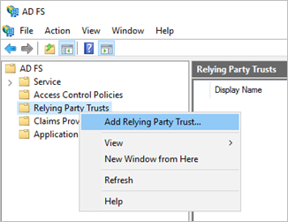

2. Follow the steps in **Add Relying Party Trust** wizard.

    Choose the **Non claims aware** option to use Windows Integrated security as the authentication mechanism.

    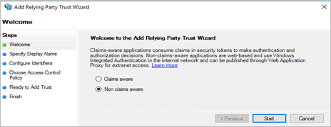

    Enter a name you prefer in the **Specify Display Name** and select **Next**.
    Add the Relying party trust identifier: `<ADFS\_URL>/adfs/services/trust`

    For example: `https://adfs.contosolab.com/adfs/services/trust`

    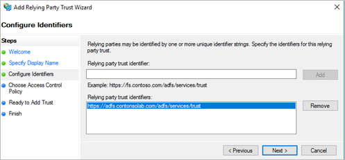

    Choose the **Access Control Policy** that fits your organization's needs, and select **Next**.

    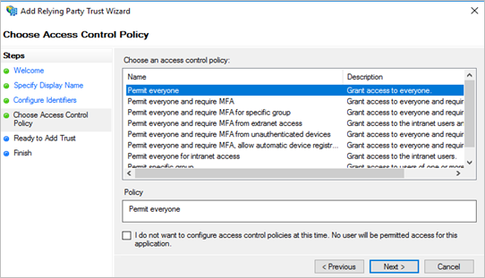
    
    Select **Next**, then select **Finish** to complete the **Add Relying Party Trust** wizard.

    When completed, the properties of the Relying Party Trusts should look like the following.

    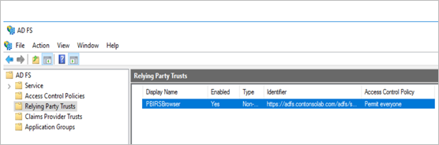

## 3. Configure Web Application Proxy (WAP)

You want to enable the Web Application Proxy (Role) Windows role on a server in your environment. It must be on a Windows 2016 server. For more information, see [Web Application Proxy in Windows Server 2016](/windows-server/remote/remote-access/web-application-proxy/web-application-proxy-windows-server) and [Publishing Applications using AD FS Preauthentication](/windows-server/remote/remote-access/web-application-proxy/Publishing-Applications-using-AD-FS-Preauthentication#BKMK_1.2).

### Configure constrained delegation

To transition from Forms authentication to Windows authentication, we need to use constrained delegation with protocol transitioning. This step is part of the Kerberos configuration. We already defined the report server SPN within the report server configuration.

We need to configure constrained delegation on the WAP Server machine account within Active Directory. You may need to work with a domain administrator if you don't have rights to Active Directory.

To configure constrained delegation, follow these steps.

1. On a machine that has the Active Directory tools installed, launch **Active Directory Users and Computers**.
2. Find the machine account for your WAP server. By default, it will be in the **Computers** container.
3. Right-click the WAP server and go to **Properties**.
4. On the **Delegation** tab, select **Trust this computer for delegation to specified services only** and then **Use any authentication protocol**.

    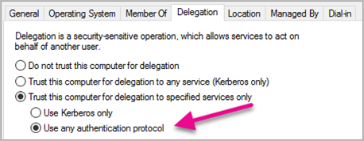

1. This option sets up constrained delegation for this WAP Server machine account. We then need to specify the services that this machine is allowed to delegate to.
2. Select **Add** under the services box.

    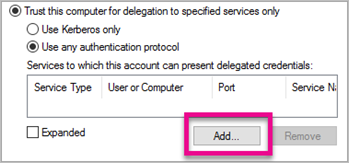

1. Select **Users or Computers**.
2. Enter the service account that you are using for the report server. This account is the same one you used to add the HTTP SPN in the earlier [report server configuration](#1-configure-the-report-server) section. 

3. Select the HTTP SPN for the report server, then select **OK**.

    > [!NOTE]
    > You may only see the NetBIOS SPN. It will actually select both the NetBIOS and FQDN SPNs, if they both exist.

1. When you select the **Expanded** check box, the result should look similar to the following example.

    

### Add WAP Application

1. On the Web Application Proxy server, open the **Remote Access Management** console and select **Web Application Proxy** in the Navigation pane. 

2. In the **Tasks** pane, select **Publish**.

2. On the Welcome page, select **Next**.

    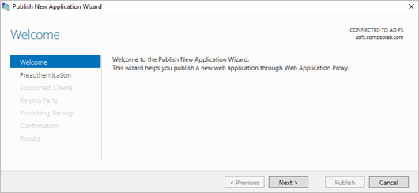

3. On the **Preauthentication** page, select **Active Directory Federation Services (AD FS)**, then select **Next**.

    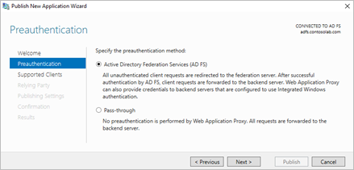

4. Select **Web and MSOFBA** preauthentication as we are going to set up just the Browser access for the report server, and not mobile app access.

    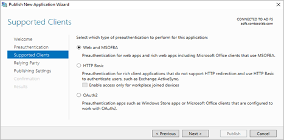

5. Add the **Relying Party** that we created in the AD FS server as shown below, then select **Next**.

    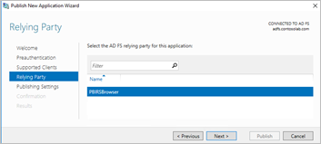

6. In the **External URL** section, put in the publicly accessible URL configured on the WAP server. Add the URL configured with the report server (Report Server Configuration Manager) as shown below in the **Backend Server URL** section. Add the SPN of the report server in the **Backend server SPN** section.

    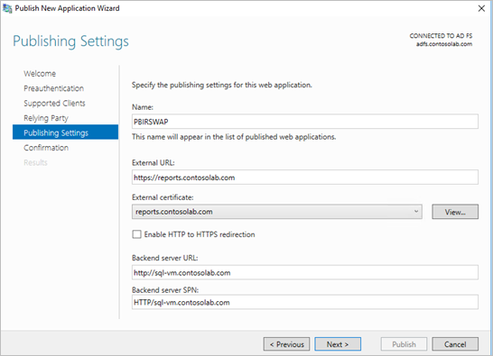

7. Select **Next** and **Publish**.
8. Run the following PowerShell command to validate the WAP configuration.

    ```
    Get-WebApplicationProxyApplication -Name "PBIRSWAP" | FL
    ```

    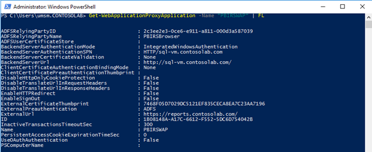

## Connect to the report server through the browser

You can then access the Public WAP URL, for example, `https://reports.contosolab.com/ReportServer` for the web service and `https://reports.contosolab.com/Reports` for the web portal from the browser. When you've authenticated successfully, you can view the reports.

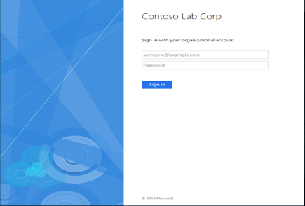

## Related content

- [Configure OAuth to connect to Power BI Report Server and SSRS](../consumer/mobile/mobile-oauth-ssrs.md)
- [What is Power BI Report Server?](get-started.md)  

More questions? [Try asking the Power BI Community](https://community.powerbi.com/)
