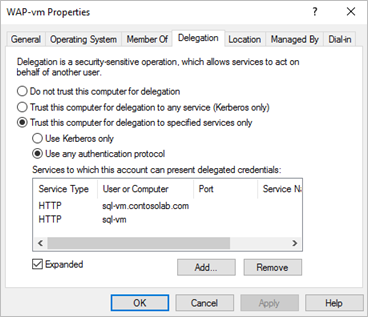

# Use Web Application Proxy and Active Directory Federated Services - Power BI Report Server

This article discusses how to use Web Application Proxy (WAP) and Active Directory Federated Services (AD FS) to connect to Power BI Report Server and SQL Server Reporting Services (SSRS) 2016 and later. Through this integration, users who are away from the corporate network can access their Power BI Report Server and Reporting Services reports from their client browsers and be protected by AD FS preauthentication.

## Prerequisites

### Domain Name Services (DNS) configuration

- The public URL that the user will connect to. For example, it may look similar to the following: `https://reports.contosolab.com`
- Configure your DNS record for the host name, `reports.contosolab.com`, for example to point to the public IP address of the Web Application Proxy (WAP) server.
- Configure a public DNS record for your AD FS server. For example, you may have configured the AD FS server with the following URL: `https://adfs.contosolab.com`.
- Configure your DNS record to point to the public IP address of the Web Application Proxy (WAP) server, for example `adfs.contosolab.com`. It's published as part of the WAP application.

### Certificates

You need to configure certificates for both the WAP application and the AD FS server. Both of these certificates must be part of a valid certificate authority that your machines recognize.

## Set up a report server with AD FS and WAP

### 1. Power BI Reporting Server configuration

We just need to make sure that we have a valid Service Principal Name (SPN) to enable the proper Kerberos authentication to occur and that the Power BI Reporting Services server is enabled for negotiate authentication.

#### Service Principal Name (SPN)

The SPN is a unique identifier for a service that uses Kerberos authentication. You need to make sure you have a proper HTTP SPN present for your report server.

For information on how to configure the proper Service Principal Name (SPN) for your report server, see [Register a Service Principal Name (SPN) for a Report Server](https://docs.microsoft.com/sql/reporting-services/report-server/register-a-service-principal-name-spn-for-a-report-server).

#### Enabling negotiate authentication

To enable a report server to use Kerberos authentication, you need to configure the Authentication Type of the report server to be RSWindowsNegotiate. You do it in the rsreportserver.config file.

\&lt;AuthenticationTypes\&gt;

    \&lt;RSWindowsNegotiate /\&gt;

    \&lt;RSWindowsNTLM /\&gt;

\&lt;/AuthenticationTypes\&gt;

For more information, see [Modify a Reporting Services Configuration File](https://docs.microsoft.com/sql/reporting-services/report-server/modify-a-reporting-services-configuration-file-rsreportserver-config) and [Configure Windows Authentication on a Report Server](https://docs.microsoft.com/sql/reporting-services/security/configure-windows-authentication-on-the-report-server).

### 2. Active Directory Federation Services (AD FS) Configuration

You need to configure AD FS on a Windows 2016 server within your environment. The configuration can be done through the Server Manager and selecting Add Roles and Features under Manage. For more information, see [Active Directory Federation Services](https://docs.microsoft.com/windows-server/identity/active-directory-federation-services).

On the AD FS server, using AD FS Management App complete these steps:

- Right-click Relying Party trust > Add Relying Party trust:

    

- Perform the following steps in **Add Relying Party Trust** wizard:
- Choose **Non-Claims aware** option in order to use Windows Integrated security as the authentication mechanism

    

- Enter a name you prefer in the **Specify Display Name** and select **Next**.
- Add the Relying party trust identifier: 
    \&lt;ADFS\_URL\&gt;/adfs/services/trust  
    For example: `https://adfs.contosolab.com/adfs/services/trust`

    

- Choose the **Access Control Policy** that fits your organization's needs.

    

- Select **Next**.
- Select **Next**.
- When completed, the properties of the Relying Party Trusts should look like the following.

    

### 3. Web Application Proxy (WAP) Configuration

You want to enable the Web Application Proxy (Role) Windows role on a server in your environment. It must be on a Windows 2016 server. For more information, see [Web Application Proxy in Windows Server 2016](https://docs.microsoft.com/windows-server/remote/remote-access/web-application-proxy/web-application-proxy-windows-server) and [Publishing Applications using AD FS Preauthentication](https://docs.microsoft.com/windows-server/remote/remote-access/web-application-proxy/Publishing-Applications-using-AD-FS-Preauthentication).

### Constrained delegation configuration

In order to transition from Forms authentication to Windows authentication, we need to use constrained delegation with protocol transitioning. This is part of the Kerberos configuration. We already defined the Reporting Services SPN within the Reporting Services configuration.

We need to configure constrained delegation on the WAP Server machine account within Active Directory. You may need to work with a domain administrator if you don't have rights to Active Directory.

To configure constrained delegation, follow these steps.

1. On a machine that has the Active Directory tools installed, launch **Active Directory Users and Computers**.
2. Find the machine account for your WAP server. By default, it will be in the computers container.
3. Right-click the WAP server and go to **Properties**.
4. Select the **Delegation** tab.
5. Select **Trust this computer for delegation to specified services only** and then **Use any authentication protocol**.

    

1. This sets up constrained delegation for this WAP Server machine account. We then need to specify the services that this machine is allowed to delegate to.
2. Select **Add** under the services box.

    

1. Select **Users or Computers**.
2. Enter the service account that you are using for Power BI Reporting Services. This account is the account you added the SPN to, within the Power BI Reporting Services configuration.
3. Select the SPN for Reporting Services and then select **OK**.

    > [!NOTE]
    > You may only see the NetBIOS SPN. It will actually select both the NetBIOS and FQDN SPNs if they both exist.

1. The result should look similar to the following when the **Expanded** checkbox is checked.

    

#### Add WAP Application

- Open Remote Access Management console and select the **Publish** option to a publish a new Web Application Proxy:

    

- Select **Next**
- Choose AD FS preauthentication method as shown below and select **Next**:

    

- Select **Web and MSOFBA** preauthentication as we are going to set up just the Browser access for Power BI Report Server and not mobile app access

    

- Add the Relying Party that we created in the AD FS server as shown below and Select Next:

    

- In the **External URL** section, put in the Publicly accessible URL configured on the WAP server and add the URL configured with Power BI Report Server (Report Server Configuration Manager) as shown below in the Backend Server URL section. Add the SPN of the report server in the **Backend server SPN** section:

    

- Select **Next** and **Publish** once done
- Run the following PowerShell command to validate the WAP configuration:

    ```
    Get-WebApplicationProxyApplication &quot;PBIRSBrowser&quot; | FL
    ```

    

## Connecting with PBIRS through the browser

You can then access the Public WAP URL `https://reports.contosolab.com/ReportServer` for the web service and `https://reports.contosolab.com/Reports` for the web portal from the browser and view the reports on successful authentication:


## Next steps
* [What is Power BI Report Server?](get-started.md)  

More questions? [Try asking the Power BI Community](https://community.powerbi.com/)

