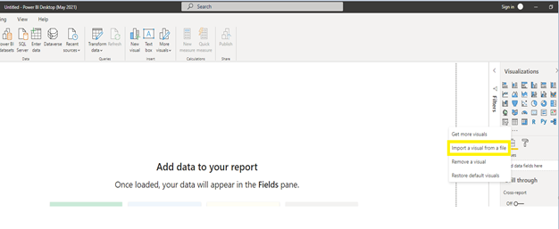
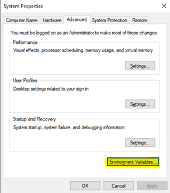

# Troubleshoot custom visuals in Power BI Desktop for Power BI Report Server

This article discusses resources available to troubleshoot issues with custom visuals in Power BI Desktop for Power BI Report Server.

## The issue

In Power BI desktop for Power BI Report Server, when adding a custom visual from local file, the visual keeps loading and doesn’t show up:

The above-mentioned behavior would be encountered in one of the following scenarios:

1. When the machine that has Power BI Desktop for Power BI Report Server is not connected to internet.
2. When the Power BI Desktop for Power BI Report Server machine’s network device blocks access to `pbivisuals.powerbi.com`.

## Loading custom visuals

You can use one of the following solutions to get the custom visual to load in Power BI Desktop for Power BI Report Server:

1. Ensure that the Power BI Desktop for Power BI Report Server desktop machine is connected to internet.

2. If the machine is connected to internet but you still encounter the behavior, check if the URL `https://pbivisuals.powerbi.com/` has been blocked Whitelist the URL to get the visual to load.

3. If the machine is not allowed internet access, perform the following step:
Configure the Environment variable under “Advanced System settings” as shown below:

Add `PBI_userFavoriteResourcePackagesEnabled` to environment variables and set it to `0`.

After making the above-mentioned change, restart Power BI Desktop for Power BI Report Server and try loading a custom visual.

## Why this happens

When importing the local copy of the visual, Power BI Desktop for Power BI Report Server tries to connect to internet and load the updated visual which results in this behavior. Specifically, Power BI Desktop for Power BI Report Server needs to connect to `https://pbivisuals.powerbi.com:443` to get the latest copy of the visuals but fails with the following error:
`DNS Lookup for "pbivisuals.powerbi.com" failed. The system reports that no network connection is available. 
System.Net.Sockets.SocketException No such host is known`. To get around the issue, you can use one of the action items mentioned above.

>[!NOTE]
>After implementing the action item of configuring the environment variable (action item 3), you might still encounter a few seconds delay before the visual gets loaded in Power BI Desktop for Power BI Report Server. This delay is encountered because Power BI Desktop for Power BI Report Server tries to fetch the updated copy of the visual from internet and after a retry period, displays the local copy of the custom visual after failing to connect to internet. This could result in a 20 to 30 second delay.

More questions? [Try asking the Power BI Community](https://community.powerbi.com/)
