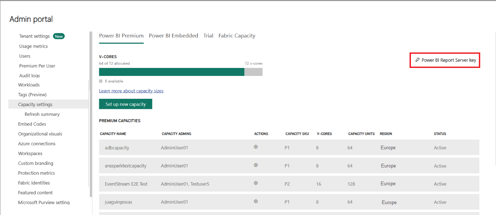
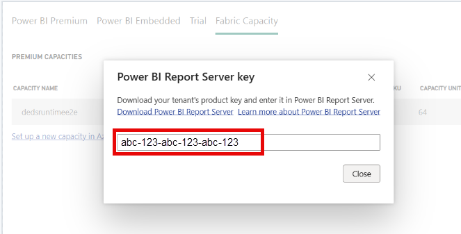

# How to find your report server product key
Learn how you can find your Power BI Report Server product key to install your server in a production environment.

> [!NOTE]  
> This video might use earlier versions of Power BI Desktop or the Power BI service.

<iframe width="640" height="360" src="https://www.youtube.com/embed/6CQnf-NGtpU?rel=0&amp;showinfo=0" frameborder="0" allowfullscreen></iframe>

You downloaded Power BI Report Server, and you have a SQL Server Enterprise Software Assurance agreement. Or, you purchased Power BI Premium. You want to install the server in a production environment, but you need a product key in order to do that. Where is the product key? The product key will be in one of two places depending on what you purchased.

> [!NOTE]
> If you’re using a subscription license for SQL Server that also grants use rights to Power BI Report Server, submit a support request through the software portal you normally use to get assistance for this scenario.
> 

## Purchased Power BI Premium
If you have purchased Power BI Premium, within the **Capacity settings** tab of the Power BI admin portal, you will have access to your Power BI Report Server product key. This will only be available for Global Admins or users assigned the Power BI service administrator role.

Selecting **Power BI Report Server key** will display a dialog contain your product key. You can copy it and use it with the installation.

## Purchased Software Assurance agreement
If you have a SQL Server Enterprise SA agreement, you can get your product key from the [Volume Licensing Service Center](https://www.microsoft.com/Licensing/servicecenter/). Look under the latest service pack, for the latest version of SQL Server. If you don't see it there, look under the RTM release of the latest SQL Server version.

> [!NOTE]
> You need to look under the download section. Not the keys section.
> 
> 

 
## Next steps
[Install Power BI Report Server](install-report-server.md)  
[Install Power BI Desktop for Power BI Report Server](install-powerbi-desktop.md)  
[Download Report Builder](https://www.microsoft.com/download/details.aspx?id=53613)  
[Download SQL Server Data Tools (SSDT)](/sql/ssdt/download-sql-server-data-tools-ssdt)

More questions? [Try asking the Power BI Community](https://community.powerbi.com/)
