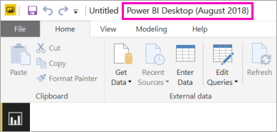

# Install Power BI Desktop optimized for Power BI Report Server
Learn how to install Power BI Desktop optimized for Power BI Report Server.

To create Power BI reports for Power BI Report Server, you need to download and install Power BI Desktop optimized for Power BI Report Server. This release is different from the Power BI Desktop used with the Power BI service. For example, the version of Power BI Desktop for the Power BI service includes preview features that aren't available in the Power BI Report Server version until after they're released. Using this release makes sure that the report server can interact with a known version of the reports and model. 

The good news is that you can install Power BI Desktop and Power BI Desktop optimized for Power BI Report Server side by side on the same computer.

## Download and install Power BI Desktop

The easiest way to be sure you have the most up-to-date version of Power BI Desktop optimized for Power BI Report Server is to start from the web portal of your report server.

1. In the report server web portal, select the **Download** arrow > **Power BI Desktop**.

    

    Or you can go directly to [Microsoft Power BI Desktop](https://www.microsoft.com/download/details.aspx?id=57271) (Optimized for Power BI Report Server - August 2018) in the Microsoft Download Center.

2. In the Download Center page, select **Download**.

3. Depending on your computer, select: 

    - **PBIDesktopRS.msi** (the 32-bit version) or

    - **PBIDesktopRS_x64.msi** (the 64-bit version).

1. After you download the installer, run the Power BI Desktop (August 2018) Setup Wizard.

2. At the end of the installation, check **Start Power BI Desktop now**.
   
    It starts automatically and you're ready to go.

## Verify you are using the correct version
You can verify that you are using the correct Power BI Desktop by looking at the launch screen or title bar within Power BI Desktop. The title bar indicates the release month and year of the release.

The Power BI Desktop version for the Power BI service doesn't have the month and year in the title bar.

## File extension association
If you installed both Power BI Desktop and Power BI Desktop optimized for Power BI Report Server on the same machine, the last install of Power BI Desktop will have the file association with .pbix. This means that when you double click on a pbix file, it will launch the Power BI Desktop that was last installed.

If you had Power BI Desktop and then installed Power BI Desktop optimized for Power BI Report Server, all pbix files will open in Power BI Desktop optimized for Power BI Report Server by default. If you would rather Power BI Desktop be the default to launch when opening a pbix file, reinstall Power BI Desktop from the Power BI service.

You can always open the version of Power BI Desktop you want to use first. And then open the file from within Power BI Desktop.

Editing a Power BI report from within Power BI Report Server, or creating a new Power BI report from the web portal, will always open the correct version of Power BI Destop.

## Considerations and limitations
Power BI reports in Power BI Report Server, in the Power BI service (http://app.powerbi.com), and in the Power BI mobile apps act almost exactly the same, but a few features are different.

### In a browser
Power BI Report Server reports support all visualizations, including:

* Custom visuals

Power BI Report Server reports don’t support:

* R visuals
* ArcGIS maps
* Breadcrumbs
* Power BI Desktop preview features

### In the Power BI mobile apps
Power BI Report Server reports support all the basic functionality in the [Power BI mobile apps](../consumer/mobile/mobile-apps-for-mobile-devices.md), including:

* [Phone report layout](../desktop-create-phone-report.md): You can optimize a report for the Power BI mobile apps. On your mobile phone, optimized reports have a special icon, , and layout.
  
    

Power BI Report Server reports don’t support these features in the Power BI mobile apps:

* R visuals
* ArcGIS maps
* Custom visuals
* Breadcrumbs
* Geofiltering or bar codes

## Power BI Desktop for earlier versions of Power BI Report Server

If your report server is an earlier version, you need the corresponding version of Power BI Desktop. Hre are the two previous versions.

- Microsoft Power BI Desktop ([Optimized for Power BI Report Server - October 2017](https://www.microsoft.com/download/details.aspx?id=56136))
- Microsoft Power BI Desktop ([Optimized for Power BI Report Server - June 2017](https://www.microsoft.com/download/details.aspx?id=55330))

## Next steps
Now that you have Power BI Desktop installed, you can start creating Power BI reports.

[Create a Power BI report for Power BI Report Server](quickstart-create-powerbi-report.md)  
[What is Power BI Report Server?](get-started.md)

More questions? [Try asking the Power BI Community](https://community.powerbi.com/)

