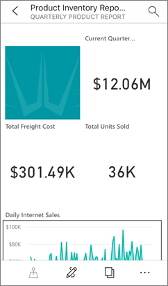

# Install Power BI Desktop for Power BI Report Server

To create Power BI reports for Power BI Report Server, you need to download and install the version of Power BI Desktop that's optimized for Power BI Report Server. This release is different from the Power BI Desktop used with the Power BI service. For example, the version of Power BI Desktop for the Power BI service includes preview features. Those features aren't in the Power BI Report Server version until they're generally available. Other features require Power BI service environment and are [unavailable in the Power BI Report Server](./compare-report-server-service.md). Using this release makes sure that the report server can interact with a known version of the reports and model. 

Not to worry. You can install Power BI Desktop, and Power BI Desktop for Power BI Report Server, side by side on the same computer.

## Download and install Power BI Desktop

The easiest way to be sure you have the most up-to-date version of Power BI Desktop for Power BI Report Server is to start from the web portal of your report server.

1. In the report server web portal, select the **Download** arrow > **Power BI Desktop**.

    

    Or go to the [Power BI Report Server](https://powerbi.microsoft.com/report-server/) home page and select **Advanced download options**.

2. In the Download Center page, select a language, then select **Download**.

3. Depending on your computer, select: 

    - **PBIDesktopRS.msi** (the 32-bit version) or
    - **PBIDesktopRS_x64.msi** (the 64-bit version).

1. After you download the installer, run the Power BI Desktop Setup Wizard.

2. At the end of the installation, select **Launch Power BI Desktop**.

    It starts automatically and you're ready to go.

> [!IMPORTANT]
> Power BI Desktop is not supported in Virtualized Environment (eg. Citrix). 

## Verify you're using the correct version
It's easy to verify that you're using the correct Power BI Desktop: Look at the launch screen or title bar within Power BI Desktop. You can tell you have the right version because **Power BI Desktop (January 2021)** or later is in the title bar. Also, the Power BI logo colors are reversed, yellow on black instead of black on yellow.

The version of Power BI Desktop for the Power BI service doesn't have the month and year in the title bar.

## File extension association
Say you've installed both Power BI Desktop and Power BI Desktop for Power BI Report Server on the same machine. Your most recent installation of Power BI Desktop has the file association with .pbix files. Thus, when you double-click a .pbix file, it launches the Power BI Desktop you installed most recently.

If you have Power BI Desktop and then install Power BI Desktop for Power BI Report Server, all .pbix files open in Power BI Desktop for Power BI Report Server by default. If you would rather have Power BI Desktop be the default to launch when opening a .pbix file, reinstall [Power BI Desktop from the Microsoft Store](https://aka.ms/pbidesktopstore).

You can always open the version of Power BI Desktop you want to use first. And then open the file from within Power BI Desktop.

Here's the safest way to always open the correct version of Power BI Desktop. Start editing a Power BI report from within Power BI Report Server, or create a new Power BI report from the Power BI service.

## Considerations and limitations

Power BI reports in Power BI Report Server, in the Power BI service (`https://app.powerbi.com`), and in the Power BI mobile apps act almost exactly the same, but a few features are different.

### Selecting a language

For Power BI Desktop for Power BI Report Server, you select the language when you install the app. You can't change it after, but you can install a version in another language.

> [!NOTE]
> Translations aren’t supported for Power BI reports in Power BI Report Server.

### Report visuals in a browser

Power BI Report Server reports support almost all visualizations, including Power BI visuals. Power BI Report Server reports don’t support:

* R visuals
* Breadcrumbs
* Power BI Desktop preview features

### Reports in the Power BI mobile apps

Power BI Report Server reports support all the basic functionality in the [Power BI mobile apps](../consumer/mobile/mobile-apps-for-mobile-devices.md), including:

* [Phone report layout](../create-reports/power-bi-create-mobile-optimized-report-about.md): You can optimize a report for the Power BI mobile apps. On your mobile phone, optimized reports have a special icon , and layout.
  
    

Power BI Report Server reports don’t support these features in the Power BI mobile apps:

* R visuals
* Power BI visuals
* Breadcrumbs
* Geo filtering or bar codes

### Custom Security

Power BI Desktop for Power BI Report Server does not support custom security. If your Power BI Report Server is configured with a custom security extension, you can't save a Power BI report from Power BI Desktop (optimized for Power BI Report Server) to the Power BI Report Server instance. You need to save the .pbix report file from Power BI Desktop and upload it to the Power BI Report Server portal site.

### Saving reports to a Power BI Report Server in a different domain

When you save a Power BI report to Power BI Report Server, your Windows credentials are used. Saving directly to a report server in a different domain to your Windows credentials is not supported. You can use a web browser to view the report server and manually upload the file from your machine instead.

## Related content

Now that you have Power BI Desktop installed, you can start creating Power BI reports.

- [Create a Power BI report for Power BI Report Server](quickstart-create-powerbi-report.md)  
- [What is Power BI Report Server?](get-started.md)

More questions? [Try asking the Power BI Community](https://community.powerbi.com/)
