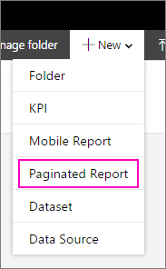

# Install Microsoft Report Builder - Power BI Report Server

Microsoft Report Builder is a stand-alone app, installed on your computer by you or an administrator. You can install it from the Microsoft Download Center or from Power BI Report Server.  

Looking for help with installing Report Builder for the Power BI service? See [Power BI Report Builder](../paginated-reports/report-builder-power-bi.md) instead.
  
An administrator typically installs and configures Power BI Report Server, grants permission to download Report Builder from the web portal, and manages folders and permissions to reports, and shared datasets saved to the report server. For more information about Power BI Report Server administration, see the [Admin overview, Power BI Report Server](admin-handbook-overview.md).  
  
## System requirements
  
 See the **System requirements** section of the [Report Builder download page](https://go.microsoft.com/fwlink/?LinkID=734968) on the Microsoft Download Center.
 
## Install Report Builder from a web portal
  
You can install Report Builder from a Power BI Report Server web portal. You may already have installed Report Builder to create reports for an SSRS server. You can use the same version or Report Builder to create reports for Power BI Report Server. If you haven't installed it, the process is easy.

1. In the Power BI Report Server web portal, select **New** > **Paginated Report**.
   
    
   
    If you don't have Report Builder installed already, the Microsoft Report Builder Wizard starts.  
  
3.  Accept the terms in the license agreement > **Next**.  
 
5.  Select **Install** to complete the installation of Report Builder.  

2. After it's installed, Report Builder opens to the **New Report or Dataset** screen.
   
    
 

##   Install Report Builder from the Download Center  
  
1.  On  the [Report Builder page of the Microsoft Download Center](https://go.microsoft.com/fwlink/?LinkID=734968) , select **Download**.  
  
2.  After Report Builder has finished downloading, select  **Run**.  
  
     The Microsoft Report Builder Wizard starts.  
  
3.  Accept the terms in the license agreement > **Next**.  
 
5.  Select **Install** to complete the installation of Report Builder.  
 

## Related content

- [What is Power BI Report Server?](get-started.md)
