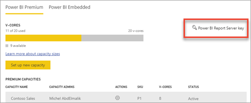
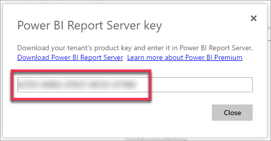
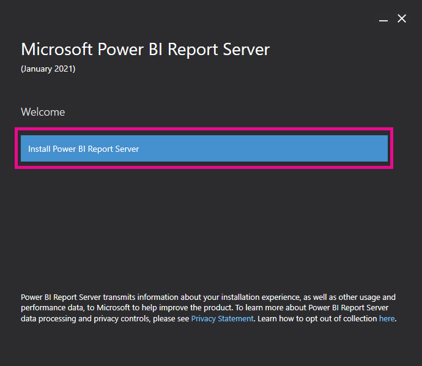
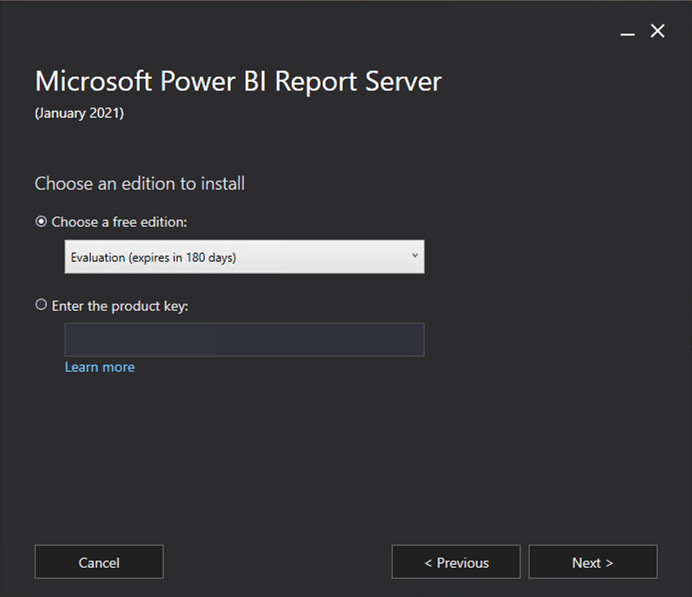
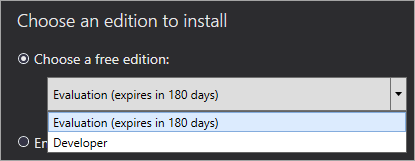
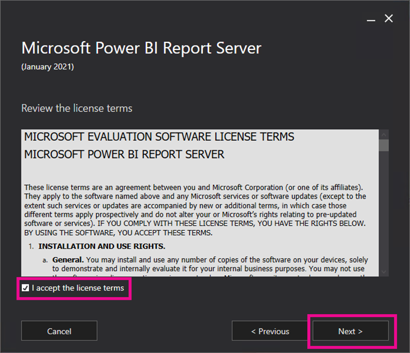
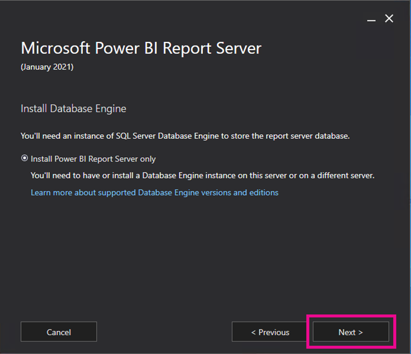
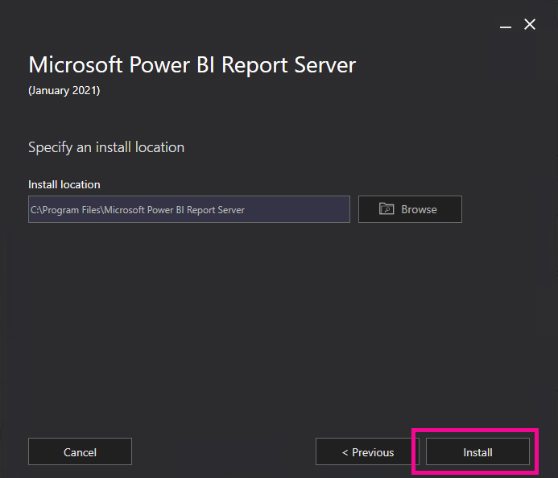
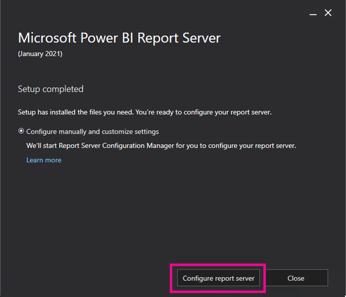
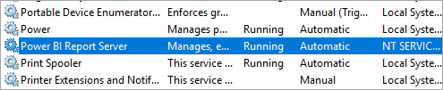

# Install Power BI Report Server

Learn how to install Power BI Report Server.

> [!TIP]
> Another option is to create a [virtual machine (VM) with a Power BI Report Server Enterprise Image](https://azuremarketplace.microsoft.com/marketplace/apps/microsoftpowerbi.pbirs?tab=overview) on Windows Server 2019 from Azure Marketplace.

## Download Power BI Report Server

On the [On-premises reporting with Power BI Report Server](https://powerbi.microsoft.com/report-server/) page, select **Download free trial**.

When you run the PowerBIReportServer.exe file, you select the free trial or you enter your product key. Read on for details.

## Before you install

Before you install Power BI Report Server, we recommend you review the [Hardware and Software Requirements for installing Power BI Report Server](system-requirements.md).

 > [!IMPORTANT]
 > While you can install Power BI Report Server in an environment that has a Read-Only Domain Controller (RODC), Power BI Report Server needs access to a Read-Write Domain Controller to function properly. If Power BI Report Server only has access to a RODC, you may encounter errors when trying to administer the service.

### Power BI Report Server product key

You can get the product key for Power BI Report Server from two different sources:

- Power BI Premium
- SQL Server Enterprise Software Assurance (SA)

Read on for details.

#### Power BI Premium / Fabric Capacity

If your organization has purchased Power BI Premium capacity, you can obtain the key for Power BI Report Server from the **Power BI Premium** tab in the admin portal. The key is only accessible to users with Global admin, Fabric admin, or PowerBI Premium capacity admin privileges.

Selecting **Power BI Report Server key** displays a dialog containing your product key. You can copy it and use it with the installation.

#### SQL Server Enterprise Software Assurance (SA)

If you have a SQL Server Enterprise SA agreement, you can get your product key from the [Volume Licensing Service Center](https://www.microsoft.com/Licensing/servicecenter/).

 > [!IMPORTANT]
 > When installing Power BI Report Server on multiple servers for a scale-out scenario, all servers must use the same Power BI Premium product key or SQL Server Enterprise Software Assurance (SA) product key.

## Install your report server

Installing Power BI Report Server is straightforward. There are only a few steps to install the files.

You don't need a SQL Server Database Engine server available at the time of install. You will need one to configure Reporting Services after install.

1. Find the location of PowerBIReportServer.exe and launch the installer.

2. Select **Install Power BI Report Server**.

    
3. Choose an edition to install and then select **Next**.

    

    Choose either Evaluation or Developer edition.

    

    Otherwise, enter the product key that you got from either the Power BI service or the Volume License Service Center. For more information about how to get your product key, see the [Before you install](#before-you-install) section above.
4. Read and agree to the license terms and conditions, then select **Next**.

    
5. You need a Database Engine available to store the report server database. Select **Next** to install the report server only.

    
6. Specify the install location for the report server. Select **Install** to continue.

    

    The default path is C:\Program Files\Microsoft Power BI Report Server.

7. After a successful setup, select **Configure Report Server** to launch the Reporting Services Configuration Manager.

    

## Configure your report server

After you select **Configure Report Server** in the setup, you're presented with Reporting Services Configuration Manager. For more information, see [Reporting Services Configuration Manager](/sql/reporting-services/install-windows/reporting-services-configuration-manager-native-mode).

To complete the initial configuration of Reporting Services, you [create a report server database](/sql/reporting-services/install-windows/ssrs-report-server-create-a-report-server-database). A SQL Server Database server is required to complete this step.

### Creating a database on a different server

If you're creating the report server database on a database server on a different machine, change the service account for the report server to a credential that is recognized on the database server. 

By default, the report server uses the virtual service account. If you try to create a database on a different server, you may receive the following error on the Applying connection rights step.

`System.Data.SqlClient.SqlException (0x80131904): Windows NT user or group '(null)' not found. Check the name again.`

To work around the error, you can change the service account to either Network Service or a domain account. Changing the service account to Network Service applies rights in the context of the machine account for the report server.

For more information, see [Configure the report server service account](/sql/reporting-services/install-windows/configure-the-report-server-service-account-ssrs-configuration-manager).

## Windows Service

A windows service is created as part of the installation. It is displayed as **Power BI Report Server**. The service name is **PowerBIReportServer**.

## Default URL reservations

URL reservations are composed of a prefix, host name, port, and virtual directory:

| Part | Description |
| --- | --- |
| Prefix |The default prefix is HTTP. If you previously installed a Secure Sockets Layer (SSL) certificate, Setup tries to create URL reservations that use the HTTPS prefix. |
| Host name |The default host name is a strong wildcard (+). It specifies that the report server accepts any HTTP request on the designated port for any host name that resolves to the computer, including `https://<computername>/reportserver`, `https://localhost/reportserver`, or `https://<IPAddress>/reportserver.` |
| Port |The default port is 80. If you use any port other than port 80, you have to explicitly add it to the URL when you open web portal in a browser window. |
| Virtual directory |By default, virtual directories are created in the format of ReportServer for the Report Server Web service and Reports for the web portal. For the Report Server Web service, the default virtual directory is **reportserver**. For the web portal, the default virtual directory is **reports**. |

An example of the complete URL string might be as follows:

* `https://+:80/reportserver` provides access to the report server.
* `https://+:80/reports` provides access to the web portal.

## Firewall

If you're accessing the report server from a remote machine, make sure you've configured any firewall rules if there is a firewall present.

Open up the TCP port that you've configured for your Web Service URL and Web Portal URL. By default, they're configured on TCP port 80.

## Additional configuration

* To configure integration with the Power BI service so you can pin report items to a Power BI dashboard, see [Integrate with the Power BI service](/sql/reporting-services/install-windows/power-bi-report-server-integration-configuration-manager).
* To configure email for subscriptions processing, see [E-Mail settings](/sql/reporting-services/install-windows/e-mail-settings-reporting-services-native-mode-configuration-manager) and [E-Mail delivery in a report server](/sql/reporting-services/subscriptions/e-mail-delivery-in-reporting-services).
* To configure the web portal so you can access it on a report computer to view and manage reports, see [Configure a firewall for report server access](/sql/reporting-services/report-server/configure-a-firewall-for-report-server-access) and [Configure a report server for remote administration](/sql/reporting-services/report-server/configure-a-report-server-for-remote-administration).
* For details on setting report server system properties in SQL Server Management Studio, see [Server Properties Advanced Page](/sql/reporting-services/tools/server-properties-advanced-page-reporting-services). Unless it specifies otherwise, the options apply to both Power BI Report Server and SQL Server Reporting Services.

## Related content

- [Administrator overview](admin-handbook-overview.md)  
- [How to find your report server product key](find-product-key.md)  
- [Install Power BI Desktop for Power BI Report Server](install-powerbi-desktop.md)  
- [Verify a Reporting Services installation](/sql/reporting-services/install-windows/verify-a-reporting-services-installation)  
- [Configure the report server service account](/sql/reporting-services/install-windows/configure-the-report-server-service-account-ssrs-configuration-manager)  
- [Configure report server URLs](/sql/reporting-services/install-windows/configure-report-server-urls-ssrs-configuration-manager)  
- [Configure a report server database connection](/sql/reporting-services/install-windows/configure-a-report-server-database-connection-ssrs-configuration-manager)  
- [Initialize a report server](/sql/reporting-services/install-windows/ssrs-encryption-keys-initialize-a-report-server)  
- [Configure SSL connections on a report server](/sql/reporting-services/security/configure-ssl-connections-on-a-native-mode-report-server)  
- [Configure windows service accounts and permissions](/sql/database-engine/configure-windows/configure-windows-service-accounts-and-permissions)  
- [Browser support for Power BI Report Server](browser-support.md)

More questions? [Try asking the Power BI Community](https://community.powerbi.com/)
