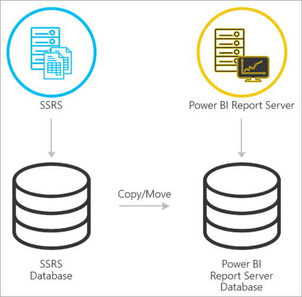
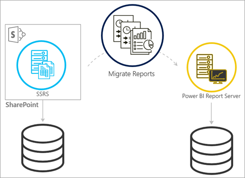
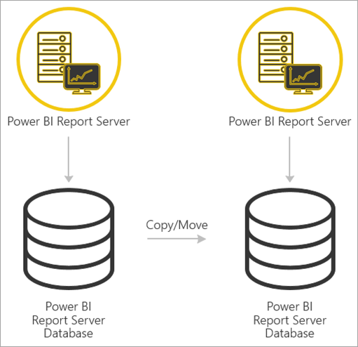

# Migrate a report server installation

Learn how to migrate your existing SQL Server Reporting Services (SSRS) instance to an instance of Power BI Report Server.

Migration is defined as moving application data files to a new Power BI Report Server instance. The following are common reasons why you might migrate your installation:

* You want to move from SQL Server Reporting Services to Power BI Report Server
  
  > [!NOTE]
  > There is not an inplace upgrade from SQL Server Reporting Services to Power BI Report Server. A migration is necessary.

* You have a large-scale deployment or update requirements
* You're changing the hardware or topology of your installation
* You encounter an issue that blocks upgrade

## Migrating to Power BI Report Server from SSRS (Native mode)

Migrating from an SSRS (Native mode) instance to Power BI Report Server consists of a few steps.



> [!NOTE]
> SQL Server 2008 Reporting Services and later are supported for migration.

* Backup database, application, and configuration files
* Back up the encryption key
* Clone your report server database hosting your reports
* Install Power BI Report Server. If you're using the same hardware, you can install Power BI Report Server on the same server as the SSRS instance. For more information on installing Power BI Report Server, see [Install Power BI Report Server](install-report-server.md).

> [!NOTE]
> The instance name for the Power BI Report Server will be *PBIRS*.

* Configure the report server using Report Server Configuration Manager and connect to the cloned database.
* Perform any cleanup needed for the SSRS (Native mode) instance

## Migration to Power BI Report Server from SSRS (SharePoint-integrated mode)

Migrating from an SSRS (SharePoint-integrated mode) to Power BI Report Server is not as straight forward as native mode. While these steps provide some guidance, you may have other files and assets within SharePoint that you need to manage outside of these steps.



You need to migrate the specific report server content from SharePoint to your Power BI Report Server. You need to have already installed Power BI Report Server somewhere in your environment. For more information on installing Power BI Report Server, see [Install Power BI Report Server](install-report-server.md).

If you want to copy the report server content from your SharePoint environment to Power BI Report Server, you need to use tools such as **rs.exe** to copy the content. Below is a sample of what the script would be to copy report server content from SharePoint to Power BI Report Server.

> [!NOTE]
> The sample script should work against SharePoint 2010 and later and SQL Server 2008 Reporting Services and later.

### Sample script

```
Sample Script
rs.exe
-i ssrs_migration.rss -e Mgmt2010
-s https://SourceServer/_vti_bin/reportserver
-v st="sites/bi" -v f="Shared Documents“
-u Domain\User1 -p Password
-v ts=https://TargetServer/reportserver
-v tu="Domain\User" -v tp="Password"
```

## Migrating from one Power BI Report Server to another

Migrating from one Power BI Report Server is the same process as migrating from SSRS (Native-mode).



* Backup database, application, and configuration files
* Back up the encryption key
* Clone your report server database hosting your reports

> [!NOTE]
> The name of the database must stay the same when restored to the Power BI Report Server.

* Install Power BI Report Server. You *can't* install Power BI Report Server on the same server as the one you're migrating from. For more information on installing Power BI Report Server, see [Install Power BI Report Server](install-report-server.md).

> [!NOTE]
> The instance name for the Power BI Report Server will be *PBIRS*.

* Configure the report server using Report Server Configuration Manager and connect to the cloned database.
* Perform any cleanup needed for the old Power BI Report Server installation.

## Related content

* [Administrator overview](admin-handbook-overview.md)  
* [Install Power BI Report Server](install-report-server.md)  
* [Script with the rs.exe Utility and the Web Service](/sql/reporting-services/tools/script-with-the-rs-exe-utility-and-the-web-service)

More questions? [Try asking the Power BI Community](https://community.powerbi.com/)
