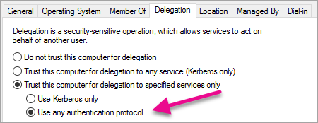

# Connect to Power BI Report Server and SSRS from Power BI mobile applications

This article discusses how to configure your environment to support OAuth authentication with the Power BI mobile app to connect to Power BI Report Server and SQL Server Reporting Services 2016 or later.

## Requirements

Windows Server is required for the Web Application Proxy (WAP) and Active Directory Federation Services (AD FS) servers. You don't need to have a Windows functional level domain.

In order for users to be able to add a report server connection to their Power BI mobile app, you must grant them access to the report server's home folder.

<a name="windows-server-upgrade-note"></a>
> [!NOTE]
> As of March 1st, 2025, the Power BI Mobile app will no longer be able to connect to Report Server through AD FS configured on Windows Server 2016. Customers who use OAuth with AD FS configured on Windows Server 2016 and Web Application Proxy (WAP) will have to upgrade their AD FS server to Windows Server 2019 or later, or use [Microsoft Entra application proxy](./microsoft-entra-application-proxy.md). After the Windows Server upgrade, Power BI Mobile app users may have to re-sign in to Report Server.
>
> This upgrade is necessitated by a change in the authentication library used by the mobile app. The change in no way affects Microsoft support for AD FS on Windows Server 2016, but rather only the ability of the Power BI Mobile app to connect to it.

## Domain Name Services (DNS) configuration

The public URL is the URL that the Power BI mobile app will connect to. For example, it might look similar to the following.

```https
https://reports.contoso.com
```

Your DNS record for **reports** to the public IP address of the Web Application Proxy (WAP) server. You also need to configure a public DNS record for your AD FS server. For example, you might have configured the AD FS server with the following URL.

```https
https://fs.contoso.com
```

Your DNS record for **fs** to the public IP address of the Web Application Proxy (WAP) server as it will be published as part of the WAP application.

## Certificates

You need to configure certificates for both the WAP application and the AD FS server. Both of these certificates must be part of a valid certificate authority that your mobile devices recognize.

## Reporting Services configuration

There isn't much to configure on the Reporting Services side. You just need to make sure that:
* There's a valid [Service Principal Name (SPN)](#service-principal-name-spn) to enable the proper Kerberos authentication to occur.
* The Reporting Services server is [enabled for negotiating authentication](#enabling-negotiate-authentication).
* Users have access to the report server's home folder.

### Service Principal Name (SPN)

The SPN is a unique identifier for a service that uses Kerberos authentication. You need to make sure you have a proper HTTP SPN present for your report server.

For information on how to configure the proper Service Principal Name (SPN) for your report server, see [Register a Service Principal Name (SPN) for a Report Server](/sql/reporting-services/report-server/register-a-service-principal-name-spn-for-a-report-server).

### Enabling negotiate authentication

To enable a report server to use Kerberos authentication, you need to configure the Authentication Type of the report server to be RSWindowsNegotiate. You do it in the rsreportserver.config file.

```xml
<AuthenticationTypes>  
    <RSWindowsNegotiate />  
    <RSWindowsKerberos />  
    <RSWindowsNTLM />  
</AuthenticationTypes>
```

For more information, see [Modify a Reporting Services Configuration File](/sql/reporting-services/report-server/modify-a-reporting-services-configuration-file-rsreportserver-config) and [Configure Windows Authentication on a Report Server](/sql/reporting-services/security/configure-windows-authentication-on-the-report-server).

## Active Directory Federation Services (AD FS) Configuration

You need to configure AD FS on a Windows server within your environment. The configuration can be done through the Server Manager and selecting Add Roles and Features under Manage. For more information, see [Active Directory Federation Services](/windows-server/identity/active-directory-federation-services).

> [!IMPORTANT]
> As of March 1st, 2025, the Power BI Mobile apps will no longer be able to connect to Report Server through AD FS configured on Windows Server 2016. See the [note](#windows-server-upgrade-note) at the beginning of this article.

### Create an application group

Within the AD FS Management screen, you want to create an application group for Reporting Services that includes information for the Power BI Mobile apps.

You can create the application group with the following steps.

1. Within the AD FS Management app, right-click **Application Groups** and select **Add Application Group…**

   

2. Within the Add Application Group Wizard, provide a **name** for the application group and select **Native application accessing a web API**.

   

3. Select **Next**.

4. Provide a **name** for the application you're adding. 

5. While the **Client ID** will be auto generated for your, enter in *484d54fc-b481-4eee-9505-0258a1913020* for both iOS and Android.

6. You want to add the following **Redirect URLs**:

   **Entries for Power BI Mobile – iOS:**  
   msauth://code/mspbi-adal://com.microsoft.powerbimobile  
   msauth://code/mspbi-adalms://com.microsoft.powerbimobilems  
   mspbi-adal://com.microsoft.powerbimobile  
   mspbi-adalms://com.microsoft.powerbimobilems

   **Android Apps only need the following steps:**  
   urn:ietf:wg:oauth:2.0:oob

   
7. Select **Next**.

8. Supply the URL for your Report Server. The URL is the external URL that will hit your Web Application Proxy. It should be in the following format.

   > [!NOTE]
   > This URL is case sensitive!

   `https://<report server url>/reports`

   
9. Select **Next**.

10. Choose the **Access Control Policy** that fits your organization's needs.

    

11. Select **Next**.

12. Select **Next**.

13. Select **Next**.

14. Select **Close**.

When completed, you should see the properties of your application group look similar to the following.


Now run the following PowerShell command on the AD FS server to ensure that token refresh is supported.

```powershell
Set-AdfsApplicationPermission -TargetClientRoleIdentifier '484d54fc-b481-4eee-9505-0258a1913020' -AddScope 'openid'
```

## Web Application Proxy (WAP) Configuration

You want to enable the Web Application Proxy (Role) Windows role on a server in your environment. It must be on a Windows server. For more information, see [Web Application Proxy in Windows Server](/windows-server/remote/remote-access/web-application-proxy/web-application-proxy-windows-server) and [Publishing Applications using AD FS Preauthentication](/windows-server/remote/remote-access/web-application-proxy/Publishing-Applications-using-AD-FS-Preauthentication#a-namebkmk14apublish-an-application-that-uses-oauth2-such-as-a-windows-store-app).

### Constrained delegation configuration

In order to transition from OAuth authentication to Windows authentication, we need to use constrained delegation with protocol transitioning. This is part of the Kerberos configuration. We already defined the Reporting Services SPN within the Reporting Services configuration.

We need to configure constrained delegation on the WAP Server machine account within Active Directory. You might need to work with a domain administrator if you don't have rights to Active Directory.

To configure constrained delegation, you want to do the following steps.

1. On a machine that has the Active Directory tools installed, launch **Active Directory Users and Computers**.

2. Find the machine account for your WAP server. By default, it is in the computers container.

3. Right-click the WAP server and go to **Properties**.

4. Select the **Delegation** tab.

5. Select **Trust this computer for delegation to specified services only** and then **Use any authentication protocol**.

   

   This sets up constrained delegation for this WAP Server machine account. We then need to specify the services that this machine is allowed to delegate to.

6. Select **Add…** under the services box.

   

7. Select **Users or Computers…**

8. Enter the service account that you're using for Reporting Services. This account is the account you added the SPN to within the Reporting Services configuration.

9. Select the SPN for Reporting Services and then select **OK**.

   > [!NOTE]
   > You may only see the NetBIOS SPN. It will actually select both the NetBIOS and FQDN SPNs if they both exist.

   

10. The result should look similar to the following when the **Expanded** checkbox is checked.

    

11. Select **OK**.

### Add WAP Application

While you can publish applications within the Report Access Management Console, we'll want to create the application via PowerShell. Here's the command to add the application.

```powershell
Add-WebApplicationProxyApplication -Name "Contoso Reports" -ExternalPreauthentication ADFS -ExternalUrl https://reports.contoso.com/ -ExternalCertificateThumbprint "0ff79c75a725e6f67e3e2db55bdb103efc9acb12" -BackendServerUrl https://ContosoSSRS/ -ADFSRelyingPartyName "Reporting Services - Web API" -BackendServerAuthenticationSPN "http/ContosoSSRS.contoso.com" -UseOAuthAuthentication
```

| Parameter | Comments |
| --- | --- |
| **ADFSRelyingPartyName** |The Web API name that you created as part of the Application Group within AD FS. |
| **ExternalCertificateThumbprint** |The certificate to use for the external users. It's important that the certificate is valid on mobile devices and come from a trusted certificate authority. |
| **BackendServerUrl** |The URL to the Report Server from the WAP server. If the WAP server is in a DMZ, you might need to use a fully qualified domain name. Make sure you can hit this URL from the web browser on the WAP server. |
| **BackendServerAuthenticationSPN** |The SPN you created as part of the Reporting Services configuration. |

### Setting Integrated Authentication for the WAP Application

After you add the WAP Application, you need to set the BackendServerAuthenticationMode to use IntegratedWindowsAuthentication. You need the ID from the WAP Application in order to set it.

```powershell
Get-WebApplicationProxyApplication "Contoso Reports" | fl
```


Run the following command to set the BackendServerAuthenticationMode using the ID of the WAP Application.

```powershell
Set-WebApplicationProxyApplication -id 30198C7F-DDE4-0D82-E654-D369A47B1EE5 -BackendServerAuthenticationMode IntegratedWindowsAuthentication
```


## Connecting with the Power BI Mobile App

Within the Power BI mobile app, you want to connect to your Reporting Services instance. To do that, supply the **External URL** for your WAP Application.


When you select **Connect**, you'll be directed to your AD FS sign-in page. Enter valid credentials for your domain.


After you select **Sign in**, you see the elements from your Reporting Services server.

## Multifactor authentication

You can enable multifactor authentication to enable additional security for your environment. To learn more, see [Configure Microsoft Entra multifactor authentication as authentication provider with AD FS](/windows-server/identity/ad-fs/operations/configure-ad-fs-and-azure-mfa).

## Troubleshooting

### You receive the error "Failed to sign in to SSRS server"


You can set up [Fiddler](https://www.telerik.com/fiddler) to act as a proxy for your mobile devices to see how far the request made it. To enable a Fiddler proxy for your phone device, you need to set up the [CertMaker for iOS and Android](https://www.telerik.com/fiddler/add-ons) on the machine running Fiddler. The add-on is from Telerik for Fiddler.

If the sign-in works successfully when using Fiddler, you might have a certificate issue with either the WAP application or the AD FS server. 

## Related content

* [Register a Service Principal Name (SPN) for a Report Server](/sql/reporting-services/report-server/register-a-service-principal-name-spn-for-a-report-server)  
* [Modify a Reporting Services Configuration File](/sql/reporting-services/report-server/modify-a-reporting-services-configuration-file-rsreportserver-config)  
* [Configure Windows Authentication on a Report Server](/sql/reporting-services/security/configure-windows-authentication-on-the-report-server)  
* [Active Directory Federation Services](/windows-server/identity/active-directory-federation-services)  
* [Web Application Proxy in Windows Server](/windows-server/remote/remote-access/web-application-proxy/web-application-proxy-windows-server)  
* [Publishing Applications using AD FS Preauthentication](/windows-server/remote/remote-access/web-application-proxy/Publishing-Applications-using-AD-FS-Preauthentication#a-namebkmk14apublish-an-application-that-uses-oauth2-such-as-a-windows-store-app)  
* [Configure Microsoft Entra multifactor authentication as authentication provider using AD FS](/windows-server/identity/ad-fs/operations/configure-ad-fs-and-azure-mfa)  
More questions? [Try the Power BI Community](https://community.powerbi.com/)
