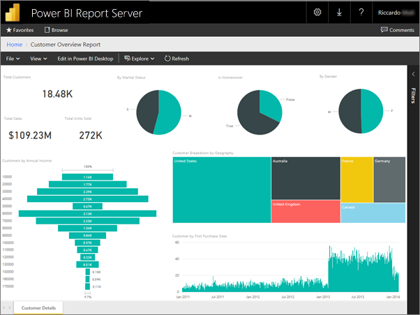
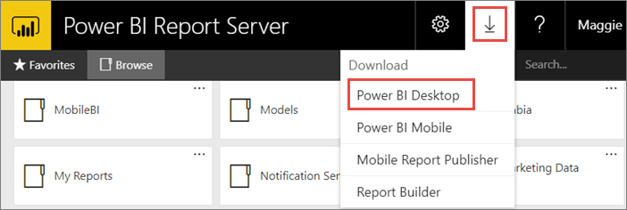
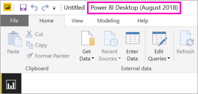
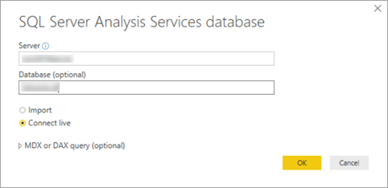
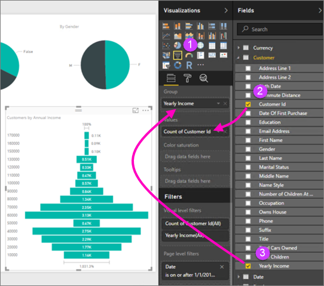
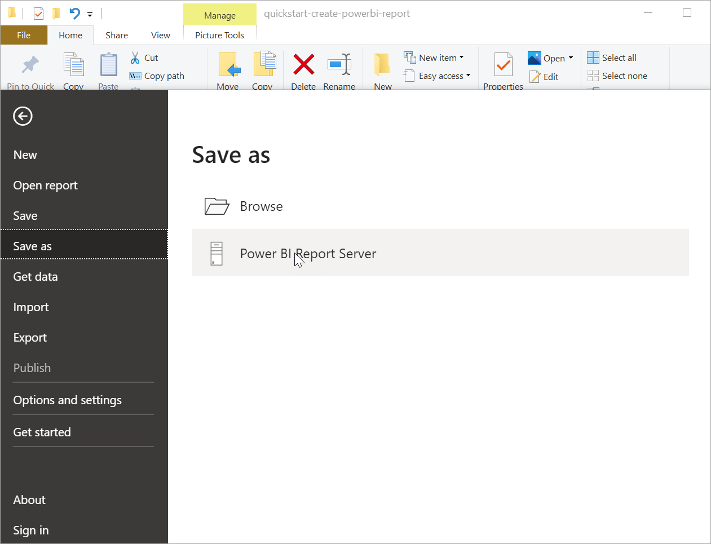

# Create a Power BI report for Power BI Report Server
You can store and manage Power BI reports on premises in the Power BI Report Server web portal, just as you can store Power BI reports in the cloud in the Power BI service (https://powerbi.com). You create and edit reports in Power BI Desktop, and publish them to the web portal. Then report readers in your organization can view them in a browser or in a Power BI mobile app on a mobile device.

Here are four quick steps to get you started.

## Step 1: Install Power BI Desktop optimized for Power BI Report Server

If you've already created Power BI reports in Power BI Desktop, then you're almost ready to create Power BI reports for Power BI Report Server. We recommend installing the version of Power BI Desktop optimized for Power BI Report Server so you know the server and the app are always in sync. You can have both versions of Power BI Desktop on the same computer.

1. In the report server web portal, select the **Download** arrow > **Power BI Desktop**.

    

    Or go directly to [Microsoft Power BI Desktop](https://www.microsoft.com/download/details.aspx?id=57271) (Optimized for Power BI Report Server - August 2018) in the Microsoft Download Center.

2. In the Download Center page, select **Download**.

3. Depending on your computer, select:

    - **PBIDesktopRS.msi** (the 32-bit version) or

    - **PBIDesktopRS_x64.msi** (the 64-bit version).

4. After you download the installer, run the Power BI Desktop (August 2018) Setup Wizard.

2. At the end of the installation, check **Start Power BI Desktop now**.
   
    It starts automatically and you're ready to go. You can tell you have the right version because "Power BI Desktop (August 2018)" is in the title bar.

    

3. If you're not familiar with Power BI Desktop, consider watching the videos on the welcome screen.
   
    

## Step 2: Select a data source
You can connect to a variety of data sources. Read more about [connecting to data sources](connect-data-sources.md).

1. From the welcome screen, select **Get Data**.
   
    Or on the **Home** tab, select **Get Data**.
2. Select your data source -- in this example, **Analysis Services**.
   
    
3. Fill in **Server**, and optionally, **Database**. Make sure **Connect live** is selected > **OK**.
   
    
4. Choose the report server where you'll save your reports.
   
    

## Step 3: Design your report
Here's the fun part: You get to create visuals that illustrate your data.

For example, you could create a funnel chart of customers and group values by yearly income.

1. In **Visualizations**, select **Funnel chart**.
2. Drag the field to be counted to the **Values** well. If it's not a numeric field, Power BI Desktop automatically makes it a *Count of* the value.
3. Drag the field to group on to the **Group** well.

Read much more about [designing a Power BI report](../desktop-report-view.md).

## Step 4: Save your report to the report server
When your report is ready, you save it to the Power BI Report Server you chose in Step 2.

1. On the **File** menu, select **Save as** > **Power BI Report Server**.
   
    
2. Now you can view it in the web portal.
   
    

## Next steps
### Power BI Desktop
There are so many great resources for creating reports in Power BI Desktop. This link is a good starting point.

* [Get started with Power BI Desktop](../desktop-getting-started.md)
* Guided learning: [Getting started with Power BI Desktop](../guided-learning/gettingdata.yml?tutorial-step=2)

### Power BI Report Server
* [Install Power BI Desktop optimized for Power BI Report Server](install-powerbi-desktop.md)  
* [What is Power BI Report Server?](get-started.md)  

More questions? [Try asking the Power BI Community](https://community.powerbi.com/)
