# Embed a Power BI Report Server report using an iFrame in SharePoint Server

In this article, you learn how to embed a Power BI Report Server report by using an iFrame in a SharePoint page. If you're working with SharePoint Online, Power BI Report Server must be publicly accessible. In SharePoint Online, the Power BI Web part that works with the Power BI service won't work with Power BI Report Server.  

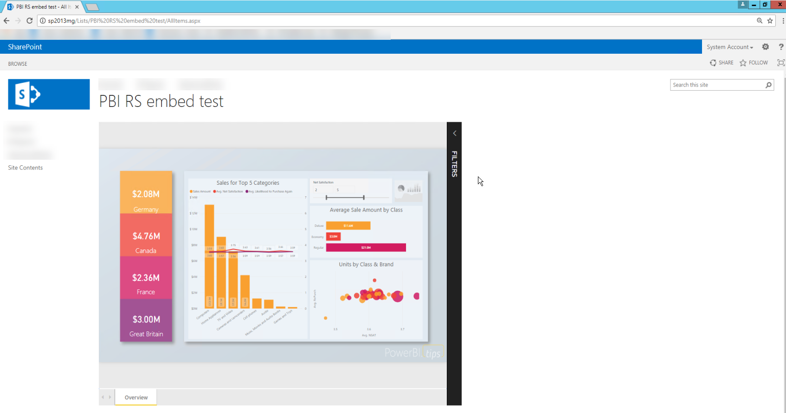

## Prerequisites
* [Power BI Report Server](https://powerbi.microsoft.com/report-server/) installed and configured.
* [Power BI Desktop for Power BI Report Server](install-powerbi-desktop.md) installed.
* A [SharePoint Server 2013, 2016, 2019, or Subscription Edition environment](/sharepoint/install/install) installed and configured.
* Internet Explorer 11 is only supported if the document mode is set to IE11 (Edge) mode or when using SharePoint Online. You may use other supported browsers with SharePoint on-premises and SharePoint Online.

## Create the Power BI report URL

1. Download the sample from GitHub: [Blog Demo](https://github.com/Microsoft/powerbi-desktop-samples). Select **Clone or download**, and then select **Download ZIP**.

    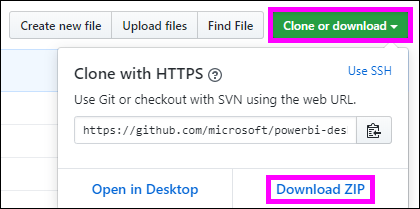

2. Unzip the file, and open the sample .pbix file in Power BI Desktop for Power BI Report Server.

    

3. Save the report to the **Power BI Report Server**. 

    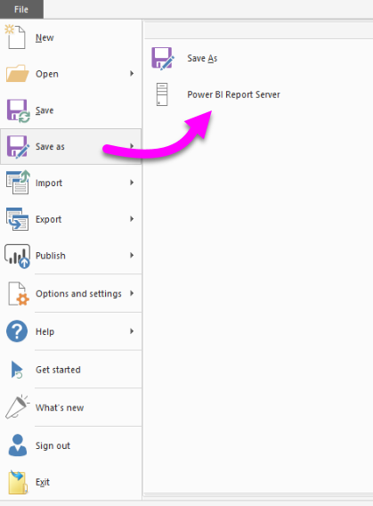

4. View report in the Power BI Report Server web portal.

    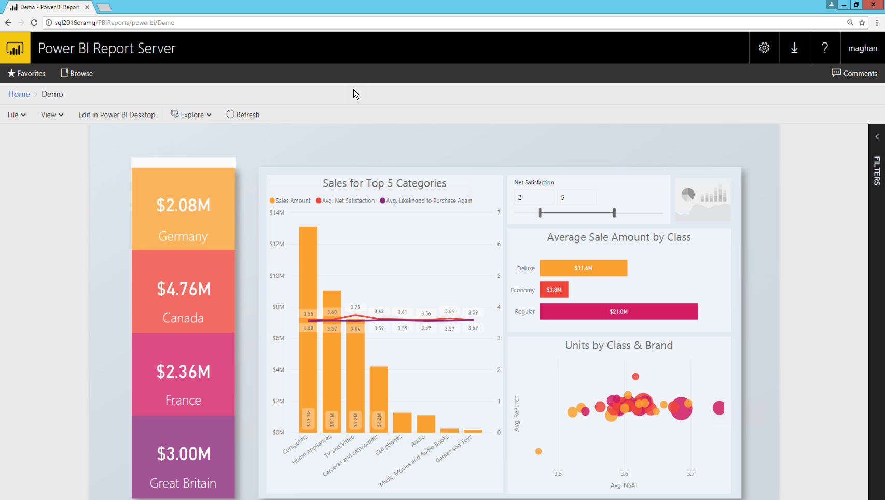

### Capture the URL parameter

After you have your URL, you can create an iFrame within a SharePoint page to host the report. For any Power BI Report Server report URL, add the following query string parameter to embed your report in a SharePoint iFrame: `?rs:embed=true`.

   For example:
    ``` 
    https://myserver/reports/powerbi/Sales?rs:embed=true
    ```
## Embed the report in a SharePoint iFrame

1. Navigate to a SharePoint **Site Contents** page.

    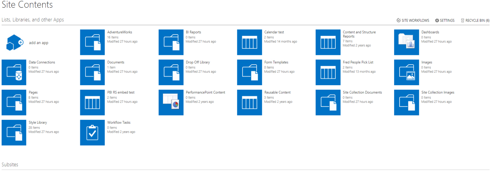

2. Choose the page where you want to add your report.

    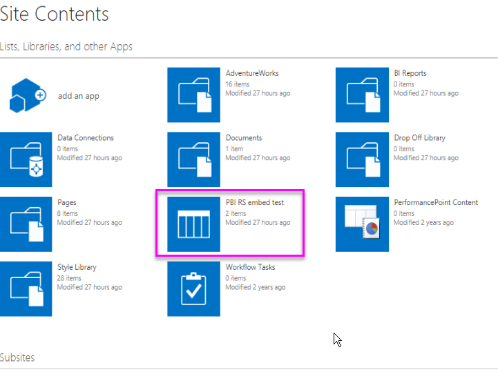

3. Select the gear icon on the top right, and then select **Edit page**.

    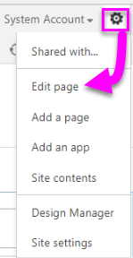

4. Select **Add a Web Part**.

5. Under **Categories**, select **Media and Content**. Under **Parts**, select **Content Editor**, and then select **Add**.

    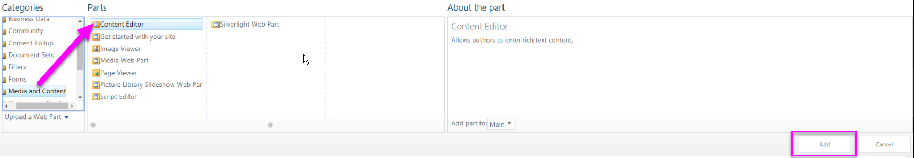

6. Select **Click here to add new content**.

7. From the top menu, select **Format Text**, and then select **Edit Source**.

     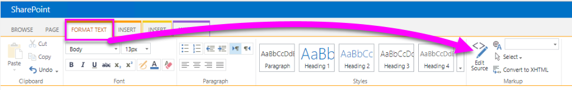

8. In the **Edit Source** window, paste your iFrame code in **HTML Source**, and then select **OK**.

    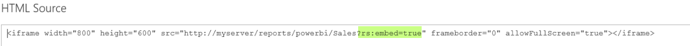

     For example:
     ```html
     <iframe width="800" height="600" src="https://myserver/reports/powerbi/Sales?rs:embed=true" frameborder="0" allowFullScreen="true"></iframe>
     ```

9. In the top menu, select **Page**, and then select **Stop Editing**.

    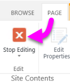

    The report appears on the page.

    

## Related content

- [Create a Power BI report for Power BI Report Server](quickstart-create-powerbi-report.md).  
- [Create a paginated report for Power BI Report Server](quickstart-create-paginated-report.md).  

More questions? [Try the Power BI Community](https://community.powerbi.com/).
