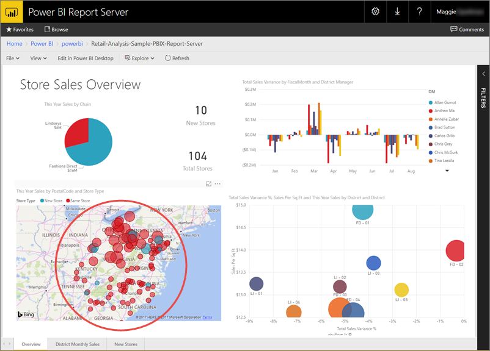
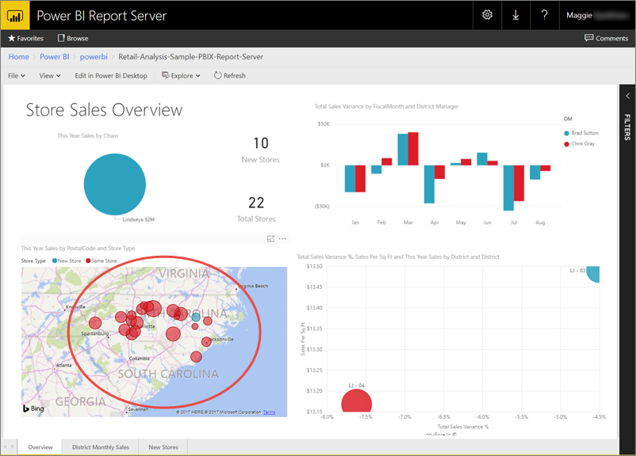

# Quickstart: Embed a Power BI report using an iFrame and URL parameters

You can embed any report by using an iFrame in your application. 

## URL parameter

For any URL to a report, you can add a querystring parameter of `?rs:Embed=true`.

For example:

```
http://myserver/reports/powerbi/Sales?rs:embed=true
```

This will work on all report types within Power BI Report Server.

## iFrame

Once you have your URL, you can create an iFrame within a web page, to host the report.

For example:

```
<iframe width="800" height="600" src="http://myserver/reports/powerbi/Sales?rs:embed=true" frameborder="0" allowFullScreen="true"></iframe>
```

## URL filter

You can add a query string parameter to the URL to filter the data that's returned in the Power BI report.

The syntax is straightforward; start with the report URL, add a question mark, then this filter syntax.

URL?filter=***Table***/***Field*** eq '***value***'

Keep these considerations in mind:

- **Table** and **Field** names are case sensitive; **value** isn't.
- You can filter a report with fields that are hidden from report view.
- **Value** has to be enclosed with single quotes.
- Field type has to be string.
- Table and field names can't have spaces.

###  Example: Filter on a field

Take for example the [Retail Analysis sample](../sample-datasets.md). Say this is the URL to the report on the report server in a folder called "power-bi":

```
https://report-server/reports/power-bi/Retail-Analysis-Sample
```

You see the map visualization in the Retail Analysis sample shows stores in North Carolina and other states.



*NC* is the value for North Carolina stored in the **Territory** field of the **Store** table. So to filter the report to show data only for stores in North Carolina, append the following to the URL:

?filter=Store/Territory eq 'NC'

Now the report is filtered for North Carolina; all the visualizations on the report page show data for only North Carolina.



### Create a DAX formula to filter on multiple values

Another way to filter on multiple fields is by creating a calculated column in Power BI Desktop that concatenates two fields to a single value. Then you can filter on that value.

For example, the Retail Analysis sample has two fields: Territory and Chain. In Power BI Desktop, you can [create a calculated column](../desktop-tutorial-create-calculated-columns.md) (Field) called TerritoryChain. Remember that the **Field** name can't have any spaces. Here is the DAX formula for that column.

TerritoryChain = [Territory] & "-" & [Chain]

Publish the report to the Power BI Report Server, then use the URL query string to filter to display data for only Lindseys stores in NC.

```
https://report-server/reports/power-bi/Retail-Analysis-Sample?filter=Store/TerritoryChain eq 'NC-Lindseys'

```

## Next steps

[Quickstart: Create a Power BI report for Power BI Report Server](quickstart-create-powerbi-report.md)  
[Quickstart: Create a paginated report for Power BI Report Server](quickstart-create-paginated-report.md)  

More questions? [Try asking the Power BI Community](https://community.powerbi.com/)