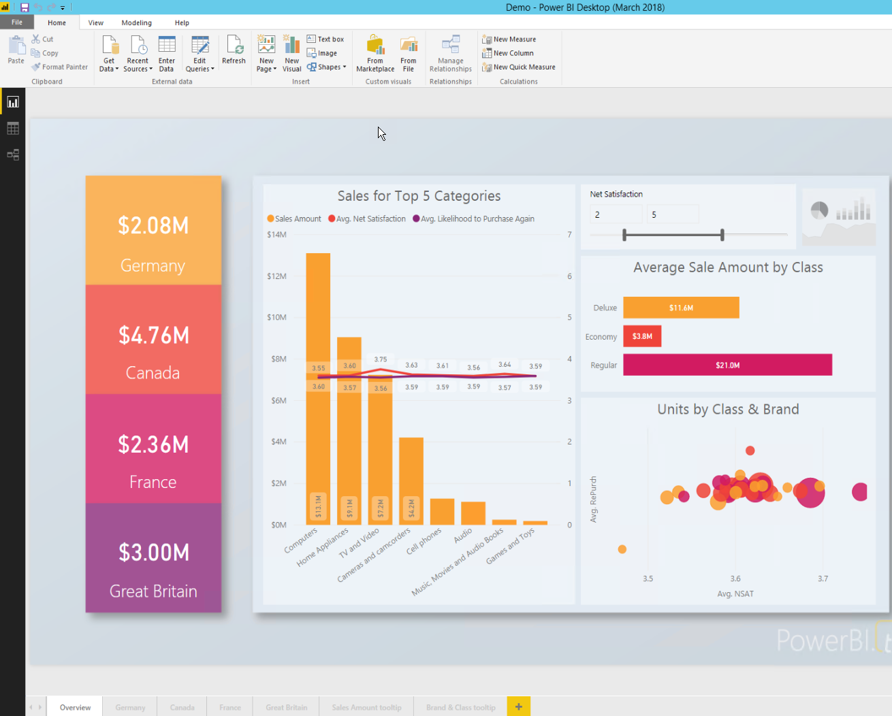

# Quickstart: Embed a Power BI Report Server report using an iFrame in SharePoint Server

In this quickstart, you'll learn how to embed a Power BI Report Server report by using an iFrame in a SharePoint page. If you're working with SharePoint Online, Power BI Report Server must be publicly accessible. In SharePoint Online, the Power BI Web part that works with the Power BI service won't work with Power BI Report Server. 


## Prerequisites
* [Power BI Report Server](https://powerbi.microsoft.com/report-server/) installed and configured.
* [Power BI Desktop optimized for Power BI Report Server](install-powerbi-desktop.md) installed.
* A [SharePoint](https://docs.microsoft.com/sharepoint/install/install) environment installed and configured.

## Create the Power BI Report Server report URL

1. Download the sample from GitHub: [Blog Demo](https://github.com/Microsoft/powerbi-desktop-samples).

    

2. Open the sample PBIX file from GitHub in **Power BI Desktop optimized for Power BI Report Server**.

    

3. Save the report to the **Power BI Report Server**. 

    

4. View report in the **Web Portal** of the Report Server.

    

### Capture the URL parameter

Once you have your URL, you can create an iFrame within a SharePoint page to host the report. For any Power BI Report Server report URL, you can add a query string parameter of `?rs:embed=true` to embed your report in a SharePoint iFrame. 

   For example:
    ``` 
    http://myserver/reports/powerbi/Sales?rs:embed=true
    ```
## Embed a Power BI Report Server report in a SharePoint iFrame

1. Navigate to a SharePoint **Site Contents** page.

    

2. Choose the page where you want to add your report.

    

3. Select the gear icon on the top right, and then select **Edit page**.

    

4. Select **Add a Web Part**.

    

5. Under **Categories**, select **Media and Content**. Under **Parts**, select **Content Editor**, and then select **Add**.

    

6. Select **Click here to add new content**.

7. From the top menu, select **Format Text**, and then select **Edit Source**.

     

8. In the **Edit Source** window, paste your iFrame code in **HTML Source**, and then select **OK**.

    

     For example:
     ```html
     <iframe width="800" height="600" src="http://myserver/reports/powerbi/Sales?rs:embed=true" frameborder="0" allowFullScreen="true"></iframe>
     ```

9. In the top menu, select **Page**, and then select **Stop Editing**.

    

10. You should now see the report on the page.

    

## Next steps

[Quickstart: Create a Power BI report for Power BI Report Server](quickstart-create-powerbi-report.md)  
[Quickstart: Create a paginated report for Power BI Report Server](quickstart-create-paginated-report.md)  

More questions? [Try asking the Power BI Community](https://community.powerbi.com/). 