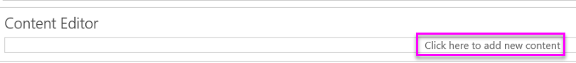

# Quickstart: Embed a Power BI Report Server report using an iFrame in SharePoint

In this quickstart you will learn how to embed a Power BI Report Server report by using an iFrame in a SharePoint page.


If you're not signed up to use Power BI Report Server, [sign up for a free trial](https://powerbi.microsoft.com/en-us/report-server/) before you begin.
## Prerequisites
* You will need to have Power BI Report Server installed and configured.
* You will need to have the Power BI Report Server Desktop tool installed.
* You will need to have a SharePoint environment installed and configured. 
## Creating the Power BI Report Server report URL

1. Download the sample from GitHub - [Blog Demo](https://github.com/Microsoft/powerbi-desktop-samples).

2. Open up the sample PBIX file from GitHub in the Power BI Report Server Desktop tool.

    

3. Save the report to the Power BI Report Server.

    

4. View report in the Web Portal.

    
### Capturing the URL parameter

Once you have your URL, you can create an iFrame within a SharePoint page, to host the report. For any Power BI Report Server report URL you can add a querystring parameter of `?rs:Embed=true` to embed your report into an iFrame.

For example:
```
<iframe width="800" height="600" src="http://myserver/reports/powerbi/Sales?rs:embed=true" frameborder="0" allowFullScreen="true"></iframe>
```
## Embedding a Power BI Report Server report in a SharePoint iFrame

1. Navigate to a SharePoint Site Contents page.

    

2. Choose which app from the Site Contents page to add the report to.

    

3. Select the gear on the top right and select Edit Page.

    

4. Select Add Web Part

    

5. Under Categories select Media and Content, Under Parts, select Content Editor, and then select Add.

    

6. Select click here to add new content.

    

7. In the ribbon select the Format Text tab then select Edit Source.

     

8. In the Edit Source window paste your iFrame code and select OK.

    

    ```
    <iframe width="800" height="600" src="http://myserver/reports/powerbi/Sales?rs:embed=true" frameborder="0" allowFullScreen="true"></iframe>
    ```

9. In the ribbon select the Page tab and select Stop Editing.

    

10. Now you should see the report on the page.

    
## Next steps

[Quickstart: Create a Power BI report for Power BI Report Server](quickstart-create-powerbi-report.md)  
[Quickstart: Create a paginated report for Power BI Report Server](quickstart-create-paginated-report.md)  

More questions? [Try asking the Power BI Community](https://community.powerbi.com/) 