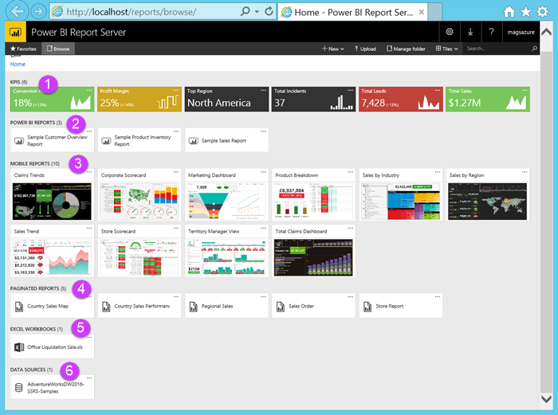
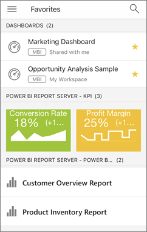

# Quickstart: Explore the Power BI Report Server web portal in a VM
In this quickstart, you create an Azure virtual machine with Power BI Report Server already installed, so you can experience viewing, editing, and managing sample Power BI and paginated reports, and KPIs.

For this quickstart, you need an Azure subscription. If you don’t have one, create a [free account](https://azure.microsoft.com/free/?WT.mc_id=A261C142F) before you begin.

## Create a Power BI Report Server VM

Luckily, the Power BI team has created a VM that comes with Power BI Report Server already installed.

1. In the Azure Marketplace, open [Power BI Report Server](https://azuremarketplace.microsoft.com/marketplace/apps/reportingservices.technical-preview?tab=Overview).  

2. Select **Get it now**.
3. To agree to the provider's terms of use and privacy policy, select **Continue**.

    

4. **Step 1 Basics**, for **VM Name**, call it **reportservervm**.

5. Create a user name and password.

6. For **Resource group**, keep **Create new**, and call it **reportserverresourcegroup**.

7. Keep the other defaults > **OK**.

    

8. **Step 2 Settings**, keep the defaults > **OK**.

9. **Step 3 Summary** > **OK**.

10. **Step 4**, review the Terms of user and privacy policy > **Create**.

    The **Submitting deployment for Power BI Report Server** process takes a several minutes.

## Start your virtual machine

1. In the Azure left navigation pane, select **Virtual machines**. 

2. In the **Filter by name** box, type "report". 

3. Select the VM named **REPORTSERVERVM**.

    

4. Under REPORTSERVERVM Virtual machine, select **Connect**.

    

5. In the Remote Desktop Connection dialog box, select **Connect**.

6. Enter the name and password you created for the VM > **OK**.

7. The next dialog box says the identity of the remote computer cannot be identified. Select **Yes**.

   Voila -- your new VM opens.

## Power BI Report Server on the VM

|Number  |What it is  |
|---------|---------|
| | Starts SQL Server Data Tools, for creating paginated (.RDL) reports |
| | Sample Power BI (.PBIX) reports  |
| | Links to Power BI Report Server documentation   |
| | Starts Power BI Desktop optimized for Power BI Report Server (March 2018)  |
| | Opens Power BI Report Server web portal in the browser   |

Double-click the **Report Server Web Portal** icon. The browser opens http://localhost/reports/browse.  

|Number  |What it is  |
|---------|---------|
| | KPIs created in the web portal |
| |  Power BI (.PBIX) reports  |
| | Mobile reports created in SQL Server Mobile Report Publisher  |
| |  Paginated reports created in Report Builder or SQL Server Data Tools  |
| | Excel workbooks   | 
| | Data sources for paginated reports | 

## Tag your favorite reports and KPIs
You can tag the reports and KPIs that you want to be favorites. They're easier to find because they're all gathered in a single Favorites folder, both in the web portal and in the Power BI mobile apps. 

1. Select the ellipsis (**…**) in the upper-right corner of the KPI or report that you want to make a favorite, and select **Add to Favorites**.
   
    
2. Select **Favorites** on the web portal ribbon to see it along with your other favorites on the Favorites page in the web portal.
   
    
   
    Now in the Power BI mobile apps you see these favorites along with your favorite dashboards from the Power BI service.
   
    

## Hide or view items in the web portal
You can hide items in the web portal, and you can choose to view hidden items.

### Hide an item
1. Select the ellipsis (...) in the upper-right corner of an item, then select **Manage**.
   
    
2. Select **Hide this item**.
   
    
3. Select **Apply**.

### View hidden items
1. Select **Tiles** (or **List**) in the upper-right corner > **Show hidden items**.
   
    The items appear. They're grayed, but you can still open and edit them.
   
    

## Search for items
You can enter a search team, and you will see everything you can access. The results are categorized into KPIs, reports, datasets, and other items. You can then interact with the results and add them to your favorites.  

## Move or delete items in List view
By default, the web portal displays its contents in Tile view.

You can switch to List view, where it's easy to move or delete multiple items at a time. 

1. Select **Tiles** > **List**.
   
    
2. Select the items, then select **Move** or **Delete**.

## Clean up resources

Now that you've finished this quickstart, delete the resource group, virtual machine, and all related resources. 

- To do so, select the resource group for the VM and select **Delete**.

## Next steps
[User handbook](user-handbook-overview.md)  
[Quickstart: Paginated reports](quickstart-create-paginated-report.md)  
[Quickstart: Power BI reports](quickstart-create-powerbi-report.md)

