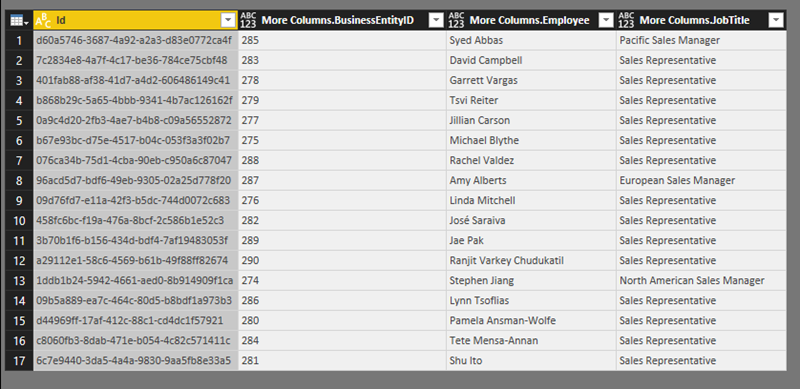

# Accessing shared datasets as OData feeds in Power BI Report Server
You can access shared datasets from Power BI Desktop with an OData feed.

1. With the OData feed URL, you connect to the OData source.
   
    
2. After you bring the data into Power BI Desktop, you can modify it in the Query Editor.
   
    
3. Now you can use the data in designing reports.
   
    

Be sure to use **Advanced Options** so you can turn on Open Type Columns and format the columns accordingly in Power Query to meet your needs.

Read more about [connecting to OData fields in Power BI Desktop](../desktop-connect-odata.md).

More questions? [Try asking the Power BI Community](https://community.powerbi.com/)

