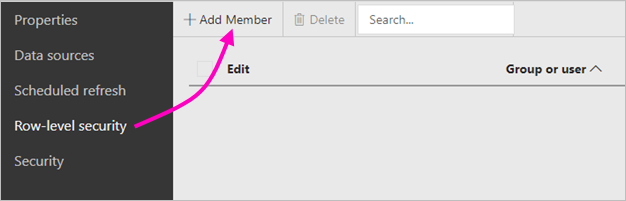
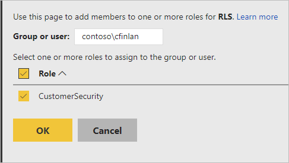
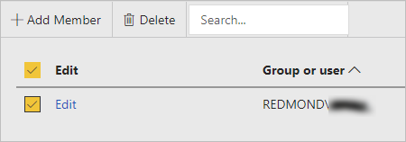

# Row-level security (RLS) in Power BI Report Server

Setting up row-level security (RLS) with Power BI Report Server can restrict data access for given users. Filters restrict data access at the row level, and you can define filters within roles.  If you're using the default permissions in Power BI Report Server, any user with Publisher or Content Manager permissions for the Power BI report can assign members to roles for that report.    

You configure RLS for reports imported into Power BI with Power BI Desktop. You can also configure RLS on reports that use DirectQuery, such as SQL Server.  Keep in mind that RLS isn't respected if your DirectQuery connection uses integrated authentication for report readers. For Analysis Services live connections, you configure row-level security on the on-premises model. The security option doesn't show up for live connection datasets. 

[!INCLUDE [rls-desktop-define-roles](../includes/rls-desktop-define-roles.md)]

## Bidirectional cross-filtering

By default, row-level security filtering uses single-directional filters, regardless of whether the relationships are set to single direction or bidirectional. You can manually enable bidirectional cross-filter with row-level security.

- Select the relationship and check the **Apply security filter in both directions** checkbox. 

    

Check this box when implementing dynamic row-level security based on user name or login ID. 

To learn more, see [Bidirectional cross-filtering using DirectQuery in Power BI Desktop](../transform-model/desktop-bidirectional-filtering.md) and the [Securing the Tabular BI Semantic Model](https://download.microsoft.com/download/D/2/0/D20E1C5F-72EA-4505-9F26-FEF9550EFD44/Securing%20the%20Tabular%20BI%20Semantic%20Model.docx) technical whitepaper.

[!INCLUDE [rls-desktop-view-as-roles](../includes/rls-desktop-view-as-roles.md)]

## Add members to roles 

After you save your report in Power BI Report Server, you manage security and add or remove members on the server. Only users with either Publisher or Content Manager permissions for the report have the row-level security option available and not greyed out.

 If the report doesn't have the roles it needs, you need to open it in Power BI Desktop, add or modify roles, then save it back to Power BI Report Server. 

1. In Power BI Desktop, save the report to Power BI Report Server. You need to use the version of Power BI Desktop for Power BI Report Server.
2. In Power BI Report Service, select the ellipsis (**…**) next to the report. 

3. Select **Manage** > **Row-level security**. 

     

    On the **Row-level security** page, you add members to a role you created in Power BI Desktop.

5. To add a member, select **Add Member**.

1. Enter the user or group in the text box in the Username format (DOMAIN\user) and select the roles you wish to assign to them. The member has to be within your organization.   

    

    Depending on how you have Active Directory configured, entering the User Principal Name here also works. In that case, the Report Server shows the corresponding username in the list.

1. Click **OK** to apply.   

8. To remove members, check the box next to their names and select **Delete**.  You can delete multiple members at a time. 

    

## username() and userprincipalname()

You can take advantage of the DAX functions username() or userprincipalname() within your dataset. You can use them within expressions in Power BI Desktop. When you publish your model, Power BI Report Server uses them.

Within Power BI Desktop, username() returns a user in the format of DOMAIN\User and userprincipalname() returns a user in the format of user@contoso.com.

Within Power BI Report Server, username() and userprincipalname() both return the user's User Principal Name (UPN), which is similar to an email address.

If you're using custom authentication in Power BI Report Server, it returns the username format you’ve set up for users.  

## Considerations and limitations

Here are the current limitations for row-level security on Power BI models. 

Users that had reports using the username() DAX function will notice new behavior now where the User Principal Name (UPN) is returned EXCEPT when using DirectQuery with integrated security.  Since RLS isn't respected in that scenario, the behavior in that scenario is unchanged.

You can define RLS only on datasets created with Power BI Desktop. To enable RLS for datasets created with Excel, you must convert your files into Power BI Desktop (PBIX) files first. Learn more about [converting Excel files](../connect-data/desktop-import-excel-workbooks.md).

Only Extract, Transform, Load (ETL) and DirectQuery connections using stored credentials are supported. Live connections to Analysis Services and DirectQuery connections using integrated authentication are handled in the underlying data source. 

If you're using integrated security with DirectQuery, then your users may notice:
- RLS is disabled and all data is returned.
- Users can't update their role assignments, and get an error on the RLS Manage page.
- For the DAX username function, you continue to receive the username as DOMAIN\USER. 

Report authors don't have access to view the report data in Power BI Report Server until they've assigned themselves roles accordingly after uploading the report. 

Role assignments through group memberships are only supported when the Power BI Report Server is configured to run with NTLM or Kerberos authentication. Servers running with Custom authentication or Windows Basic need users explicitly assigned to roles.
 

## FAQ 

### Can I create these roles for Analysis Services data sources? 

You can if you imported the data into Power BI Desktop. If you're using a live connection, you can't configure RLS within the Power BI service. RLS is defined within the Analysis Services model on-premises. 

### Can I use RLS to limit the columns or measures accessible by my users? 

No. If a user has access to a particular row of data, they can see all the columns of data for that row. 

### Does RLS let me hide detailed data but give access to data summarized in visuals? 

No, you secure individual rows of data but users can always see either the details or the summarized data. 

### Can I add new roles in Power BI Desktop if I already have existing roles and members assigned? 

Yes, if you already have existing roles defined and members assigned in Power BI Report Server, you can make additional roles and republish your report with no effect on your current assignments. 

## Related content

- [What is Power BI Report Server?](get-started.md) 
- [Administrator handbook](admin-handbook-overview.md)  

More questions? [Try asking the Power BI Community](https://community.powerbi.com/)
