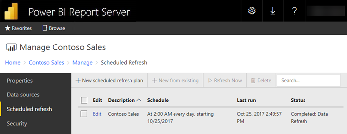

# Power BI report scheduled refresh in Power BI Report Server
Scheduled refresh for Power BI reports allows the data for a report to stay up to date.

Scheduled refresh is specific to Power BI reports with an embedded model. Meaning you imported data into the report instead of using a live connection or DirectQuery. When importing your data, it is disconnected from the original data source and needs to be updated to keep data fresh. Scheduled refresh is the way to keep your data up to date.

Scheduled refresh is configured within the management section of a report. For more information on how to configure scheduled refresh, see [How to configure Power BI report scheduled refresh](configure-scheduled-refresh.md).

## How this works
Several components are involved when using scheduled refresh for your Power BI reports.

* SQL Server Agent as a timer to generate scheduled events.
* Scheduled jobs are added to a queue of events and notifications in the report server database. In a scale-out deployment, the queue is shared across all of the report servers in the deployment.
* All report processing that occurs as a result of a schedule event is performed as a background process.
* The data model is loaded within an Analysis Services instance.
* For some data sources, the Power Query mashup engine is used to connect to data sources and transform the data. Other data sources may be connected to directly from an Analysis Services service used to host the data models for Power BI Report Server.
* New data is loaded into the data model within Analysis Services.
* In a scale-out configuration, the data model can be replicated across nodes.
* Analysis Services processes the data and executes any needed calculations.

Power BI Report Server maintains an event queue for all scheduled operations. It polls the queue at regular intervals to check for new events. By default, the queue is scanned at 10 second intervals. You can change the interval by modifying the **PollingInterval**, **IsNotificationService**, and **IsEventService** configuration settings in the RSReportServer.config file. **IsDataModelRefreshService** can also be used to set whether a report server process scheduled events.

### Analysis Services
Rendering a Power BI report, as well as performing a scheduled refresh, requires loading the Power BI report's data model in Analysis Services. An Analysis Services process will be running with Power BI Report Server.

## Considerations and limitations
### When scheduled refresh can't be used
Not all Power BI Reports can have a scheduled refresh plan created on them. The following is a list of Power BI Reports that you Can't create a scheduled refresh plan.

* Your report contains one or more Analysis Services data sources, which use a live connection.
* Your report contains one or more data sources, which use DirectQuery.
* Your report does not contain any data source. For example, data is manually entered via *Enter Data* or a report contains only static content like images, text, etc.
* Your report contains dynamic data sources. For example, data from the report is used to dynamicaly build the name of a server, the name of a database, or a URL address to fetch contents. Only data sources that are detected when the report was uploaded can be refreshed.

In addition to the above list, there are specific scenarios with data sources in *import* mode, for which you cannot create refresh plans.

* If a *File* or *Folder* data source is used and the file path is a local path (e.g. C:\Users\user\Documents), then a refresh plan cannot be created. The path must be a path the report server can connect to like a network share. For example, *\\myshare\Documents*.
* If data source can be connected using only OAuth (e.g. Facebook, Google Analytics, Salesforce, etc.), then cache refresh plan cannot be created. At the moment, RS does not support OAuth authentication for any data source whether it is for paginated, mobile or Power BI reports.

### Memory limits
Traditional workload for a report server has been similar to a web application. The ability to load reports with imported data or DirectQuery, and the ability to perform scheduled refresh, rely on an Analysis Services instance being hosted alongside of the report server. As a result, this could result is unexpected memory pressure on the server. Plan your server deployment accordingly knowning that Analysis Services may be consuming memory alongside the report server.

For information on how to monitor an Analysis Services instance, see [Monitor an Analysis Services Instance](/sql/analysis-services/instances/monitor-an-analysis-services-instance).

For information about memory settings within Analysis Services, see [Memory Properties](/sql/analysis-services/server-properties/memory-properties).

### Data model size limit
The data model loaded into the internal Analysis Services engine during a scheduled refresh has a maximum size of 2,000 MB (2GB). This maximum size can't be configured. If your data model grows larger than 2GB, you will receive the refresh error, "The length of the result exceeds the length limit (2GB) of the target large type." In that case, we recommend hosting the model in an Analysis Services instance and using a live connection to the model in the report.

## Related content

* Configure [scheduled refresh](configure-scheduled-refresh.md) on a Power BI report.

More questions? [Try asking the Power BI Community](https://community.powerbi.com/)
