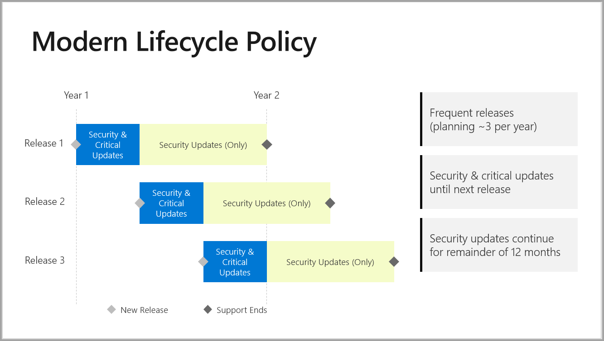

# Support timeline for Power BI Report Server

Power BI Report Server releases a few times per year. Security and critical updates are available until the next release becomes generally available (GA). After the next release, the previous release continues to receive security updates for the remainder of the 12-month release lifespan.

This support policy allows us to deliver innovation to customers at a rapid rate while providing flexibility for customers to adopt the innovation at their pace.

* Security and Critical Updates servicing phase - When running the latest current version of Power BI Report Server, you receive both Security and Critical updates.
* Security Updates (Only) servicing phase - After the release of a new version, support for older versions reduces to Security updates only for the rest of the 12-month support lifecycle (shown in figure 1).

    

To download Power BI Report Server, and Power BI Desktop for Power BI Report Server, go to [On-premises reporting with Power BI Report Server](https://powerbi.microsoft.com/report-server/).

## Related content

* [What's new in Power BI Report Server](whats-new.md)  
* [What is Power BI Report Server?](get-started.md)
* [Administrator overview](admin-handbook-overview.md)  
* [Install Power BI Report Server](install-report-server.md)  

More questions? [Try asking the Power BI Community](https://community.powerbi.com/)

