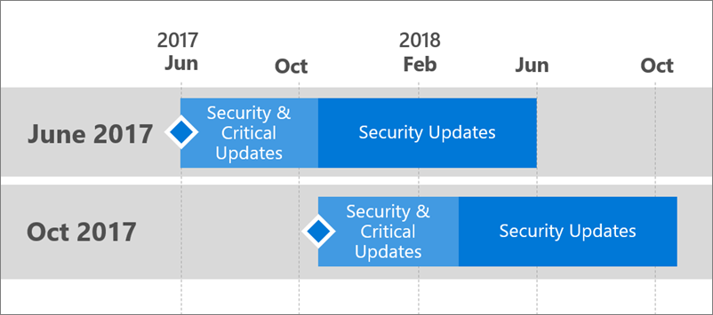

# Support timeline for Power BI Report Server
Power BI Report Server will be released a few times per year. Security and critical updates will be available until the next release becomes generally available (GA). After the next release, the previous release will continue to receive security updates for the remainder of the 12 month release lifespan.

This support policy allows us to deliver innovation to customers at a rapid rate while providing flexibility for customers to adopt the innovation at their pace.

* Security and Critical Updates servicing phase - When running the latest current version of Power BI Report Server, you will receive both Security and Critical updates.
* Security Updates (Only) servicing phase - After a new version is released, support for older versions will reduce to Security updates only for the remainder of the twelve (12) month support lifecycle (shown in figure 1).

    

## Version history
| **Version** | **Availability date** | **Support end date** |
| --- | --- | --- |
| October 2017 |October 31, 2017 |October 31, 2018 |
| June 2017 |June 12, 2017 |June 12, 2018 |

To download Power BI Report Server, and Power BI Desktop optimized for Power BI Report Server, go to [On-premises reporting with Power BI Report Server](https://powerbi.microsoft.com/report-server/).

For the current release notes, see [Power BI Report Server - Release notes](release-notes.md).

## Next steps
[What's new in Power BI Report Server](whats-new.md)  
[Power BI Report Server release notes](release-notes.md)  
[User handbook](user-handbook-overview.md)  
[Administrator handbook](admin-handbook-overview.md)  
[Quickstart: Install Power BI Report Server](quickstart-install-report-server.md)  

More questions? [Try asking the Power BI Community](https://community.powerbi.com/)

