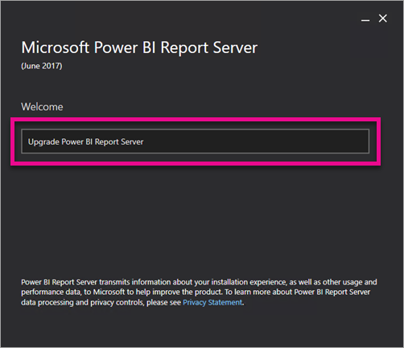
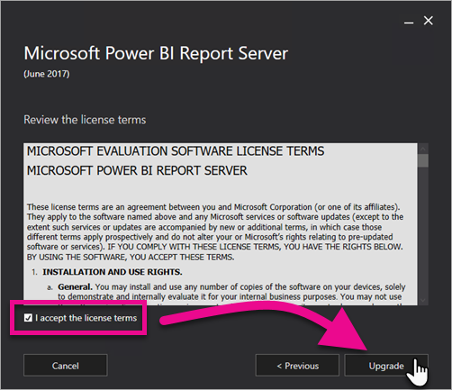

# Upgrade Power BI Report Server

Learn how to upgrade Power BI Report Server.

 **Download** 

To download Power BI Report Server, and Power BI Desktop optimized for Power BI Report Server, go to [On-premises reporting with Power BI Report Server](https://powerbi.microsoft.com/report-server/).

## Before you begin

Before you upgrade a report server, it is recommended that you perform the following steps to back up your report server.

### Backing up the encryption keys

You should back up the encryption keys when you configure a report server installation for the first time. You should also back up the keys anytime you change the identity of the service accounts or rename the computer. For more information, see [Back Up and Restore Reporting Services Encryption Keys](https://docs.microsoft.com/sql/reporting-services/install-windows/ssrs-encryption-keys-back-up-and-restore-encryption-keys).

### Backing up the report server databases

Because a report server is a stateless server, all application data is stored in the **reportserver** and **reportservertempdb** databases that run on a SQL Server Database Engine instance. You can back up the **reportserver** and **reportservertempdb** databases using one of the supported methods for backing up SQL Server databases. Recommendations that are specific to the report server databases include the following:

* Use the full recovery model to back up the **reportserver** database.
* Use the simple recovery model to back up the **reportservertempdb** database.
* You can use different backup schedules for each database. The only reason to back up the **reportservertempdb** is to avoid having to recreate it if there is a hardware failure. In the event of hardware failure, it is not necessary to recover the data in **reportservertempdb**, but you do need the table structure. If you lose **reportservertempdb**, the only way to get it back is to recreate the report server database. If you recreate the **reportservertempdb**, it is important that it have the same name as the primary report server database.

For more information about backup and recovery of SQL Server relational databases, see [Back Up and Restore of SQL Server Databases](https://docs.microsoft.com/sql/relational-databases/backup-restore/back-up-and-restore-of-sql-server-databases).

### Backing up the configuration files

Power BI Report Server uses configuration files to store application settings. You should back up the files when you first configure the server and after you deploy any custom extensions. Files to back up include:

* config.json
* RSHostingService.exe.config
* Rsreportserver.config
* Rssvrpolicy.config
* Reportingservicesservice.exe.config
* Web.config for the Report Server ASP.NET applications
* Machine.config for ASP.NET

## Upgrade the report server

Upgrading Power BI Report Server is straight forward. There are only a few steps to install the files.

1. Find the location of PowerBIReportServer.exe and launch the installer.

2. Select **Upgrade Power BI Report Server**.

    

3. Read and agree to the license terms and conditions and then select **Upgrade**.

    

4. After a successful upgrade, you can select **Configure Report Server** to launch the Reporting Services Configuration Manager, or select **Close** to exit the installer.

    

## Upgrade Power BI Desktop

After the report server is upgrade, you will want to make sure that any Power BI report authors upgrade to the version of Power BI Desktop optimized for Power BI Report Server that matches the server.

## Next steps

* [Administrator overview](admin-handbook-overview.md)  
* [Install Power BI Desktop optimized for Power BI Report Server](install-powerbi-desktop.md)  
* [Verify a reporting services installation](https://docs.microsoft.com/sql/reporting-services/install-windows/verify-a-reporting-services-installation)  
* [Configure the report server service account](https://docs.microsoft.com/sql/reporting-services/install-windows/configure-the-report-server-service-account-ssrs-configuration-manager)  
* [Configure report server URLs](https://docs.microsoft.com/sql/reporting-services/install-windows/configure-report-server-urls-ssrs-configuration-manager)  
* [Configure a report server database connection](https://docs.microsoft.com/sql/reporting-services/install-windows/configure-a-report-server-database-connection-ssrs-configuration-manager)  
* [Initialize a report server](https://docs.microsoft.com/sql/reporting-services/install-windows/ssrs-encryption-keys-initialize-a-report-server)  
* [Configure SSL connections on a report server](https://docs.microsoft.com/sql/reporting-services/security/configure-ssl-connections-on-a-native-mode-report-server)  
* [Configure windows service accounts and permissions](https://docs.microsoft.com/sql/database-engine/configure-windows/configure-windows-service-accounts-and-permissions)  
* [Browser support for Power BI Report Server](browser-support.md)

More questions? [Try asking the Power BI Community](https://community.powerbi.com/)