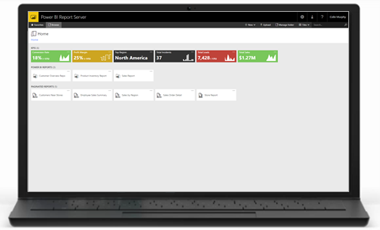
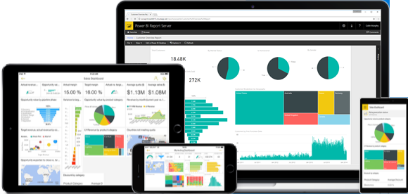

# User handbook overview for Power BI Report Server
Welcome to the user handbook for Power BI Report Server, an on-premises location for storing and managing your Power BI, mobile, and paginated reports.

Power BI Report Server is also a set of products and experiences that work together to bring your data to life:

* A [web portal](#web-portal) you can view in any modern browser. In the web portal, reports and KPIs are organized and displayed in folders, and you can mark them as favorites. You can also store Excel workbooks there.
* [Power BI reports](#power-bi-reports) created with Power BI Desktop, which you view within the web portal or in the Power BI mobile apps.
* [Paginated reports](#paginated-reports), modern-looking, fixed-layout documents optimized for printing, with tools for creating them.

Read on for more about each.

## Web portal

The front door of Power BI Report Server is a modern web portal you can view in any modern browser. You can access all your reports and KPIs in the new portal.

The web portal may feature your organization's custom branding and display KPIs right in the web portal. KPIs can surface key business metrics at a glance in the browser, so you don't have to open a report.

The content on the web portal is organized into folders, and within each folder, it's organized by type: Power BI reports, mobile reports, paginated reports, and KPIs, plus Excel workbooks. You can tag your favorite reports and KPIs. They're all collected in the Favorites folder so you can find them fast.

## Power BI reports

A Power BI report is a multi-perspective view into a dataset, with visualizations that represent different findings and insights from that dataset. A report can have a single visualization or pages full of visualizations. Depending on your role, you may be someone who creates reports and/or you may be someone who views and interacts with reports.

Reports are based on a single dataset. The visualizations in a report each represent a nugget of information. And the visualizations aren't static: Like a dashboard but more so, a report is interactive and customizable, and the visualizations update as the underlying data changes.

* If you're a report creator you can add and remove data, add or rearrange visualizations, or change visualization types.
* If you're a report viewer, you can sort and apply filters and slicers as you dig into the data to discover insights and look for answers.

You create Power BI reports with a special edition of Power BI Desktop. Download [Microsoft Power BI Desktop](https://go.microsoft.com/fwlink/?linkid=837581) (Optimized for Power BI Report Server - October 2017 GA).

## Paginated reports

Paginated reports are document-style reports, in which the more data you have, the more rows in the tables, and the more pages the report has. They make great fixed-layout, pixel-perfect documents optimized for printing, such as PDF and Word files.

You create these paginated reports with [Report Builder](https://docs.microsoft.com/sql/reporting-services/report-builder/report-builder-in-sql-server-2016) or Report Designer in [SQL Server Data Tools (SSDT)](https://docs.microsoft.com/sql/reporting-services/tools/reporting-services-in-sql-server-data-tools-ssdt).

## Next steps
[Install Power BI Desktop optimized for Power BI Report Server](install-powerbi-desktop.md)  
[Quickstart: Paginated reports](quickstart-create-paginated-report.md)  
[Quickstart: Power BI reports](quickstart-create-powerbi-report.md)

More questions? [Try asking the Power BI Community](https://community.powerbi.com/)

