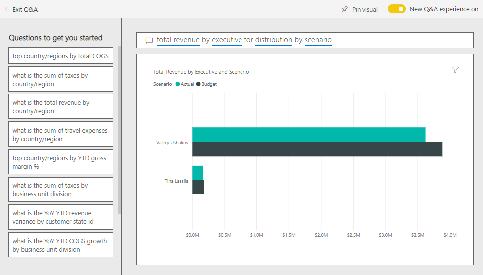

# Customer Profitability sample for Power BI: Take a tour

## Overview of the Customer Profitability sample
The “Customer Profitability Sample” content pack contains a dashboard, report, and dataset for a company that manufactures marketing materials. This dashboard was created by a CFO to see key metrics about her 5 business unit managers (aka executives), products, customers, and gross margins (GM). At a glance she can see what factors are impacting profitability.

This sample is part of a series that illustrates how you can use Power BI with business-oriented data, reports and dashboards. This is real data from obviEnce ([www.obvience.com](http://www.obvience.com/)) that has been anonymized. The data is available in several formats: content pack/app, Excel workbook, or .pbix Power BI Desktop file. See [Sample datasets](sample-datasets.md).

## Prerequisites
Want to follow along? This tutorial uses Power BI service and the "Customer Profitability" sample content pack.  Because the report experiences are so similar, you can also follow along using Power BI Desktop and the sample PBIX file. Instructions for connecting to the content pack and the PBIX file are below.

### Get the content pack for this sample

1. Open the Power BI service (app.powerbi.com) and log in.
2. In the bottom left corner select **Get data**.

    
3. On the Get Data page that appears, select the **Samples** icon.

   
4. Select the **Customer Profitability Sample**, then choose **Connect**.  

   
5. Power BI imports the content pack and adds a new dashboard, report, and dataset to your current workspace. The new content is marked with a yellow asterisk. Use the samples to take Power BI for a test run.  

   

### Get the .pbix file for this sample

Alternatively, you can download the sample as a .pbix file, which is designed for use with Power BI Desktop.
[Customer Profitability Sample](http://download.microsoft.com/download/6/A/9/6A93FD6E-CBA5-40BD-B42E-4DCAE8CDD059/Customer%20Profitability%20Sample%20PBIX.pbix)

### Get the Excel workbook for this sample

If you want to dig into the datasource for this sample, it's also available as an [(Excel workbook)](http://go.microsoft.com/fwlink/?LinkId=529781). The workbook contains Power View sheets that you can view and modify. To see the raw data, select **Power Pivot > Manage**.

## What is our dashboard telling us?

Under **My Workspace**, find the dashboard for the Customer Profitability sample:

### Company-wide dashboard tiles
1. Open the dashboard in Power BI service. The dashboard tiles give our CFO a view of the high-level company metrics important to her.  When she sees something interesting, she can select a tile to dig into the data.

2. Review the tiles on the left side of the dashboard.

    

- Our company gross margin is 42.5%.
- We have 80 customers.
- We sell 5 different products.
- We had our lowest revenue variance% to budget in February, followed by our highest in March.
- Most of our revenue comes from the East and North regions. Gross margin has never exceeded budget, with ER-0 and MA-0 requiring some further investigation.
- Total revenue for the year is close to budget.

### Manager-specific dashboard tiles
The tiles on the right side of the dashboard provide a team scorecard. The CFO needs to keep track of her managers and these tiles give her a high level overview of profit – using GM%. If the GM% trend is unexpected for any manager, then she can investigate further.

- All executives, except Carlos, have already exceeded their target sales. But Carlos' actual sales are the highest.
- Annelie’s GM% is the lowest, but we see a steady increase since March.
- Valery, on the other hand, has seen her GM% drop significantly.
- And Andrew had a volatile year.

## Explore the dashboard's underlying data
This dashboard has tiles that link to a report and to an Excel workbook.

### Open the Excel Online data source
Two tiles on this dashboard, "Target vs Actual" and "Year Over Year Revenue Growth" were pinned from an Excel workbook. So when you select either of these tiles, Power BI opens the data source -- in this case, Excel Online.

1. Select either of the tiles that were pinned from Excel. Excel Online opens within Power BI service.
2. Notice that the workbook has 3 tabs's worth of data. Open "Revenue".
3. Let's look into why Carlos hasn't hit his target yet.  
    a. From the "Executive" slider, select **Carlos Grilo**.   
    b. The first PivotTable tells us that Carlos' revenue for his top Product, Primus, is down 152% from last year. And the YoY chart shows that for most months he's below budget.  

    

    

4. Continue exploring, and if you find something interesting, select **Pin**  from the upper-right corner to [pin it to a dashboard](service-dashboard-pin-tile-from-excel.md).

5. Use your browser's back arrow to return to the dashboard.

### Open the underlying Power BI report
The majority of the tiles on the Customer Profitability sample dashboard were pinned from the underlying Customer Profitability sample report.

1. Select one of these tiles to open the report in Reading view.

2. The report has 3 pages. Each tab at the bottom of the report represents a page.

    

    * "Team Scorecard" focuses on the performance of the 5 managers and their "books of business."
    * "Industry Margin Analysis" provides a way to analyze our profitability compared to what's going on in our entire industry.
    * "Executive Scorecard" provides a view of each of our managers formatted for viewing in Cortana.

### Team Scorecard page

Let’s look at two of the team members in detail and see what insights can be gained. In the slicer on the left, select Andrew's name to filter the report page to display only data about Andrew.

* For a quick KPI, look at Andrew’s **Revenue Status** - he is green. He’s performing well.
* The “Revenue Var % to Budget by Month”  Area chart shows that except for a dip in February, Andrew is doing pretty well overall. His dominant region is East and he handles 49 customers and 5 (out of 7) products. His GM% isn’t the highest or lowest.
* The “RevenueTY and Revenue Var % to Budget by Month” shows a steady even profit story.But when you filter by clicking on the square for **Central** in the region treemap, you discover that Andrew has revenue only in March and only in Indiana. Is this intentional or is this something that needs looking into?

Now on to Valery. In the slicer, select Valery’s name to filter the report page to display only data about her.  

* Notice the red KPI for **RevenueTY Status**. This definitely needs further investigation.
* Her revenue variance also paints a worrying picture – she is not meeting her revenue margins.
* Valery has only 9 customers, handles only 2 products and works almost-exclusively with customers in the north. This specialization could explain wide fluctuations in her metrics.
* Selecting the **North** square in the treemap shows that Valery’s gross margin in the North is consistent with her overall margin.
* Selecting the other **Region** squares tells an interesting story: her GM% ranges from 23% to 79% and her revenue numbers, in all regions except North, are extremely seasonal.

Continue digging to find out why Valery’s area is not performing well. Look at regions, the other business units, and the next page in the report – “Industry Margin Analysis.”

### Industry Margin Analysis
This report page provides a different slice of the data. It looks at gross margin for the entire industry, broken down by segment. The CFO uses this page to compare company and business unit metrics to industry metrics to help her explain trends and profitability. You might wonder why the “Gross Margin by Month and Executive Name” area chart is on this page, since it is team-specific. Having it here lets us filter the page by business unit manager.  

How does profitability vary by industry? How do the products and customers break down by industry? Select one or more industries from the top left. (Start from the CPG industry) To clear the filter, select the eraser icon.

On the bubble chart, the CFO looks for the largest bubbles since these are the ones that have the biggest impact on revenue. Filtering the page by manager by clicking on their names in the area chart makes it easy to see each manager’s impact by industry segment.

* Andrew's area of influence spans many different industry segments with widely varying GM% (most on the positive side) and Var%.
* Annelie's chart is similar, except that she concentrates on only a handful of industry segments with a focus on the Federal segment and a focus on Gladius product.
* Carlos has a clear focus on the Services segment, with good profit. He's greatly improved variance % for the High Tech segment and a new segment for him, Industrial, performed exceptionally well compared to budget.
* Tina works with a handful of segments and has the highest GM%, but the mostly small size of her bubbles shows that her impact on the company's bottom line is minimal.
* Valery, who is responsible for only one product, works in only 5 industry segments. Her industry influence is seasonal, but always produces a large bubble, indicating a significant impact on the company’s bottom line. Does industry explain her negative performance?

### Executive Scorecard
This page is formatted as an Answer Card for Cortana. To learn more, see [create Answer Cards for Cortana](service-cortana-answer-cards.md)

## Dig into the data by asking questions with Q&A
For our analysis, it would be helpful to determine which industry generates the most revenue for Valery. Let’s use Q&A.

1. Open the report in Editing view by selecting **Edit report**. Editing view is only available if you "own" the report; this is sometimes referred to as **creator** mode. If, instead, this report had been shared with you, you wouldn't be able to open it in Editing view.

2.  From the top menubar, select **Ask a question** to open the Q&A question box.

    

3. Type **total revenue by industry for Valery**. Notice how the visualization updates as you type the question.

    

   Distribution is the biggest revenue area for Valery.

### Dig deeper by adding filters
Let's take a look at the *Distribution* industry.  

1. Open the "Industry Margin Analysis" report page.
2. Without selecting any visualizations on the report page, expand the filter pane on the right (if it isn't already expanded). The Filters pane should display only Page level filters.  

   
3. Locate the filter for **Industry** and select the arrow to expand the list. Let's add a page filter for the Distribution industry. First, clear all selections by clearing the **Select All** checkbox. Then select only **Distribution.**  

   
4. The "Gross margin by Month and Executive Name" area chart tells us that only Valery and Tina have customers in this industry and Valery only worked with this industry from June to November.   
5. Select **Tina** and then **Valery** in the "Gross Margin by Month and Executive" area chart legend. Notice Tina's portion of "Total Revenue by Product" is really small compared to Valery.
6. To see actual revenue, use Q&A to ask **total revenue by executive for distribution by scenario**.  

     

    We can similarly explore other industries and even add customers to our visuals to understand causes for Valery's performance.

This is a safe environment to play in. You can always choose not to save your changes. But if you do save them, you can always go to **Get Data** for a new copy of this sample.

You can also [download just the dataset (Excel workbook) for this sample](http://go.microsoft.com/fwlink/?LinkId=529781).

## Next steps: Connect to your data
We hope this tour has shown how Power BI dashboards, Q&A, and reports can provide insights into customer data. Now it is your turn — connect to your own data. With Power BI you can connect to a wide variety of data sources. Learn more about [getting started with Power BI](service-get-started.md).

[Back to Samples in Power BI](sample-datasets.md)  
