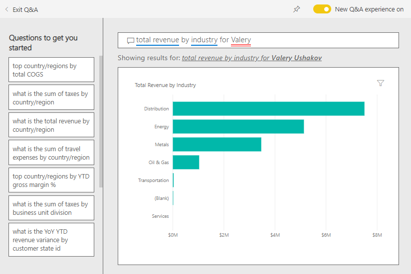
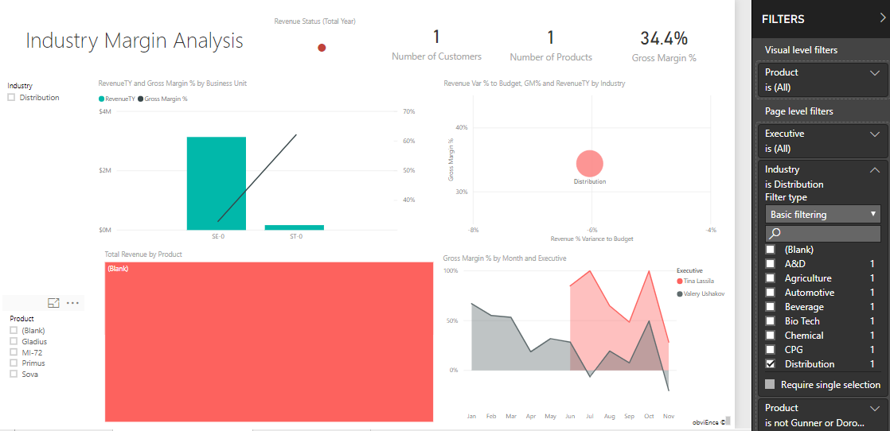

# Customer Profitability sample for Power BI: Take a tour

## Overview of the Customer Profitability sample
The Customer Profitability Sample content pack contains a dashboard, report, and dataset for a company that manufactures marketing materials. This dashboard was created by a CFO to see key metrics about her five business unit managers (executives), products, customers, and gross margins (GM). At a glance, she can see what factors are impacting profitability.

This sample is part of a series that shows how you can use Power BI with business-oriented data, reports, and dashboards. This sample was created with real data by [obviEnce](http://www.obvience.com/), which has been anonymized. The data is available in several formats: content pack/app, Excel workbook, or .pbix Power BI Desktop file. See [Samples for Power BI](sample-datasets.md). This tutorial uses the Power BI service and the Customer Profitability Sample content pack. Because the report experiences are so similar, you can also follow along by using Power BI Desktop and the sample .pbix file. 

## Prerequisites

Before you can use the sample, you must first download it as a [content pack](#get-the-content-pack-for-this-sample), [pbix file](#get-the-pbix-file-for-this-sample), or 
[Excel workbook](#get-the-excel-workbook-for-this-sample).

### Get the content pack for this sample

1. Open the Power BI service (app.powerbi.com), sign in, and open the workspace where you want to save the sample.

2. In the bottom-left corner, select **Get Data**.

    
3. On the **Get Data** page that appears, select **Samples**.

4. Select **Customer Profitability Sample**, then choose **Connect**.  

   
5. Power BI imports the content pack and then adds a new dashboard, report, and dataset to your current workspace.

   

### Get the .pbix file for this sample

Alternatively, you can download the [Customer Profitability sample](http://download.microsoft.com/download/6/A/9/6A93FD6E-CBA5-40BD-B42E-4DCAE8CDD059/Customer%20Profitability%20Sample%20PBIX.pbix) as a .pbix file, which is designed for use with Power BI Desktop.

### Get the Excel workbook for this sample

If you want to view the data source for this sample, it's also available as an [Excel workbook](http://go.microsoft.com/fwlink/?LinkId=529781). The workbook contains Power View sheets that you can view and modify. To see the raw data, enable the Data Analysis add-ins, then select **Power Pivot > Manage**. To enable the Power View and Power Pivot add-ins, see [Take a look at the Excel samples from inside Excel itself](sample-datasets.md#optional-take-a-look-at-the-excel-samples-from-inside-excel-itself) for details.

## What is our dashboard telling us?

In the workspace where you saved the sample, find the Customer Profitability dashboard and select it:

### Company-wide dashboard tiles
1. Open the dashboard in the Power BI service. The dashboard tiles give our CFO a view of the high-level company metrics important to her. When she sees something interesting, she can select a tile to dig into the data.

2. Review the tiles on the left side of the dashboard.

    

- The company's gross margin is 42.5%.
- It has 80 customers.
- It sells five different products.
- It had its lowest revenue % variance to budget in February, followed by the highest in March.
- Most of our revenue comes from the east and north regions. Gross margin has never exceeded budget, with the ER-0 and MA-0 business units requiring further investigation.
- Total revenue for the year is close to budget.

### Manager-specific dashboard tiles
The tiles on the right side of the dashboard provide a team scorecard. The CFO needs to keep track of her managers and these tiles give her a high-level overview of profit, by using GM%. If the GM% trend is unexpected for any manager, then she can investigate further.

By analyzing the manager-specific dashboard tiles, we can make the following observations:

- All executives, except Carlos, have already exceeded their target sales. However, Carlos' actual sales are the highest.
- Annelie’s GM% is the lowest, but we see a steady increase since March.
- Valery, on the other hand, has seen her GM% drop significantly.
- Andrew had a volatile year.

## Explore the dashboard's underlying data
This dashboard has tiles that link to a report and to an Excel workbook.

### Open the Excel Online data source
Two tiles on this dashboard, **Target vs Actual** and **Year Over Year Revenue Growth** were pinned from an Excel workbook. When you select either of these tiles, Power BI opens the data source: in this case, Excel Online.

1. Select either of the tiles that were pinned from Excel. Excel Online opens within the Power BI service.
2. Notice that the workbook has three tabs worth of data. Open **Revenue**.
3. Let's look into why Carlos hasn't hit his target yet:  
    a. From the **Executive** slider, select **Carlos Grilo**.   
    b. The first PivotTable tells us that Carlos' revenue growth for his top product, Primus, is down 152% from last year. The YoY Revenue Variance chart shows that for most months he's below budget.  

    

    

4. Continue exploring. If you find something interesting, select **Pin**  from the upper-right corner to [pin it to a dashboard](service-dashboard-pin-tile-from-excel.md).

5. Use your browser's back arrow to return to the dashboard.

### Open the underlying Power BI report
Many of the tiles on the Customer Profitability sample dashboard were pinned from the underlying Customer Profitability sample report.

1. Select one of these tiles to open the report in Reading view.

   If the tile was created in Q&A, selecting it opens the Q&A window. Select **Exit Q&A** to return to the dashboard and try a different tile.

2. The report has three pages. Each tab at the bottom of the report represents a different page.

    

    * **Team Scorecard** focuses on the performance of the five managers and their books of business.
    * **Industry Margin Analysis** provides a way to analyze the profitability compared to what's happening in the entire industry.
    * **Executive Scorecard** provides a view of each of the managers, formatted for viewing in Cortana.

### Team Scorecard page

Let’s look at two of the team members in detail and see what insights can be gained. In the **Executive** box on the left, select Andrew's name to filter the report page to display only data about Andrew.

* For a quick KPI, look at Andrew’s **Revenue Status (Total Year)**; it's green, which means he’s performing well.
* The **Revenue % Variance to Budget by Month and Executive** chart shows that, except for a dip in February, Andrew is doing well overall. His dominant region is the east region, he handles 49 customers, and 5 out of 7 products. His GM% is not the highest or the lowest.
* The **RevenueTY and Revenue % Var to Budget by Month** chart shows a steady, even-profit story. However, if you filter by selecting the square for **Central** in the region treemap, you discover that Andrew has revenue only in March and only in Indiana. Is this intentional or is it something that needs looking into?

Now on to Valery. In the **Executive** box, select Valery’s name to filter the report page to display data only about her. 

* Notice the red KPI for **Revenue Status (Total Year)**. This item definitely needs further investigation.
* Her revenue variance also paints a worrying picture; she is not meeting her revenue margins.
* Valery has only nine customers, handles only two products, and works almost exclusively with customers in the north region. This specialization could explain the wide fluctuations in her metrics.
* If you select the **North** square in the tree map, it shows that Valery’s gross margin in the north region is consistent with her overall margin.
* Selecting the other **Total Revenue by Region** squares tells an interesting story: her GM% ranges from 23% to 79%. Her revenue numbers, in all regions except the north region, are extremely seasonal.

Continue exploring to find out why Valery’s area is not performing well. Look at regions, the other business units, and the next page in the report: **Industry Margin Analysis**.

### Industry Margin Analysis
This report page provides a different slice of the data. It looks at gross margin for the entire industry, broken down by segment. The CFO uses this page to compare company and business unit metrics to industry metrics to help her explain trends and profitability. You might wonder why the **Gross Margin % by Month and Executive**  chart is on this page, because it's team-specific. Having it here lets us filter the page by business unit manager.  

How does profitability vary by industry? How do the products and customers break down by industry? To answer these questions, select one or more industries from the top left (start with the CPG industry). To clear the filter, select the eraser icon.

On the bubble chart (**Revenue Var % to Budget, GM%, and RevenueTY by Industry**), the CFO looks for the largest bubbles, because they have the biggest impact on revenue. To easily see each manager’s impact by industry segment, filter the page by clicking on each manager's name in the area chart.

* Andrew's area of influence spans many different industry segments with widely varying GM% (most on the positive side) and Var%.
* Annelie's chart is similar, except that she concentrates on only a handful of industry segments with a focus on the Federal segment and a focus on the Gladius product.
* Carlos has a clear focus on the services segment, with good profit. He's greatly improved Var% for the High Tech segment and a new segment for him, Industrial, performed exceptionally well compared to budget.
* Tina works with a handful of segments and has the highest GM%, but the mostly small size of her bubbles shows that her impact on the company's bottom line is minimal.
* Valery, who is responsible for only one product, works in only five industry segments. Her industry influence is seasonal, but always produces a large bubble, indicating a significant impact on the company’s bottom line. Do the industry segments explain her negative performance?

### Executive Scorecard
This page is formatted as a Cortana answer page for Cortana. To learn more, see [Create a custom answer page for Cortana](service-cortana-answer-cards.md).

## Dig into the data by asking questions with Q&A
For our analysis, it might be helpful to determine which industry generates the most revenue for Valery. Let’s use Q&A.

1. Open the report in Editing view by selecting **Edit report**. Editing view is available only if you own the report. This view is sometimes called **creator** mode. If instead, this report was only shared with you, you can't open it in Editing view.

2.  From the top menu bar, select **Ask a question** to open the Q&A question box.

    

3. Type *total revenue by industry for Valery Ushakov*. Notice how the visualization updates as you type the question.

    

   As you can see, the Distribution industry is the biggest revenue area for Valery.

### Dig deeper by adding filters
Let's take a look at the Distribution industry.  

1. Open the **Industry Margin Analysis** report page.
2. Without selecting any visualizations on the report page, expand the filter pane on the right (if it isn't already expanded). The **Filters** pane should display only **Page level filters**.  

   
3. Locate the filter for **Industry** and select the arrow to expand the list. Let's add a page filter for the Distribution industry. First, clear all selections by clearing the **Select All** checkbox. Then select only **Distribution.**  

   
4. The **Gross Margin % by Month and Executive** chart tells us that only Valery and Tina have customers in this industry and Valery worked with this industry only from June to November.   
5. Select **Tina** and then **Valery** in the **Gross Margin by Month and Executive** chart legend. Notice Tina's portion of the **Total Revenue by Product** chart is small compared to Valery.
6. To see actual revenue, use Q&A to enter *total revenue by executive for distribution by scenario*.  

     

    We can similarly explore other industries and even add customers to our visuals to understand causes for Valery's performance.

This environment is a safe one to play in, because you can choose not to save your changes. But if you do save them, you can always select **Get Data** for a new copy of this sample.

## Next steps: Connect to your data
We hope this tour has shown how Power BI dashboards, Q&A, and reports can provide insights into customer data. Now it's your turn; connect to your own data. With Power BI, you can connect to a wide variety of data sources. To learn more, see [Get started with the Power BI service](service-get-started.md).

[Samples for Power BI](sample-datasets.md)  
