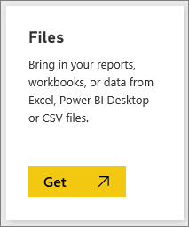
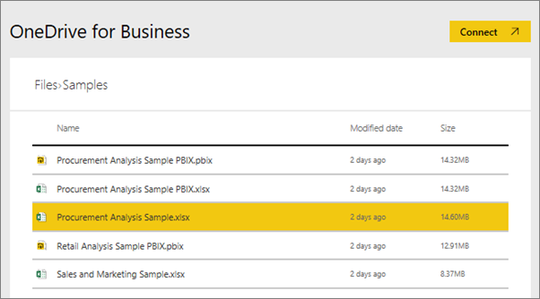
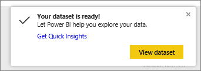

# What sample data is available to use with Power BI?
Say you're new to Power BI and want to try it out but don't have any data.  Or maybe you have a dataset, but because you don't understand (yet) how Power BI works, you worry that you might somehow damage your dataset?

No need to stress out! obviEnce ([www.obvience.com](http://www.obvience.com/)) and Microsoft have created samples for you to use until you feel more comfortable with Power BI.  The data is anonymized and represents different industries: finance, HR, sales, and more. And as you read through our online documentation you'll discover tutorials and examples that use these same samples which means that you'll be able to follow along.      

   

Each of these samples is available in several formats: as a content pack, as an individual Excel workbook, and as a .pbix file. If you don't know what these things are, or how to get your hands on them -- don't worry. We'll explain it all later in this article. And for each sample we've created a *tour* which is a type of article that tells the story behind the sample and walks you through different scenarios. One scenario might be answering questions for your manager, another might be looking for competitive insights, or creating reports and dashboards to share, or explaining a business shift.   

But before we get started, please read through these legal guidelines for using the samples. When you're done we'll introduce the samples and show you how to use them.   

## Usage guidelines for the Power BI sample Excel workbooks
Please read this information before using the Power BI samples.

©2015 Microsoft Corporation. All rights reserved. The documents and workbooks are provided "as-is." Information and views expressed in the workbooks, including URL and other Internet Web site references, may change without notice. You bear the risk of using it. Some examples are for illustration only and are fictitious. No real association is intended or inferred. Microsoft makes no warranties, express or implied, with respect to the information provided here.

The workbooks do not provide you with any legal rights to any intellectual property in any Microsoft product. You may copy and use this workbook for your internal, reference purposes.

The workbooks and related data are provided by obviEnce. [www.obvience.com](http://www.obvience.com)

ObviEnce is an ISV and an Intellectual Property (IP) Incubator focused on Microsoft Business Intelligence. ObviEnce works closely with Microsoft to develop best practices and thought leadership for jump-starting and deploying Microsoft Business Intelligence solutions.

The workbooks and data are property of obviEnce, LLC and have been shared solely for the purpose of demonstrating Power BI functionality with industry sample data.

Any uses of the workbooks and/or data must include the above attribution (that is also on the Info worksheet included with each workbook). The workbook and any visualizations must be accompanied by the following copyright notice: obviEnce ©.

By clicking any of the links below to download the Excel workbook files or .pbix files, you are agreeing to the terms above.

## Available samples
Eight samples are available for you to use.  Each one represents a different industry.

### Customer Profitability sample  
[Take a tour of the Customer Profitability sample](sample-customer-profitability.md)

This industry sample analyzes a CFO's key metrics for her executives, products, and customers. You can investigate what factors impact the company's profitability.

### Human Resources sample  
[Take a tour of the HR sample](sample-human-resources.md)

This industry sample focuses on the hiring strategy for a company by analyzing new hires, active employees, and employees who've left.  By exploring the data, you can find trends in voluntary separations and biases in the hiring strategy.

### IT Spend Analysis sample 
[Take a tour of the IT Spend Analysis sample](sample-it-spend.md)

In this industry sample we analyze the planned vs. actual costs of the IT department of a company. This comparison helps us understand how well the company planned for the year and investigate areas with huge deviations from the plan. The company in this example goes through a yearly planning cycle, and then quarterly it produces a new Latest Estimate (LE) to help analyze changes in IT spend over the fiscal year.

### Opportunity Analysis sample  
[Take a tour of the Opportunity Analysis sample](sample-opportunity-analysis.md)

This industry sample explores a software company's sales channel. Sales managers monitor their direct and partner sales channels by tracking opportunities and revenue by region, deal size, and channel.

### Procurement Analysis sample  
[Take a tour of the Procurement Analysis sample](sample-procurement.md)

This industry sample analyzes a CFO's key metrics for her executives, products, and customers. You can investigate what factors impact the company's profitability

### Retail Analysis sample  
[Take a tour of the Retail Analysis sample](sample-retail-analysis.md)

This industry sample analyzes retail sales data of items sold across multiple stores and districts. The metrics compare this year's performance to last year's in these areas: sales, units, gross margin, and variance, as well as new store analysis.

### Sales and Marketing sample  
[Take a tour of the Sales and Marketing sample](sample-sales-and-marketing.md)

This industry sample analyzes a manufacturing company, VanArsdel Ltd. It allows the Chief Marketing Officer to watch the industry and the market share for VanArsdel.  By exploring the sample, you can find the company's market share, product volume, sales, and sentiment.

### Supplier Quality sample  
[Take a tour of the Supplier Quality sample](sample-supplier-quality.md)

This industry sample focuses on one of the typical supply chain challenges — supplier quality analysis. Two primary metrics are at play in this analysis: total number of defects and the total downtime that these defects caused. This sample has two main objectives: understand who the best and worst suppliers are, with respect to quality, and identify which plants do a better job finding and rejecting defects, to minimize downtime.

Now you know what's available. Time to learn how to get ahold of these samples.  

## How to get the samples
As you read above, the samples are available in several formats: content packs, Excel workbooks, and .pbix files. We'll describe how to use each of these, starting with content packs.

## The Power BI samples as content packs
Content packs are the only sample format that is available from within Power BI; you don't have to leave Power BI to find them. A content pack is essentially a bundle of one or more dashboard, dataset, and report that someone creates and that can be used with Power BI service. People create content packs to share with colleagues. Each of the Power BI sample content packs contains a dataset, report, and dashboard.  Content packs are not available for Power BI Desktop. If you'd like to learn more about content packs, read [Intro to content packs in Power BI](service-organizational-content-pack-introduction.md).

### Get and open a sample content pack in Power BI service
1. Open Power BI service (app.powerbi.com) and log in.
2. In the bottom left corner select **Get data**.

    
3. On the Get Data page that appears, select the **Samples** icon.

   
4. Select one of the samples to open a description of that sample. Then choose **Connect**.  

   
5. Power BI imports the content pack and adds a new dashboard, report, and dataset to your current workspace. The new content is marked with a yellow asterisk. Use the samples to take Power BI for a test run.  

   

Now that you have data, you're on your way.  Try out some of our tutorials using the sample content packs or just open Power BI service and explore.

## The Power BI samples as Excel files
Each of the sample content packs is also available as an Excel workbook. The Excel workbooks are designed to be used with Power BI service.  

1. Download the files individually using the links below, or [download a zip file of all the sample files](http://go.microsoft.com/fwlink/?LinkId=535020). If you're an advanced user, you might want to download the Excel workbooks to explore or edit the data models.

   * [Retail Analysis Sample](http://go.microsoft.com/fwlink/?LinkId=529778)
   * [Supplier Quality Analysis Sample](http://go.microsoft.com/fwlink/?LinkId=529779)
   * [Human Resources Sample](http://go.microsoft.com/fwlink/?LinkId=529780)
   * [Customer Profitability Sample](http://go.microsoft.com/fwlink/?LinkId=529781)
   * [Opportunity Tracking Sample](http://go.microsoft.com/fwlink/?LinkId=529782)
   * [IT Spend Analysis Sample](http://go.microsoft.com/fwlink/?LinkId=529783)
   * [Procurement Analysis Sample](http://go.microsoft.com/fwlink/?LinkId=529784)
   * [Sales and Marketing Sample](http://go.microsoft.com/fwlink/?LinkId=529785)
2. Save the downloaded file. Where you save the file makes a difference.

   *   **Local** - If you save your file to a local drive on your computer or another location in your organization, from Power BI, you can import your file into Power BI. Your file will actually remain on your local drive, so the whole file isn’t really imported into Power BI. What really happens is a new dataset is created in your Power BI site and data, and in some cases the data model, are loaded into the dataset. If your file has any reports, those will appear in your Power BI site under Reports.
   *  **OneDrive - Business** – If you have OneDrive for Business and you sign into it with the same account you sign into Power BI with, this is by-far the most effective way to keep your work in Excel, Power BI, or a .CSV file in-sync with your dataset, reports, and dashboards in Power BI. Because both Power BI and OneDrive are in the cloud, Power BI connects to your file on OneDrive about every hour. If any changes are found, your dataset, reports, and dashboards are automatically updated in Power BI.
   *  **OneDrive - Personal** – If you save your files to your own OneDrive account, you’ll get many of the same benefits as you would with OneDrive for Business. The biggest difference is when you first connect to your file (using Get Data > Files > OneDrive – Personal) you’ll need to sign in to your OneDrive with your Microsoft account, which is usually different from what you use to sign in to Power BI. When signing in with your OneDrive with your Microsoft account, be sure to select the Keep me signed in option. This way, Power BI will be able to connect to your file about every hour and make sure your dataset in Power BI is in-sync.
   *  **SharePoint Team-Sites**    Saving your Power BI files to SharePoint – Team Sites is much the same as saving to OneDrive for Business. The biggest difference is how you connect to the file from Power BI. You can specify a URL or connect to the root folder.
3. Open Power BI service (app.powerbi.com) and log in.

   > [!TIP]
   > At this point you may want to create a new dashboard and name it after the file you plan on importing.  Otherwise, when you import the Excel dataset, Power BI won't create a new dashboard named after the sample but instead will add a tile to the dashboard that you currently have open. Selecting that tile will take you to the dataset's report. This isn't a major big deal as you can always create a new dashboard later, but starting with a new dashboard saves you a step or two.
   >
   >
4. In the bottom left corner select **Get data**.

    
5. On the Get Data page that appears, select **Files > Get**.

     
6. Navigate to the location where you downloaded and saved the sample.

   
7. Select the file, in this case **Procurement Analysis Sample.xlsx** which was saved on OneDrive for Business, and choose **Connect**.

   
8. Choose whether to import the data or to bring the workbook into Power BI and see it exactly as it is in Excel online.

    
9. If you select **Import**, Power BI imports the sample workbook and adds it as a new dataset named **Procurement Analysis Sample**.  If the workbook has any Power View sheets, tables or ranges, or a data model, Power BI also creates a report (with the same name). And if you don't already have a dashboard open, Power BI creates a new dashboard. (If you had a dashboard open when you clicked **Get Data**, you'll see a new blank tile on that dashboard.  Clicking that tile will take you to the report for the dataset you just added). The new content is named after the sample and is marked with a yellow asterisk.
10. When the **Your dataset is ready!** screen appears, select **View dataset** or **Get Quick Insights** or simply use your Power BI left navbar to locate and open the associated report or dashboard.  

     

### (Optional) Take a look at the Excel samples from inside Excel itself
Want to understand how the data in an Excel workbook gets converted to Power BI datasets and reports? Opening the Excel samples ***in Excel*** and exploring the worksheets provides some of the answers.

* When you first open a sample workbook in Excel, you may see two warnings. The first says the workbook is in Protected View. Select **Enable Editing**. The second may say that the workbook has external data connections. Select **Enable Content**.
* Each workbook contains several sheets. Because these Excel samples all have at least one Power View sheet with visualizations, when you import the Excel file into Power BI you'll end up with a dataset **and** a report.

   You may need to [enable the Power View add-in](https://support.office.com/article/Create-a-Power-View-sheet-in-Excel-2013-B23D768D-7586-47FE-97BD-89B80967A405#__toc328591957).
* So where's the actual data? It's in the Power Pivot data model. To see the data, on the **PowerPivot** tab, select **Manage Data Model**.

    Don't see the PowerPivot tab? [Enable the Power Pivot add-in](https://support.office.com/article/Start-Power-Pivot-in-Microsoft-Excel-2013-add-in-A891A66D-36E3-43FC-81E8-FC4798F39EA8).
* The Info tab provides information about obviEnce, the company that created the sample.

## The Power BI samples as .pbix files
Each of the sample content packs is also available as Power BI .pbix file. The .pbix files are designed to be used with Power BI Desktop.  

1. Download the files individually using the links below. Selecting these links saves the file automatically to your Downloads folder. 

   * [Retail Analysis Sample PBIX](http://download.microsoft.com/download/9/6/D/96DDC2FF-2568-491D-AAFA-AFDD6F763AE3/Retail%20Analysis%20Sample%20PBIX.pbix)
   * [Supplier Quality Analysis Sample PBIX](http://download.microsoft.com/download/8/C/6/8C661638-C102-4C04-992E-9EA56A5D319B/Supplier-Quality-Analysis-Sample-PBIX.pbix)
   <!-- Previous link doesn't work -->
   * [Human Resources Sample PBIX](http://download.microsoft.com/download/6/9/5/69503155-05A5-483E-829A-F7B5F3DD5D27/Human%20Resources%20Sample%20PBIX.pbix)
   * [Customer Profitability Sample PBIX](http://download.microsoft.com/download/6/A/9/6A93FD6E-CBA5-40BD-B42E-4DCAE8CDD059/Customer%20Profitability%20Sample%20PBIX.pbix)
   * [Opportunity Tracking Sample PBIX](http://download.microsoft.com/download/9/1/5/915ABCFA-7125-4D85-A7BD-05645BD95BD8/Opportunity%20Analysis%20Sample%20PBIX.pbix)
   * [IT Spend Analysis Sample PBIX](http://download.microsoft.com/download/E/9/8/E98CEB6D-CEBB-41CF-BA2B-1A1D61B27D87/IT%20Spend%20Analysis%20Sample%20PBIX.pbix)
   * [Procurement Analysis Sample PBIX](http://download.microsoft.com/download/D/5/3/D5390069-F723-413B-8D27-5888500516EB/Procurement%20Analysis%20Sample%20PBIX.pbix)
   * [Sales and Marketing Sample PBIX](http://download.microsoft.com/download/9/7/6/9767913A-29DB-40CF-8944-9AC2BC940C53/Sales%20and%20Marketing%20Sample%20PBIX.pbix)

1. From Power BI Desktop, select **File > Open** and navigate to the location where you saved the sample .pbix.

   
4. Select the .pbix file to open it in Power BI Desktop.

## Next steps
[Power BI basic concepts](consumer/end-user-basic-concepts.md)

[Tutorial: Connect to the Power BI samples](sample-tutorial-connect-to-the-samples.md)

[Data sources for Power BI](service-get-data.md)

More questions? [Try the Power BI Community](http://community.powerbi.com/)
