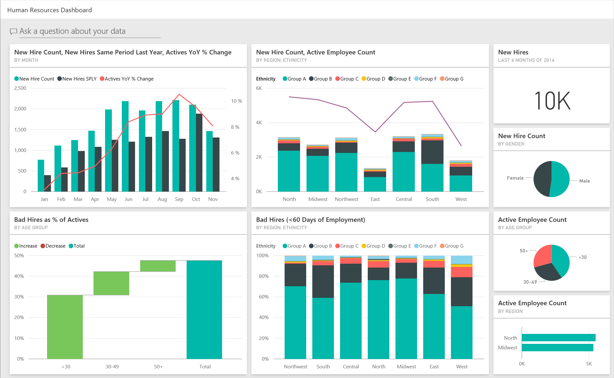
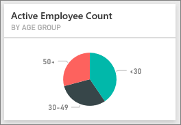
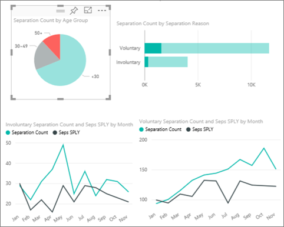
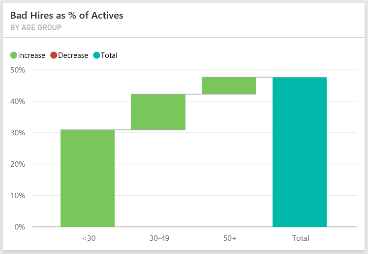
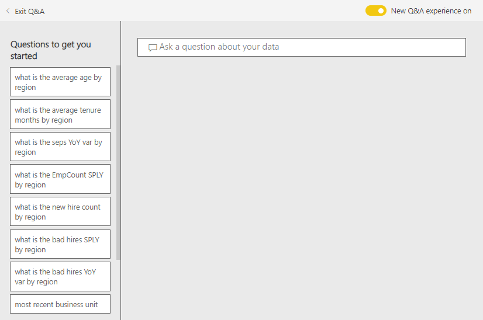
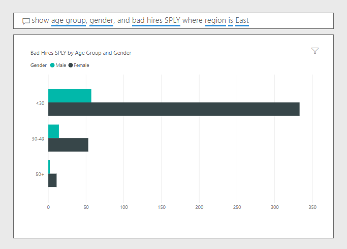

# Human Resources sample for Power BI: Take a tour

## Overview of the Human Resources sample
The HR department has the same reporting model across different companies, even when they differ by industry or size. This sample looks at new hires, active employees, and employees who left and tries to uncover any trends in the hiring strategy. Our main objectives are to understand:

* Who we hire
* Biases in our hiring strategy
* Trends in voluntary separations

This sample is part of a series that illustrates how you can use Power BI with business-oriented data, reports, and dashboards. This is real data from obviEnce ([www.obvience.com)](http://www.obvience.com/) that has been anonymized. The data is available in several formats: content pack/app, Excel workbook, or .pbix Power BI Desktop file. To learn more, see [Sample datasets](sample-datasets.md).

## Prerequisites

 Before you can use the sample, you must first download it as a [content pack](https://docs.microsoft.com/power-bi/sample-human-resources#get-the-content-pack-for-this-sample), [pbix file](http://download.microsoft.com/download/6/9/5/69503155-05A5-483E-829A-F7B5F3DD5D27/Human%20Resources%20Sample%20PBIX.pbix), or 
[Excel workbook](http://go.microsoft.com/fwlink/?LinkId=529780).

### Get the content pack for this sample

1. Open the Power BI service (app.powerbi.com) and log in.
2. In the bottom left corner select **Get data**.
   
    
3. On the Get Data page that appears, select the **Samples** icon.
   
   
4. Select the **Human Resources Sample**, then choose **Connect**.  
   
   
5. Power BI imports the content pack and adds a new dashboard, report, and dataset to your current workspace. The new content is marked with a yellow asterisk. 
   
   
  
### Get the .pbix file for this sample

Alternatively, you can download the sample as a .pbix file, which is designed for use with Power BI Desktop. 

 * [Human Resources Sample PBIX](http://download.microsoft.com/download/6/9/5/69503155-05A5-483E-829A-F7B5F3DD5D27/Human%20Resources%20Sample%20PBIX.pbix)

### Get the Excel workbook for this sample
You can also [download just the dataset (Excel workbook)](http://go.microsoft.com/fwlink/?LinkId=529780) for this sample. The workbook contains Power View sheets that you can view and modify. To see the raw data select **Power Pivot > Manage**.

## New hires
Let’s explore new hires first.

1. In your workspace, select the **Dashboards** tab, and open the Human Resources dashboard.
2. On the dashboard, select the **New Hire Count, New Hires Same Period Last Year, Actives YoY % Change** **By Month** tile.  
     

   The Human Resources Sample report opens to the **New Hires** page.  

   

Notice the following:

* The **New Hire Count, New Hires SPLY and Actives YoY % Change by Month** combo chart shows we hired more people every month this year compared to last year &#151; significantly more people in some months.
* In the combo chart **New Hire Count and Active Employee Count by Region and Ethnicity**, notice we’re hiring fewer people in the **East** region.
* The **New Hires YoY Var by Age Group** waterfall chart shows we’re hiring mainly younger people. This may be due to the mainly part-time nature of the jobs.
* The **New Hire Count by Gender** pie chart shows a pretty even split.

Can you find more insights; for example, a region where the gender split is not even? Select different age groups and genders in the charts to explore the relationships between age, gender, region, and ethnicity group.

Select the name of the dashboard from the top navbar to return to the dashboard.

## Compare current active and former employees
Let’s explore data for current active employees and employees who no longer work for the company.

On the dashboard, select the **Active Employee Count by Age Group** tile.  

The Human Resources Sample report opens to the **Active Employees vs. Separations** page.  

**Items of interest**:

* Combo charts on the left show year-over-year change for active employees and separates. We have more actives this year due to rapid hiring, but also more separates than last year.
* In August we had more separates compared to other months. Select the different age groups, genders, or regions to see if you can find any outliers.
* Looking at the pie charts, we notice we have a pretty even split in our active employees by gender and age groups. Select different age groups to see the gender split differs by age. Do we have an even split by gender in every age group?

## Reasons for separation
Let’s look at the report in Editing View. Select **Edit report** in the upper-left corner.

Change the pie charts to show Separates data instead of Actives.

1. Select the **Active Employee Count by Age Group** pie chart.
2. In **Fields**, select the arrow next to **Employees** to expand the Employees table. Clear the check box next to **Active Employee Count** to remove that field.
3. Select the check box next to **Separation Count** in the Employees table to add it to the **Values** box in the field well.
4. Back on the report canvas, select the **Voluntary** bar in the **Separation Count by Separation Reason** bar chart. This highlights those who left voluntarily in the other visuals in the report.
5. Click the 50+ slice of the Separation Count by Age Group pie chart.

   Look at the Separations by Reason line chart in the lower-right corner. This chart is filtered to show voluntary separations.  
   

   Notice the trend in the 50+ age group? During the latter part of the year more employees over age 50 are leaving voluntarily. This would be an area to investigate further with more data.
6. You can follow the same steps for the **Active Employee Count by Gender** pie chart too, changing it to separations instead of active employees. Look at the voluntary separation data by gender to see if you find any other insights.
7. Click **Power BI** in the top navigation bar to return to the dashboard. You can save the changes you’ve made to the report or not.

## Bad hires
The last area to explore is bad hires. Bad hires are defined as employees who didn’t last for more than 60 days. We’re hiring rapidly. Are we hiring good candidates?

1. Select the **Bad Hires as % of Actives by Age Group** dashboard tile. This opens the report to page 3, “Bad Hires”.

     
2. Select the **Northwest** check box in the Region slicer on the left and the **Male** slice in the Bad Hire Count by Gender donut chart.  Look at other charts on the “Bad Hires” page. More male bad hires than females and lot of Group A bad hires.
     
3. Looking at the **Bad Hires by Gender** donut chart and clicking through the **Region** slicer we notice that East is the only region with more female than male bad hires.  
4. Select the name of the dashboard from the top navbar to return to the dashboard.

## Asking a question in the Q&A box
The [Q&A question box](power-bi-tutorial-q-and-a.md) is where you type a question using natural language. Q&A recognizes the words you type and figures out where in your dataset to find the answer.

1. Click in the Q&A question box. Notice before you even start typing, the Q&A box contains suggestions:

   
2. You can pick one of those suggestions, or type:  **show age group, gender and bad hires SPLY  where region is east**.  

   

   Notice most of the female bad hires are under 30.

This is a safe environment to play in. You can always choose not to save your changes. If you do save them, you can always go to **Get Data** for a new copy of this sample.

## Next steps: Connect to your data
We hope this tour has shown how Power BI dashboards, Q&A, and reports can provide insights into human resources data. Now it is your turn — connect to your own data. With Power BI you can connect to a wide variety of data sources. Learn more about [getting started with Power BI](service-get-started.md).  
