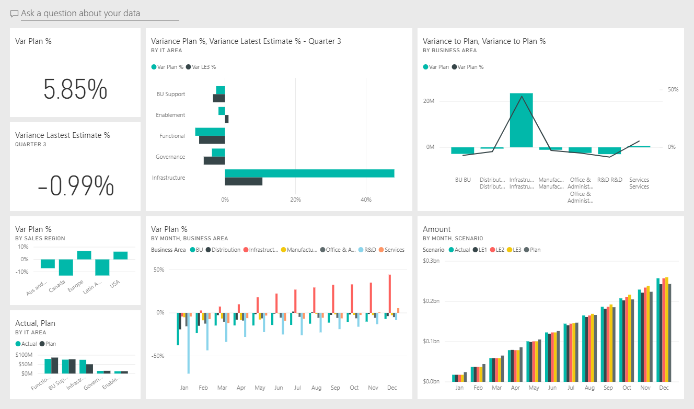

# IT Spend Analysis sample for Power BI: Take a tour

## Overview of the IT Spend Analysis sample
The IT Spend Analysis Sample content pack contains a dashboard, report, and dataset that analyzes the planned vs. actual costs of an IT department. This comparison helps us understand how well the company planned for the year and investigate areas with huge deviations from the plan. The company in this example goes through a yearly planning cycle, and then quarterly it produces a new Latest Estimate (LE) to help analyze changes in IT spend over the fiscal year.

This sample is part of a series that shows how you can use Power BI with business-oriented data, reports, and dashboards. This sample was created with real data by [obviEnce](http://www.obvience.com/), which has been anonymized. The data is available in several formats: content pack/app, Excel workbook, or .pbix Power BI Desktop file. See [Samples for Power BI](sample-datasets.md). This tutorial uses the Power BI service and the Human Resources Sample content pack. Because the report experiences are so similar, you can also follow along by using Power BI Desktop and the sample .pbix file. 

## Prerequisites

 Before you can use the sample, you must first download it as a [content pack](#get-the-content-pack-for-this-sample), [pbix file](#get-the-pbix-file-for-this-sample), or 
[Excel workbook](#get-the-excel-workbook-for-this-sample).

### Get the content pack for this sample

1. Open the Power BI service (app.powerbi.com), sign in, and open the workspace where you want to save the sample.

2. In the bottom-left corner, select **Get Data**.
   
    
3. On the **Get Data** page that appears, select **Samples**.
   
4. Select **IT Spend Analysis Sample**, then choose **Connect**.  
  
   
   
5. Power BI imports the content pack and then adds a new dashboard, report, and dataset to your current workspace.
   
   
  
### Get the .pbix file for this sample

Alternatively, you can download the [IT Spend Analysis sample](http://download.microsoft.com/download/E/9/8/E98CEB6D-CEBB-41CF-BA2B-1A1D61B27D87/IT%20Spend%20Analysis%20Sample%20PBIX.pbix) as a .pbix file, which is designed for use with Power BI Desktop.

### Get the Excel workbook for this sample

If you want to view the data source for this sample, it's also available as an [Excel workbook](http://go.microsoft.com/fwlink/?LinkId=529783). The workbook contains Power View sheets that you can view and modify. To see the raw data, enable the Data Analysis add-ins, then select **Power Pivot > Manage**. To enable the Power View and Power Pivot add-ins, see [Take a look at the Excel samples from inside Excel itself](sample-datasets.md#optional-take-a-look-at-the-excel-samples-from-inside-excel-itself) for details.

## The IT Spend Analysis Sample dashboard
The two numbers tiles on the dashboard, the **Var Plan %** and **Variance Latest Estimate % Quarter 3**, give us an overview of how well we are doing against plan and against the Latest Qtr estimate (LE3 = Latest Estimate Quarter 3). Overall we are about 6% off the plan. Let’s explore the cause of this variance – when, where, and which category?

## “YTD IT Spend Trend Analysis” page
Selecting the **Var Plan % by Sales Region** dashboard tile takes you to the “IT Spend Trend Analysis” page of the IT Spend Analysis Sample report. We see at a glance that we have positive variance in US and Europe and negative variance in Canada, Latin America, and Australia. US had about 6% +LE variance and Australia has about 7% -LE variance.

But just looking at this chart and drawing conclusions can be misleading. We need to look at actual dollar amounts to put things in perspective.

1. Select **Aus and NZ** in the Var Plan % by Sales Region chart, and observe Var Plan by IT Area chart.

   
2. Now select **USA**. You get the idea — Australia is a really small part of our overall spend as compared to US.

    So we narrowed it down to the USA, now what? Let’s explore which category in the USA is causing the variance.

## Ask questions of the data
1. Select **IT Spend Analysis Sample** in the top navigation bar to return to the Dashboards.
2. In the question box, type “show IT areas, var plan % and var le3 % bar chart”.

   

   In the first IT area, **Infrastructure**, the percentage has changed drastically between the initial variance plan and the variance plan latest estimate.

## “YTD Spend by Cost Elements” page
Go back to the dashboard and look at the **Var Plan %, Var LE3%** dashboard tile.

Infrastructure jumps out with huge positive variance to plan.

1. Click this tile to go to the “YTD Spend by Cost Elements” page of the IT Spend Analysis Sample report.
2. Click the **Infrastructure** bar in the “Var Plan % and Var LE3 % by IT Area” chart in the lower left, and observe the variance to plan in the "Var Plan % by Sales Region" to the left.

    
3. Click the name of each Cost Element Group in the slicer to find the cost element with a large variance.
4. With **Other** selected, click **Infrastructure** in the IT Area and click the sub areas in the IT Sub Area slicer to find the sub area with the largest variance.  

   We see a huge variance in **Networking**.

   Apparently the company decided to give its employees phone services as a benefit but this move was not planned for.

## “Plan Variance Analysis” page
Still in the report, click the "Plan Variance Analysis" tab on the bottom of the report to go to page 3 of the report.

In the “Var Plan, and Var Plan % by Business Area” combo chart on the left, click the Infrastructure column to highlight infrastructure values in the rest of the page.

Notice on the “Var plan% by Month and Business Area” chart that infrastructure started to have a positive variance around February and then it keeps increasing. Also, notice how the variance to plan value for infrastructure varies by country, compared to the value for all business areas. Use the “IT Area” and “IT Sub Areas” slicers on the right to filter the values in the rest of the page rather than highlighting them. Click the different IT Areas on the right to explore the data in another way. You can also click IT Sub Areas and see the variance at that level.

## Edit the report
Click **Edit Report** in the upper-left corner and explore in Editing View.

* See how the pages are made – the fields in each chart, filters on the pages
* Add pages and charts based on the same data
* Change the visualization type for each chart
* Pin them to your dashboard

This environment is a safe one to play in. You can always choose not to save your changes. But if you do save them, you can select **Get Data** for a new copy of this sample.

## Next steps: Connect to your data
We hope this tour has shown how Power BI dashboards, Q&A, and reports can provide insights into IT spend data. Now it's your turn; connect to your own data. With Power BI, you can connect to a wide variety of data sources. To learn more, see [Get started with the Power BI service](service-get-started.md).
