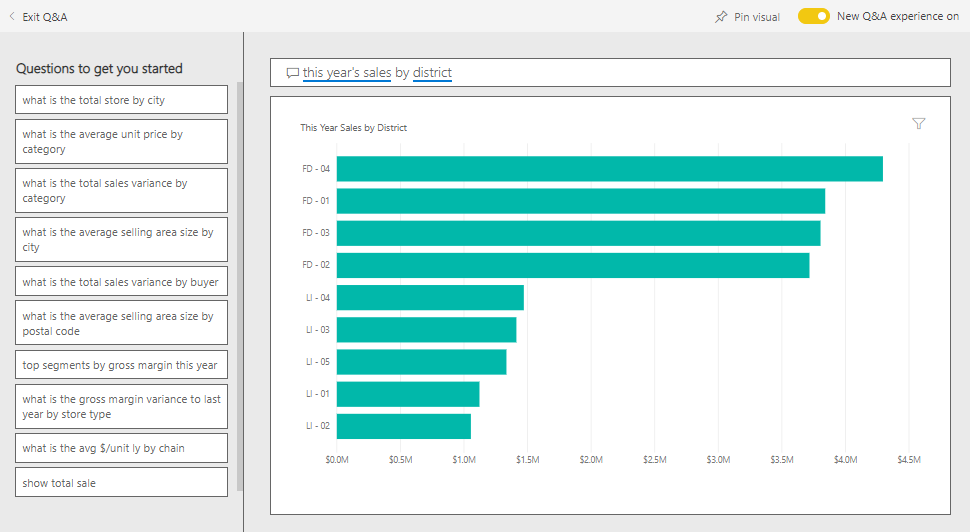
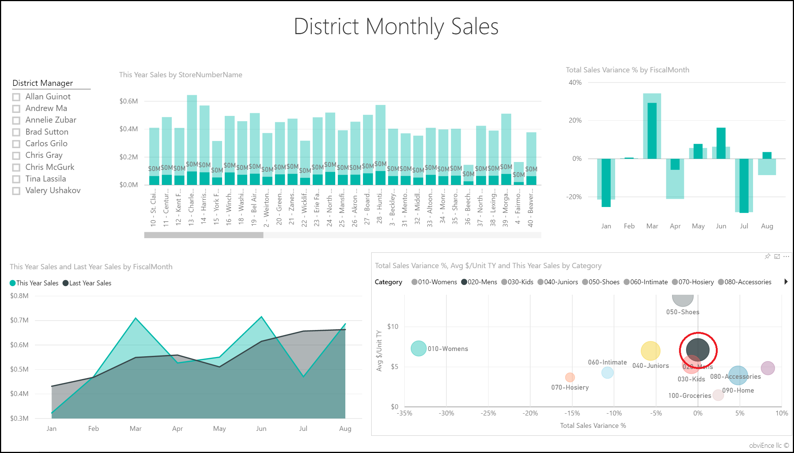
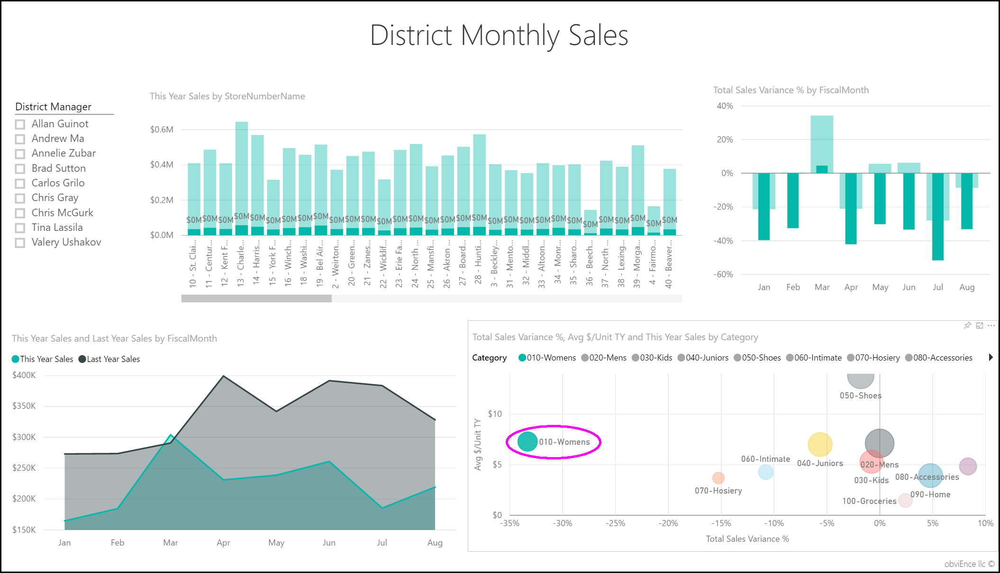

# Retail Analysis sample for Power BI: Take a tour

This industry sample dashboard and underlying report analyze retail sales data of items sold across multiple stores and districts. The metrics compare this year’s performance to last year’s in these areas:  sales, units, gross margin, and variance, as well as new store analysis. This is real data from obviEnce ([www.obvience.com](http://www.obvience.com)) that has been anonymized.

## Prerequisites

 Before you can use the sample, you must first download it as a [content pack](https://docs.microsoft.com/power-bi/sample-datasets#get-and-open-a-sample-content-pack-in-power-bi-service), [.pbix file](http://download.microsoft.com/download/9/6/D/96DDC2FF-2568-491D-AAFA-AFDD6F763AE3/Retail%20Analysis%20Sample%20PBIX.pbix), or [Excel workbook](http://go.microsoft.com/fwlink/?LinkId=529778).

### Get the content pack for this sample

1. Open the Power BI service (app.powerbi.com) and log in.
2. In the bottom left corner select **Get data**.
   
    
3. On the Get Data page that appears, select the **Samples** icon.
   
   
4. Select the **Retail Analysis Sample**, then choose **Connect**.  
  
   
   
5. Power BI imports the content pack and adds a new dashboard, report, and dataset to your current workspace. The new content is marked with a yellow asterisk. 
   
   
  
### Get the .pbix file for this sample

Alternatively, you can download the sample as a .pbix file, which is designed for use with Power BI Desktop. 

 * [Retail Analysis Sample](http://download.microsoft.com/download/9/6/D/96DDC2FF-2568-491D-AAFA-AFDD6F763AE3/Retail%20Analysis%20Sample%20PBIX.pbix)

### Get the Excel workbook for this sample
You can also [download just the dataset (Excel workbook)](http://go.microsoft.com/fwlink/?LinkId=529778) for this sample. The workbook contains Power View sheets that you can view and modify. To see the raw data select **Power Pivot > Manage**.

## Start on the dashboard and open the report
1. On the dashboard, select the "Total Stores" tile:

     

   This takes you to the "Store Sales Overview" page in the report. You see we have 104 total stores, 10 of them new. We have two chains, Fashions Direct and Lindseys. Fashions Direct stores are larger on average.
2. In the pie chart, select **Fashions Direct**.

     

   Notice the result in the bubble chart:

     

   FD-01 district has the highest Average Sales per Square Foot, FD-02 has the lowest Variance in Sales compared to last year, FD-03 and FD-04 are worst performers overall.
3. Select individual bubbles or other charts to see cross highlighting, revealing the impact of your selections.
4. To return to the dashboard, select its name from the top navbar (breadcrumbs).

   
5. On the dashboard, select the tile that has "This Year’s Sales."

   

   This is equivalent to typing "This year sales" in the question box.

   You see this screen:

   

## Review a tile created with Power BI Q&A
Let’s get more specific.

1. Add “this year sales **by district**” onto the question. Observe the result: It automatically put the answer in a bar chart and suggests other phrases:

   
2. Now change the question to “this year sales **by zip and chain**”.

   Notice how it answers the question as you type with the appropriate charts.
3. Play around with more questions and see what kind of results you get.
4. When you’re ready, return to the dashboard.

## Dive deeper into the data
Now let's explore on a more detailed level, looking at the districts' performances.

1. On the dashboard, select the tile comparing this year's sales to last year’s.

   

   Notice the large variability on Variance % to last year, with Jan, Apr, and Jul being particularly bad months.

   

   Let’s see if we can narrow down where the issues might be.
2. Select the bubble chart, and choose **020-Mens**.

     

   Observe the men's category wasn't as severely affected in April as the business overall, but January and July were still problem months.
3. Now, select the **010-Womens’ bubble**.

   

   Notice the women's category performed much worse than business overall across all months, and much worse in almost every month compared to the previous year.
4. Select the bubble again to clear the filter.

## Try out the slicer
Let’s look at how specific districts are doing.

1. Select Allan Guinot in the slicer on the top left.

   

   Note that Allan’s district outperformed Last Year in March and June.
2. Now, while Allan is still selected, select the Women’s bubble.

   

   Note that for the Women’s category, his district never met last year’s volume.
3. Explore the other district managers and categories – what other insights can you find?
4. When you are ready – return to the dashboard.

## What is our data telling us about sales growth this year?
The last area we want to explore is our growth – new stores opened this year.

1. Select the 'Stores Opened This Year’ tile.

   

   As evident from the tile – more Fashions Direct stores than Lindseys stores opened this year.
2. Observe the 'Sales Per Sq Ft by Name' chart:

   

    There is quite a bit of difference in Average Sales per SQF across the new stores.
3. Click on the Fashions Direct legend item in the top right chart. Notice, even for the same chain, the best store (Winchester Fashions Direct) significantly outperforms the worst store (Cincinnati 2 Fashions Direct) $21.22 vs $12.86 respectively.

   
4. Click Winchester Fashions Direct in the slicer and observe the line chart. The first sales numbers were reported in February.
5. Click on Cincinnati 2 Fashions Direct in the slicer and you will see in the line chart that it was opened in June and it seems to be the worst performing store.
6. As before, explore by clicking on other bars, lines and bubbles throughout the charts and see what insights you can discover.

This is a safe environment to play in. You can always choose not to save your changes. But if you do save them, you can always go to Get Data for a new copy of this sample.

## Connect to your data
We hope this tour has shown how Power BI dashboards, Q&A, and reports can provide insights into retail data. Now it’s your turn — connect to your own data. With Power BI you can connect to a wide variety of data sources. Learn more about [getting started with Power BI](service-get-started.md).

## Next steps
* [Download the Retail Analysis sample content pack](sample-tutorial-connect-to-the-samples.md)
* [Download a zip file of all the sample files](http://go.microsoft.com/fwlink/?LinkId=535020)    
* [Download the Excel workbook for this Power BI sample](http://go.microsoft.com/fwlink/?LinkId=529778)    
* [Get data (for Power BI)](service-get-data.md)    
* [Basic concepts for designers in the Power BI service](service-basic-concepts.md)    
* More questions? [Try the Power BI Community](http://community.powerbi.com/)
