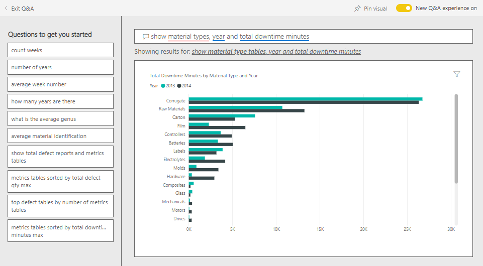

# Supplier Quality Analysis sample for Power BI: Take a tour

## A brief overview of the Supplier Quality Analysis sample
This industry sample dashboard and underlying report focus on one of the typical supply chain challenges — supplier quality analysis.
Two primary metrics are at play in this analysis: total number of defects and the total downtime that these defects caused. This sample has two main objectives:

* Understand who the best and worst suppliers are, with respect to quality
* Identify which plants do a better job finding and rejecting defects, to minimize downtime

This sample is part of a series that illustrates how you can use Power BI with business-oriented data, reports, and dashboards.
This is real data from obviEnce ([www.obvience.com](http://www.obvience.com/)) that has been anonymized.

## Prerequisites

 Before you can use the sample, you must first download it as a [content pack](https://docs.microsoft.com/power-bi/sample-supplier-quality#get-the-content-pack-for-this-sample), [.pbix file](http://download.microsoft.com/download/8/C/6/8C661638-C102-4C04-992E-9EA56A5D319B/Supplier-Quality-Analysis-Sample-PBIX.pbix), or
[Excel workbook](http://go.microsoft.com/fwlink/?LinkId=529779).

### Get the content pack for this sample

1. Open the Power BI service (app.powerbi.com) and log in.
2. In the bottom left corner select **Get data**.
   
    
3. On the Get Data page that appears, select the **Samples** icon.
   
   
4. Select the **Supplier Quality Analysis Sample**, then choose **Connect**.  
  
   
   
5. Power BI imports the content pack and adds a new dashboard, report, and dataset to your current workspace. The new content is marked with a yellow asterisk. 
   
   
  
### Get the .pbix file for this sample

Alternatively, you can download the sample as a .pbix file, which is designed for use with Power BI Desktop. 

 * [Supplier Quality Analysis Sample PBIX](http://download.microsoft.com/download/8/C/6/8C661638-C102-4C04-992E-9EA56A5D319B/Supplier-Quality-Analysis-Sample-PBIX.pbix)

### Get the Excel workbook for this sample
You can also [download just the dataset (Excel workbook)](http://go.microsoft.com/fwlink/?LinkId=529779) for this sample. The workbook contains Power View sheets that you can view and modify. To see the raw data select **Power Pivot > Manage**.

## Downtime caused by defective materials
Let’s analyze the downtime caused by defective materials and see which vendors are responsible.  

1. On the dashboard, select the **Total Defect Quantity** number tile or the **Total Downtime Minutes** number tile.  

     

   The “Supplier Quality Analysis Sample” report opens to the “Downtime Analysis” page. Notice we have 33M total defective pieces, and the total downtime caused by these defective pieces is 77K minutes. Some materials have fewer defective pieces but they can cause a huge delay resulting in larger downtime. Let’s explore them on the report page.  
2. Looking at the **Total Downtime Minutes** line in the **Defects and Downtime (min) by Material Type** combo chart, we see corrugate materials cause the most downtime.  
3. Select the **Corrugate** column in the same combo chart to see which plants are impacted most by this defect and which vendor is responsible.  

     
4. Select individual plants in the map to see which vendor or material is responsible for the downtime at that plant.

### Which are the worst suppliers?
 We want to find the worst eight suppliers and determine what percentage of the downtime they are responsible for creating. We can do this by changing the **Downtime (min) by Vendor** area chart to a treemap.  

1. On page 3 of the report, “Downtime Analysis,” select **Edit Report** in the upper-left corner.  
2. Select the **Downtime (min) by Vendor** area chart, and in the Visualizations pane select Treemap.  

     

    The treemap automatically puts the **Vendor** field as the **Group**.  

      

   From this tree map, we can see the top eight vendors are the eight blocks on the left of the tree map. We can also see they account for about 50% of all downtime minutes.  
3. Select **Supplier Quality Analysis Sample** in the top navigation bar to go back to the dashboard.

### Comparing plants
Now let’s explore which plant does a better job managing defective material, resulting in less downtime.  

1. Select the **Total Defect Reports by Plant, Defect Type** map tile.  

    The report opens to the “Supplier Quality” page.  

     
2. In the map legend, select the **Impact** circle.  

      

    Notice in the bubble chart that **Logistics** is the most troubled category – it’s the largest in terms of total defect quantity, total defect reports, and total downtime minutes. Let’s explore this category more.  
3. Select the Logistics bubble in the bubble chart and observe the plants in Springfield, IL and Naperville, IL. Naperville seems to be doing a much better job of managing defective supplies as it has a high number of rejects and few impacts, compared to Springfield’s large number for impacts.  

     
4. Select **Supplier Quality Analysis Sample** in the top navigation bar to return to your active workspace.

## Which material type is best managed?
The best managed material type is the one with lowest downtime or no impact, regardless of defect quantity.

* In the dashboard, look at the **Total Defect Quantity by Material Type, Defect Type** tile.

  

Notice that **Raw Materials** have a lot of total defects, but most of the defects are either rejected or have no impact.

Let’s verify that raw materials don’t cause a lot of downtime, despite high defect quantity.

* In the dashboard, look at the **Total Defect Qty, Total Downtime Minutes by Material Type** tile.

  

Apparently raw materials are well managed: they have more defects, but lower total downtime minutes.

### Compare defects to downtime by year
1. Select the **Total Defect Reports by Plant, Defect Type** map tile to open the report to the first report page, Supplier Quality.
2. Notice that **Defect Qty** is higher in 2014 than in 2013.  

      
3. Do more defects translate into more downtime? We can ask questions in the Q&A box to find out.  
4. Select **Supplier Quality Analysis Sample** in the top navigation bar to go back to the dashboard.  
5. Since we know Raw Materials have the highest number of defects, in the question box, type “show material types, year and total defect qty”.  

    There were many more raw materials defects in 2014 than in 2013.  

      
6. Now change the question to “show material types, year and total downtime minutes”.  

   

Raw materials downtime was about the same in 2013 and 2014, even though there were many more raw materials defects in 2014.

It turns out more raw materials defects in 2014 didn’t lead to much more raw materials downtime in 2014.

### Compare defects to downtime month to month
Let’s look at another dashboard tile related to total defective quantity.  

1. Select the back arrow  in the upper-left corner above the question box to get back to the dashboard.  

    Looking more closely at the **Total Defect Quantity by Month, Year** tile shows that the first half of 2014 had a similar number of defects as 2013, but in the second half of 2014, the number of defects jumped significantly.  

      

    Let’s see if this increase in defect quantity led to an equal increase in downtime minutes.  
2. In the question box, type “total downtime minutes by month and year as a line chart”.  

   

   We do see a jump in downtime minutes during June and Oct, but other than that, the jump in the number of defects didn’t result in significantly more downtime. This shows we’re managing defects well.  
3. To pin this chart to your dashboard, select the pin icon  to the right of the question box.  
4. To explore the outlier months, check out the downtime minutes during Oct by material type, plant location, category, etc. by asking questions such as "total downtime minutes in October by plant".    
5. Select the back arrow  in the upper-left corner above the question box to get back to the dashboard.

This is a safe environment to play in. You can always choose not to save your changes. But if you do save them, you can always go to **Get Data** for a new copy of this sample.

## Next steps: Connect to your data
We hope this tour has shown how Power BI dashboards, Q&A, and reports can provide insights into supplier quality data. Now it’s your turn — connect to your own data. With Power BI you can connect to a wide variety of data sources. Learn more about [getting started with Power BI](service-get-started.md).
