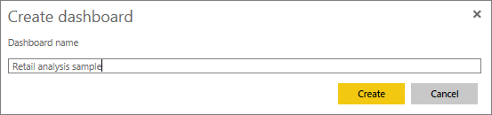

# The Power BI samples, a tutorial
<!-- Shared newnav Include -->
[!INCLUDE [newnavbydefault](./includes/newnavbydefault.md)]

We recommend starting with the article [Sample datasets for Power BI](sample-datasets.md). In that article you'll learn all about the samples; how to get them, where to save them, how to use them, and some of the stories each sample can tell. Then, when you have a grasp of the basics, come back to this Tutorial.   

## About this tutorial
This tutorial teaches you how to import the sample content packs, add them to Power BI service, and open the content. A *content pack* is a type of sample where the dataset is bundled with a dashboard and report. The sample content packs are available from within Power BI, using **Get Data**.

> [!NOTE]
> This tutorial applies to Power BI Service and not Power BI Desktop.
> 
> 

The *Retail Analysis* sample content pack used in this tutorial consists of a dashboard, report, and dataset.
To familiarize yourself with this particular content pack and its scenario, you may want to
 [take a tour of the Retail Analysis sample](sample-retail-analysis.md) before you begin.

## Get data (in this case, get a sample content pack)
1. Open and sign in to Power BI Service (app.powerbi.com).
2. Select a workspace and create a new dashboard.  
   
    
3. Name it **Retail analysis sample**.
   
   
4. Select **Get Data** at the bottom of the left navigation pane. If you don't see **Get Data**, expand the nav pane by selecting .
   
   
5. Select **Samples**.  
   
   
6. Select the *Retail Analysis Sample*, and choose **Connect**.   
   
   

## What exactly was imported?
With the sample content packs, when you select **Connect**, Power BI is actually bringing in a copy of that content pack and storing it for you in the cloud. Because the person who created the content pack included a dataset, a report, and a dashboard -- that's what you get when you click **Connect**.

1. Power BI creates the new dashboard and lists it on your **Dashboards** tab. The yellow asterisk lets you know it's new.
   
   
2. Open the **Reports** tab.  Here you'll see a new report named *Retail Analysis Sample*.
   
   
   
   And check out the **Datasets** tab.  There's a new dataset as well.
   
   

## Explore your new content
Now explore the dashboard, dataset, and report on your own. There are many different ways to navigate to your dashboards, reports, and datasets, and just one of those many ways is described below.  

> [!TIP]
> Want a little hand-holding first?  Try the [Tour of the Retail Analysis sample](sample-retail-analysis.md) for a step-by-step walkthrough of this sample.
> 
> 

1. Navigate back to your **Dashboards** tab and select the *Retail Analysis Sample* dashboard to open it.    
   
   
2. The dashboard opens.  It has a variety of visualization tiles.
   
   
3. Select one of the tiles to open the underlying report.  In this example, we'll select the area chart (outlined in pink in the previous image). The report opens to the page that contains that area chart.
   
    
   
   > [!NOTE]
   > if the tile had been created using [Power BI Q&A](service-q-and-a.md), the Q&A page would've opened instead.
   > 
   > 
4. Back on your **Datasets** tab, you have several options for exploring your dataset.  You won't be able to open it and see all the rows and columns (as you can in Power BI Desktop or Excel).  When someone shares a content pack with colleagues, they typically want to share the insights, not give their colleagues direct access to the data. But that doesn't mean you can't explore the dataset.  
   
   
   
   * One way of exploring the dataset is by creating your own visualizations and reports from scratch.  Select the chart icon  to open the dataset in report editing mode.
     
       
   * Another way of exploring the dataset is to run [Quick Insights](service-insights.md). Select the ellipses (...) and choose **Get insights**. When the insights are ready, select **View insights**.
     
       

## See also
[Power BI basic concepts](service-basic-concepts.md)

[Samples for Power BI service](sample-datasets.md)

[Data sources for Power BI](service-get-data.md)

More questions? [Try the Power BI Community](http://community.powerbi.com/)

