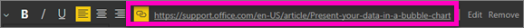

# Add a hyperlink to a text box in a report
Text boxes can be added to reports, pinned to dashboards from reports, and added directly to dashboards. Hyperlinks can be added to a text box no matter where it resides. **This topic covers text boxes in reports.**

> **NOTE**: For information on hyperlinks in Power BI tables and matrixes, see [Hyperlinks in tables](power-bi-hyperlinks-in-tables.md). For information on adding text boxes to your **dashboard**, see [Add a tile directly from the dashboard ](service-dashboard-add-widget.md). 
> 
> 

<iframe width="560" height="315" src="https://www.youtube.com/embed/_3q6VEBhGew#t=0m55s" frameborder="0" allowfullscreen></iframe>

## To add a hyperlink to a text box in a report
1. [Create a text box and add some text](power-bi-reports-add-text-and-shapes.md). 
2. Highlight existing text, or add new text to use as a hyperlink.
   
   
3. Select the hyperlink icon   .
4. Type or paste the URL in the hyperlink field, and select **Done**.
   
   
5. Test the link.  
   
   
   
   * In the text box, select the hyperlink to display the URL
     
      
   * Select the URL to open the page in a new browser window.

## To remove the hyperlink but leave the text
1. In the text box, select the hyperlink to highlight it,
   
     
2. Choose **Remove**. 

## Next steps
[Text boxes in Power BI reports](power-bi-reports-add-text-and-shapes.md)

[Add a text box to a dashboard ](service-dashboard-add-widget.md)

More questions? [Try the Power BI Community](http://community.powerbi.com/)

